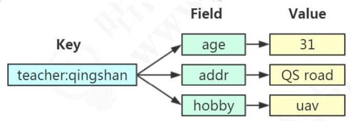

# Hash数据结构

> Redis的字典相当于 Java 对象语言里面的 HashMap, "数组+链表"
>
> 第一维读 hash 的数组位置碰撞时,就会将碰撞的元素使用链表串接起来
>
> 不同的是, 
>
> - Redis 字典中的值只能是字符串
> - rehash 的方式不一样: 渐进式 reshash

## 渐进式 rehash

渐进式 rehash 会在 rehash 的同时,保留新就两个 hash结构,查询时会同时查询两个 hash 结构,然后再后续的定时任务以及 hash 操作指令中,循序渐进地将旧的内容一点点地迁移到新的 hash结构中,当搬迁完成之后,就会使用新的 hash 取而代之

- 操作辅助 rehash : 在 redis 中每一个增删改查命令都会判断字典中的 hash 表是否正在进行 rehash,如果是则帮助执行一次
- 定时辅助 rehash : 如果服务器比较空间,那么 redis 数据库会很长时间内一直使用两个 hash 表,所以在 redis 的周期函数中,如果发现字典正在进行渐进式 rehash 操作,则会花费 1毫秒的事件,帮助一起进行渐进式 rehash操作


Redis hash 是一个 string 类型的 field 和 value 的映射表，hash 特别适合用于存储对象。

Redis 中每个 hash 可以存储 232 - 1 键值对（40多亿）。

```
127.0.0.1:6379>  HMSET runoobkey name "redis tutorial" description "redis basic commands for caching" likes 20 visitors 23000
OK
127.0.0.1:6379>  HGETALL runoobkey
1) "name"
2) "redis tutorial"
3) "description"
4) "redis basic commands for caching"
5) "likes"
6) "20"
7) "visitors"
8) "23000"
```


| 序号 | 命令         | 描述                                                     |                                         |
| ---- | ------------ | -------------------------------------------------------- | --------------------------------------- |
| 1    | hdel         | 删除一个或多个哈希表字段                                 | [hdel.md](hash/hdel.md)                 |
| 2    | hexists      | 查看哈希表 key 中，指定的字段是否存在。                  | [hexists.md](hash/hexists.md)           |
| 3    | hget         | 获取存储在哈希表中指定字段的值。                         | [hget.md](hash/hget.md)                 |
| 4    | hgetall      | 获取在哈希表中指定 key 的所有字段和值                    | [hgetall.md](hash/hgetall.md)           |
| 5    | hincrby      | 为哈希表 key 中的指定字段的整数值加上增量 increment 。   | [hincrby.md](hash/hincrby.md)           |
| 6    | hincrbyfloat | 为哈希表 key 中的指定字段的浮点数值加上增量 increment 。 | [hincrbyfloat.md](hash/hincrbyfloat.md) |
| 7    | hkeys        | 获取所有哈希表中的字段                                   | [hkeys.md](hash/hkeys.md)               |
| 8    | hlen         | 获取哈希表中字段的数量                                   | [hlen.md](hash/hlen.md)                 |
| 9    | hmget        | 获取所有给定字段的值                                     | [hmget.md](hash/hmget.md)               |
| 10   | hmset        | 同时将多个 field-value (域-值)对设置到哈希表 key 中。    | [hmset.md](hash/hmset.md)               |
| 11   | hset         | 将哈希表 key 中的字段 field 的值设为 value 。            | [hset.md](hash/hset.md)                 |
| 12   | hsetnx       | 只有在字段 field 不存在时，设置哈希表字段的值。          | [hsetnx.md](hash/hsetnx.md)             |
| 13   | hvals        | 获取哈希表中所有值                                       | [hvals.md](hash/hvals.md)               |
| 14   | hscan        | 迭代哈希表中的键值对。                                   | [hscan.md](hash/hscan.md)               |

##  图示



#### 存储类型

包含键值对的无序散列表。value 只能是字符串，不能嵌套其他类型。

同样是存储字符串，Hash 与 String 的主要区别?

- 把所有相关的值聚集到一个 key 中，节省内存空间
- 只使用一个 key，减少 key 冲突 
- 当需要批量获取值的时候，只需要使用一个命令，减少内存/IO/CPU 的消耗

Hash 不适合的场景:
1、Field 不能单独设置过期时间
2、没有 bit 操作
3、需要考虑数据量分布的问题(value 值非常大的时候，无法分布到多个节点)

## 存储实现原理

Redis 的 Hash 本身也是一个 KV 的结构，类似于 Java 中的 HashMap。

外层的哈希+只用到了 hashtable。当存储 hash 数据类型时， 我们把它叫做内层的哈希。内层的哈希底层可以使用两种数据结构实现:

- ziplist:OBJ_ENCODING_ZIPLIST(压缩列表) 
- hashtable:OBJ_ENCODING_HT(哈希表)

```
127.0.0.1:6379> hset h2 f 
(integer) 1
127.0.0.1:6379> hset h3 f 
(integer) 1
127.0.0.1:6379> object encoding h2 "ziplist"
127.0.0.1:6379> object encoding h3 "hashtable"
```


#### hashtable(dict)

在 Redis 中，hashtable 被称为字典(dictionary)，它是一个数组+链表的结构。
源码位置:dict.h
前面我们知道了，Redis 的 KV 结构是通过一个 dictEntry 来实现的。
Redis 又对 dictEntry 进行了多层的封装。

```java
typedef struct dictEntry {
void *key; /* key 关键字定义 */
union {
void *val; uint64_t u64; /* value 定义 */ int64_t s64; double d;
} v;
struct dictEntry *next; /* 指向下一个键值对节点 */
} dictEntry;
```

dictEntry 放到了 dictht(hashtable 里面):

```java
/* This is our hash table structure. Every dictionary has two of this as we * implement incremental rehashing, for the old to the new table. */ typedef struct dictht {
dictEntry **table; /* 哈希表数组 */
unsigned long size; /* 哈希表大小 */
unsigned long sizemask; /* 掩码大小，用于计算索引值。总是等于 size-1 */ unsigned long used; /* 已有节点数 */
} dictht;
```

ht 放到了 dict 里面:

```java
typedef struct dict {
dictType *type; /* 字典类型 */
void *privdata; /* 私有数据 */
dictht ht[2]; /* 一个字典有两个哈希表 */
long rehashidx; /* rehash 索引 */
unsigned long iterators; /* 当前正在使用的迭代器数量 */
} dict;
```

从最底层到最高层 dictEntry——dictht——dict——OBJ_ENCODING_HT

#### 总结:哈希的存储结构


#### 问题:为什么要定义两个哈希表呢?ht[2]

redis 的 hash 默认使用的是 ht[0]，ht[1]不会初始化和分配空间。
哈希表 dictht 是用链地址法来解决碰撞问题的。在这种情况下，哈希表的性能取决 于它的大小(size 属性)和它所保存的节点的数量(used 属性)之间的比率:
比率在 1:1 时(一个哈希表 ht 只存储一个节点 entry)，哈希表的性能最好; 如果节点数量比哈希表的大小要大很多的话(这个比例用 ratio 表示，5 表示平均一个 ht 存储 5 个 entry)，那么哈希表就会退化成多个链表，哈希表本身的性能
优势就不再存在。
在这种情况下需要扩容。Redis 里面的这种操作叫做 rehash。

rehash 的步骤:

1、为字符 ht[1]哈希表分配空间，这个哈希表的空间大小取决于要执行的操作，以
及 ht[0]当前包含的键值对的数量。
扩展:ht[1]的大小为第一个大于等于 ht[0].used*2。
2、将所有的 ht[0]上的节点 rehash 到 ht[1]上，重新计算 hash 值和索引，然后放
入指定的位置。
3、当 ht[0]全部迁移到了 ht[1]之后，释放 ht[0]的空间，将 ht[1]设置为 ht[0]表，
并创建新的 ht[1]，为下次 rehash 做准备。

####   问题:什么时候触发扩容?

```
static int dict_can_resize = 1;
static unsigned int dict_force_resize_ratio = 5;
```

ratio = used / size，已使用节点与字典大小的比例
dict_can_resize 为 1 并且 dict_force_resize_ratio 已使用节点数和字典大小之间的 比率超过 1:5，触发扩容

#### 应用场景

String 可以做的事情，Hash 都可以做。

存储对象类型的数据

比如对象或者一张表的数据，比 String 节省了更多 key 的空间，也更加便于集中管 理。