# HyperLogLog 原理

> https://mp.weixin.qq.com/s/AvPoG8ZZM8v9lKLyuSYnHQ

## 总结

HyperLogLog 是一数据结构,主要作用是 **一种有误差的去重计数方案**, 标准误差为 0.81% ,其原理是用来估计数据的基数

基数就是指一个集合中不同值的数目，比如 a, b, c, d 的基数就是 4，a, b, c, d, a 的基数还是 4。虽然 a 出现两次，只会被计算一次。

## 为什么要使用

Redis 统计技术一般有三种方式, 分别是

- HashMap
- BitMap
- HyperLogLog

HashMap 和 BitMap 随着集合的数量增长,所消耗的内存也会大量增加,但是 hyperLogLog 不会

## 为什么HyperLogLog只占用 12kb

Redis 的 HyperLogLog 通过牺牲准确率来减少内存空间的消耗，只需要12K内存，在标准误差0.81%的前提下，能够统计`2^64`个数据。所以 HyperLogLog 是否适合在比如统计日活月活此类的对精度要不不高的场景。

## 内存消耗实验

我们首先使用 Lua 脚本向 Redis 对应的数据结构中插入一定数量的数，然后执行 bgsave 命令，最后使用 redis-rdb-tools 的 rdb 的命令查看各个键所占的内存大小。

下面是 Lua 的脚本，不了解 Redis 执行 Lua 脚本的同学可以看一下我之前写的文章[《基于Redis和Lua的分布式限流》](https://mp.weixin.qq.com/s?__biz=Mzg2NjE5NDQyOA==&mid=2247483767&idx=1&sn=eb9d22513ec856eabe9a14dbbe9b41a2&scene=21#wechat_redirect)。

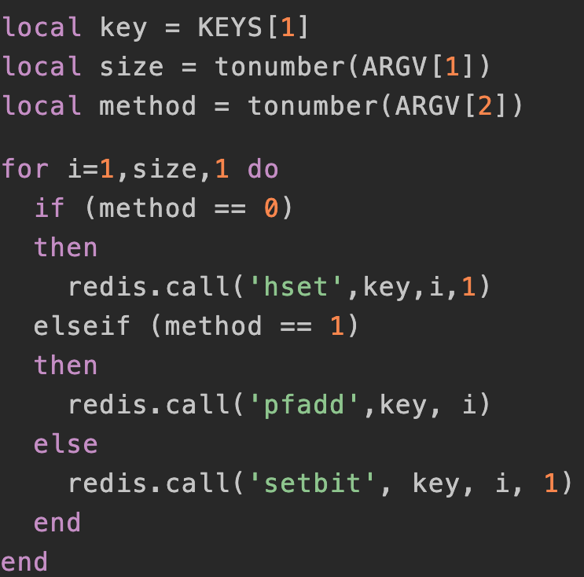

我们通过 redis-cli 的 script load 命令将 Lua 脚本加载到 Redis 中, 然后 `evalsha`命令分别向 HashMap, HyperLogLog 和 BitMap 三种数据结构中插入一千万个数,然后使用 rdb 命令查看内存消耗

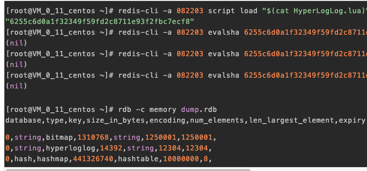

我们进行了两轮实验，分别插入一万数字和一千万数字，三种数据结构消耗的内存统计如下所示。

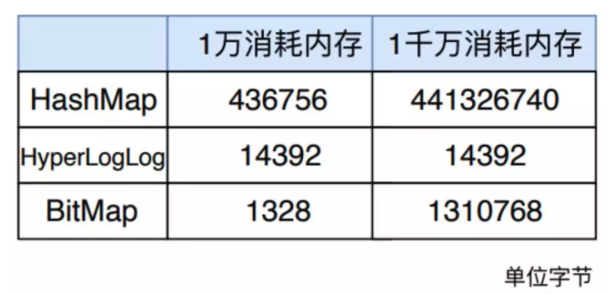

从表中可以明显看出，一万数量级时 BitMap 消耗内存最小， 一千万数量级时 HyperLogLog 消耗内存最小，但是总体来看，HyperLogLog 消耗的内存都是 14392 字节，可见 HyperLogLog 在内存消耗方面有自己的独到之处。

## 基本原理

HyperLogLog 是一种概率数据结构，它使用概率算法来统计集合的近似基数。而它算法的最本源则是**伯努利过程**。

伯努利过程就是一个抛硬币实验的过程。抛一枚正常硬币，落地可能是正面，也可能是反面，二者的概率都是 1/2 。伯努利过程就是一直抛硬币，直到落地时出现正面位置，并记录下抛掷次数k。比如说，抛一次硬币就出现正面了，此时 k 为 1; 第一次抛硬币是反面，则继续抛，直到第三次才出现正面，此时 k 为 3。

对于 n 次伯努利过程，我们会得到 n 个出现正面的投掷次数值 k1, k2 ... kn , 其中这里的最大值是k_max。

根据一顿数学推导，我们可以得出一个结论： 2^{k_ max} 来作为n的估计值。也就是说你可以根据最大投掷次数近似的推算出进行了几次伯努利过程。

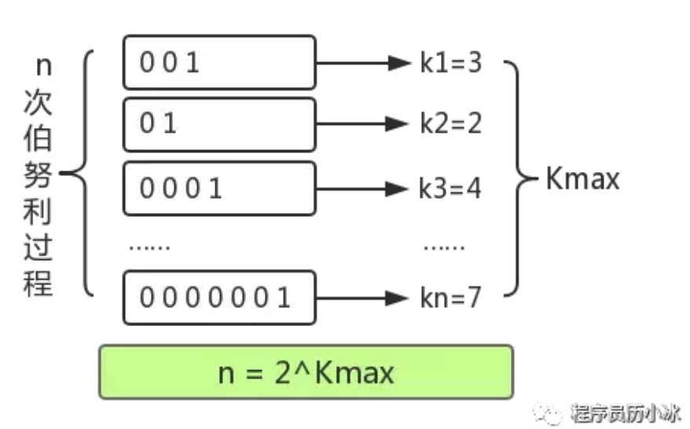

下面，我们就来讲解一下 HyperLogLog 是如何模拟伯努利过程，并最终统计集合基数的。

HyperLogLog 在添加元素时，会通过Hash函数，将元素转为64位比特串，例如输入5，便转为101(省略前面的0，下同)。这些比特串就类似于一次抛硬币的伯努利过程。比特串中，0 代表了抛硬币落地是反面，1 代表抛硬币落地是正面，如果一个数据最终被转化了 10010000，那么从低位往高位看，我们可以认为，这串比特串可以代表一次伯努利过程，首次出现 1 的位数为5，就是抛了5次才出现正面。

所以 HyperLogLog 的基本思想是利用集合中数字的比特串第一个 1 出现位置的最大值来预估整体基数，但是这种预估方法存在较大误差，为了改善误差情况，HyperLogLog中引入分桶平均的概念，计算 m 个桶的调和平均值。

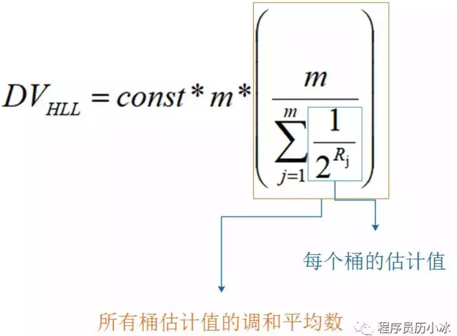

Redis 中 HyperLogLog 一共分了 2^14 个桶，也就是 16384 个桶。每个桶中是一个 6 bit 的数组，如下图所示。

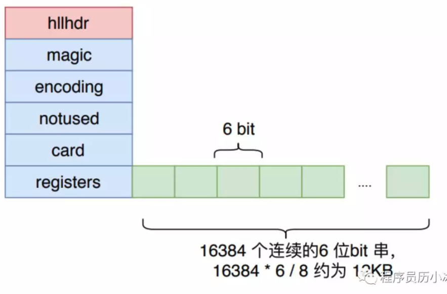

HyperLogLog 将上文所说的 64 位比特串的低 14 位单独拿出，它的值就对应桶的序号，然后将剩下 50 位中第一次出现 1 的位置值设置到桶中。50位中出现1的位置值最大为50，所以每个桶中的 6 位数组正好可以表示该值。

在设置前，要设置进桶的值是否大于桶中的旧值，如果大于才进行设置，否则不进行设置。示例如下图所示。 

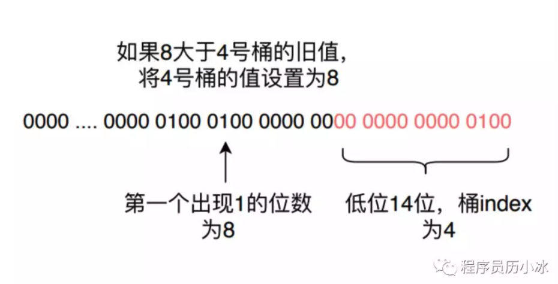

此时为了性能考虑，是不会去统计当前的基数的，而是将 HyperLogLog 头的 card 属性中的标志位置为 1，表示下次进行 pfcount 操作的时候，当前的缓存值已经失效了，需要重新统计缓存值。在后面 pfcount 流程的时候，发现这个标记为失效，就会去重新统计新的基数，放入基数缓存。

在计算近似基数时，就分别计算每个桶中的值，带入到上文将的 DV 公式中，进行调和平均和结果修正，就能得到估算的基数值。

## Redis 源码分析

我们首先来看一下 HyperLogLog 对象的定义

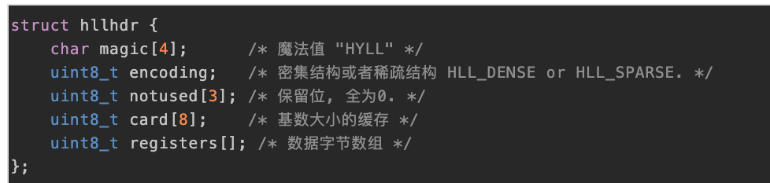

HyperLogLog 对象中的 `registers` 数组就是桶，它有两种存储结构，分别为密集存储结构和稀疏存储结构，两种结构只涉及存储和桶的表现形式，从中我们可以看到 Redis 对节省内存极致地追求。

我们先看相对简单的密集存储结构，它也是十分的简单明了，既然要有 2^14 个 6 bit的桶，那么我就真使用足够多的 `uint8_t` 字节去表示，只是此时会涉及到字节位置和桶的转换，因为字节有 8 位，而桶只需要 6 位。

所以我们需要将桶的序号转换成对应的字节偏移量 offsetbytes 和其内部的位数偏移量 offsetbits。需要注意的是小端字节序，高位在右侧，需要进行倒转。

当 offset_bits 小于等于2时，说明一个桶就在该字节内，只需要进行倒转就能得到桶的值。

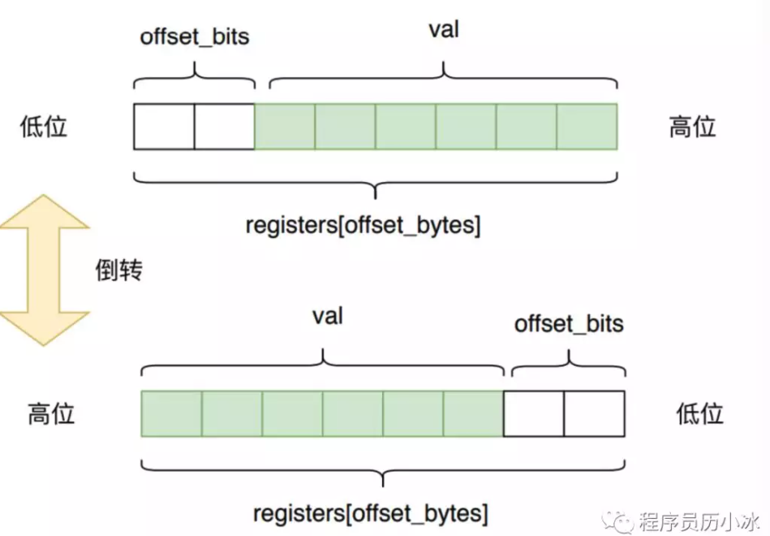

如果 offset_bits 大于 2 ，则说明一个桶分布在两个字节内，此时需要将两个字节的内容都进行倒置，然后再进行拼接得到桶的值，如下图所示。

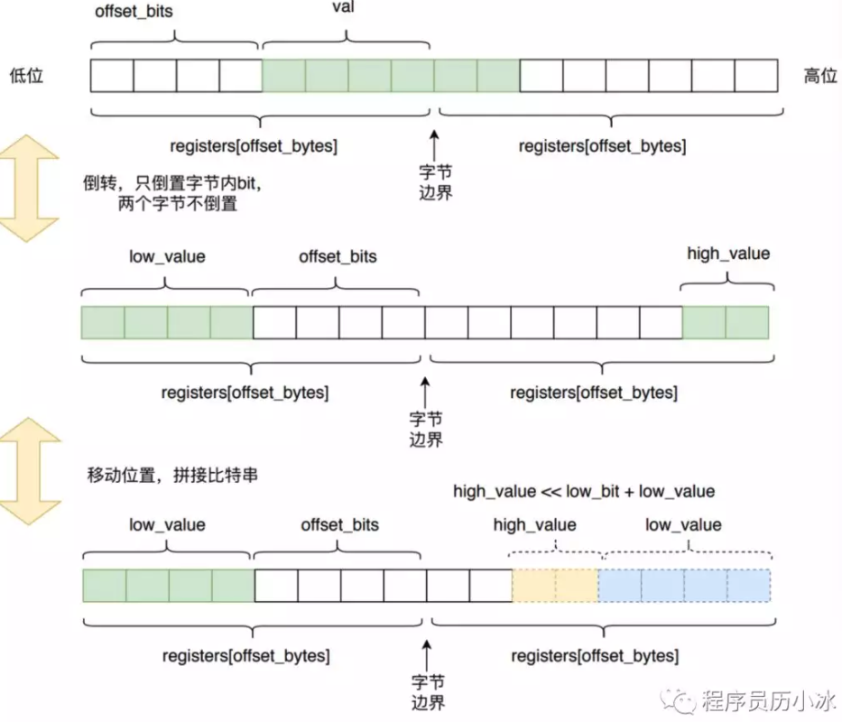

HyperLogLog 的稀疏存储结构是为了节约内存消耗，它不像密集存储模式一样，真正找了那么多个字节数组来表示2^14 个桶，而是使用特殊的字节结构来表达。

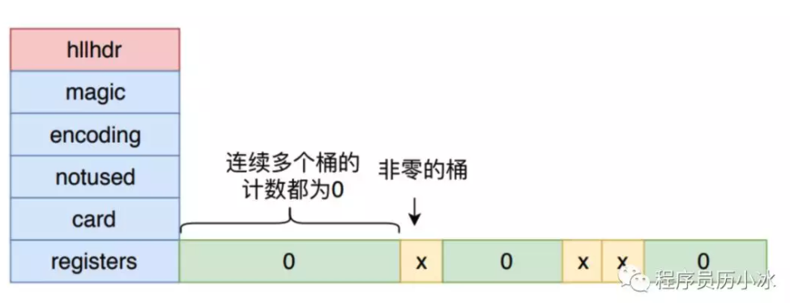

Redis 为了方便表达稀疏存储，它将上面三种字节表示形式分别赋予了一条指令。

- ZERO : 一字节，表示连续多少个桶计数为0，前两位为标志00，后6位表示有多少个桶，最大为64。
- XZERO : 两个字节，表示连续多少个桶计数为0，前两位为标志01，后14位表示有多少个桶，最大为16384。
- VAL : 一字节，表示连续多少个桶的计数为多少，前一位为标志1，四位表示连桶内计数，所以最大表示桶的计数为32。后两位表示连续多少个桶。

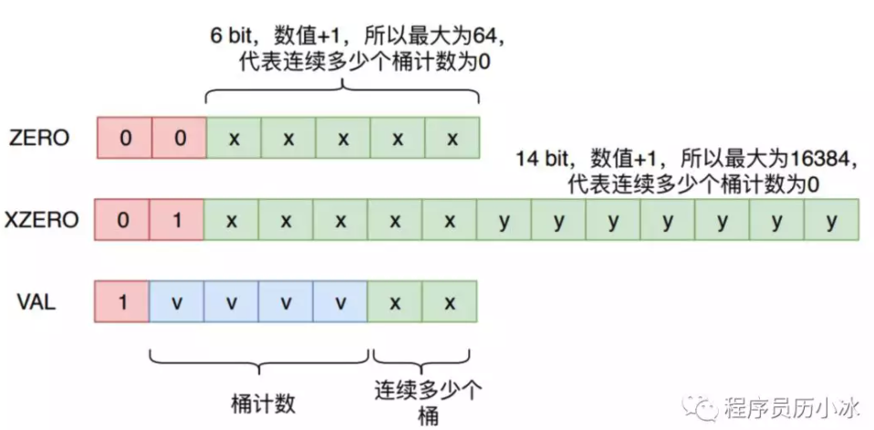

所以，一个初始状态的 HyperLogLog 对象只需要2 字节，也就是一个 XZERO 来存储其数据，而不需要消耗12K 内存。当 HyperLogLog 插入了少数元素时，可以只使用少量的 `XZERO`、`VAL` 和 `ZERO 进行表示，如下图所示。

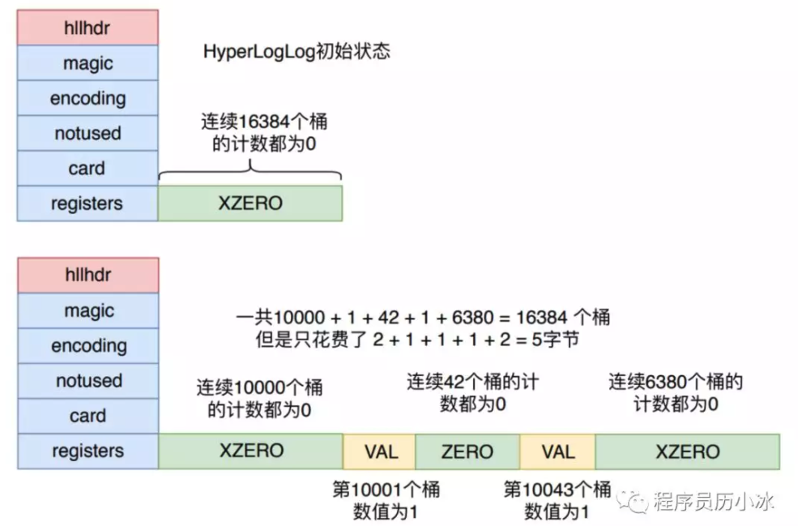

Redis从稀疏存储转换到密集存储的条件是：

- 任意一个计数值从 32 变成 33，因为 VAL 指令已经无法容纳，它能表示的计数值最大为 32
- 稀疏存储占用的总字节数超过 3000 字节，这个阈值可以通过 hllsparsemax_bytes 参数进行调整。

