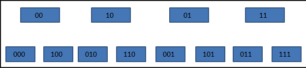

# Scan

> 作者：Jackeyzhe
> 链接：https://www.jianshu.com/p/be15dc89a3e8
> 来源：简书
> 著作权归作者所有。商业转载请联系作者获得授权，非商业转载请注明出处。

熟悉Redis的人都知道，它是单线程的。因此在使用一些时间复杂度为O(N)的命令时要非常谨慎。可能一不小心就会阻塞进程，导致Redis出现卡顿。

有时，我们需要针对符合条件的一部分命令进行操作，比如删除以test_开头的key。那么怎么获取到这些key呢？在Redis2.8版本之前，我们可以使用keys命令按照正则匹配得到我们需要的key。但是这个命令有两个缺点：

1. 没有limit，我们只能一次性获取所有符合条件的key，如果结果有上百万条，那么等待你的就是“无穷无尽”的字符串输出。
2. keys命令是遍历算法，时间复杂度是O(N)。如我们刚才所说，这个命令非常容易导致Redis服务卡顿。因此，我们要尽量避免在生产环境使用该命令。

在满足需求和存在造成Redis卡顿之间究竟要如何选择呢？面对这个两难的抉择，Redis在2.8版本给我们提供了解决办法——scan命令。

## Scan

- 复杂度也是 O(n), 但是通过游标分步进行,不会阻塞线程
- 提供 limit 参数, 限定服务器单次遍历字典槽位数,而不是限定返回的结果数量
- 服务端不需要为游标保存状态,游标的唯一状态就是 scan返回给客户端的游标证书
- **返回的结果可能有重复,需要客户端去重,这个非常重要**
- 遍历过程中如果有数据修改,改动后的数据能不能遍历到不确定
- 单次返回结果是空并不意味着建立结束,而要看返回的游标值是否为零

```
127.0.0.1:6379> scan 0 match key99* count 1000
1) "100672"
2) 1) "key99073"
   2) "key99130"
   3) "key99638"
   4) "key99039"
   5) "key99193"
127.0.0.1:6379> scan 0 match key99* count 100
1) "57856"
2) (empty list or set)
127.0.0.1:6379> scan 0 match key99* count 10
1) "118784"
2) (empty list or set)
127.0.0.1:6379> scan 0 match key99* count 1
```

#### Redis的结构

Redis使用了Hash表作为底层实现，原因不外乎高效且实现简单。说到Hash表，很多Java程序员第一反应就是HashMap。没错，Redis底层key的存储结构就是类似于HashMap那样数组+链表的结构。其中第一维的数组大小为2n(n>=0)。每次扩容数组长度扩大一倍。

scan命令就是对这个一维数组进行遍历。每次返回的游标值也都是这个数组的索引。limit参数表示遍历多少个数组的元素，将这些元素下挂接的符合条件的结果都返回。因为每个元素下挂接的链表大小不同，所以每次返回的结果数量也就不同。

#### SCAN的遍历顺序

关于scan命令的遍历顺序，我们可以用一个小栗子来具体看一下。

```
127.0.0.1:6379> keys *
1) "db_number"
2) "key1"
3) "myKey"
127.0.0.1:6379> scan 0 MATCH * COUNT 1
1) "2"
2) 1) "db_number"
127.0.0.1:6379> scan 2 MATCH * COUNT 1
1) "1"
2) 1) "myKey"
127.0.0.1:6379> scan 1 MATCH * COUNT 1
1) "3"
2) 1) "key1"
127.0.0.1:6379> scan 3 MATCH * COUNT 1
1) "0"
2) (empty list or set)
```

我们的Redis中有3个key，我们每次只遍历一个一维数组中的元素。如上所示，SCAN命令的遍历顺序是

```
0->2->1->3
```

这个顺序看起来有些奇怪。我们把它转换成二进制就好理解一些了。

```
00->10->01->11
```

我们发现每次这个序列是高位加1的。普通二进制的加法，是从右往左相加、进位。而这个序列是从左往右相加、进位的。这一点我们在redis的源码中也得到印证。

在dict.c文件的dictScan函数中对游标进行了如下处理

```c
v = rev(v);
v++;
v = rev(v);
```

意思是，将游标倒置，加一后，再倒置，也就是我们所说的“高位加1”的操作。

这里大家可能会有疑问了，为什么要使用这样的顺序进行遍历，而不是用正常的0、1、2……这样的顺序呢，这是因为需要考虑遍历时发生字典扩容与缩容的情况（不得不佩服开发者考虑问题的全面性）。

我们来看一下在SCAN遍历过程中，发生扩容时，遍历会如何进行。加入我们原始的数组有4个元素，也就是索引有两位，这时需要把它扩充成3位，并进行rehash。

#### Redis 的扩容和缩容

 [06-Redis扩容与缩容.md](../06-模式以及常见问题/06-Redis扩容与缩容.md) 



原来挂接在xx下的所有元素被分配到0xx和1xx下。在上图中，当我们即将遍历10时，dict进行了rehash，这时，scan命令会从010开始遍历，而000和100（原00下挂接的元素）不会再被重复遍历。

再来看看缩容的情况。假设dict从3位缩容到2位，当即将遍历110时，dict发生了缩容，这时scan会遍历10。这时010下挂接的元素会被重复遍历，但010之前的元素都不会被重复遍历了。

所以，缩容时还是可能会有些重复元素出现的。

#### 由于Redis使用的是渐进式rehash机制，因此，scan命令在需要同时扫描新表和旧表，将结果返回客户端。


## Scan 遍历顺序

Redis 中所有的 key 都存储在一个很大的字典里,这个字典的结构和 Java 中的 hashmap 很像,

数组+链表 的结构实现的

- 一维数组总是 2^n (n>=0)
- 扩容一次数组,大小空间加倍 ,也就是 2^(n+1)

scan 指令返回的游标就是一维数组的位置索引,我们将这个位置索引成为槽(slot)

如果不考虑字典的扩容缩容,直接按照数组下标挨个遍历就行了

limit 参数就是要遍历的槽位数

**之所以返回的结果可能多可能少**,是因为不是所有的槽位上都挂接链表,有些槽位有可能是空的,还有些操作上挂接的元素可能有多个,所以每次遍历都会将 limit 数组的槽位上挂接所有链表元素进行模式匹配后过滤

一次性返回给客户端

##### 遍历顺序

scan 的遍历顺序非常特别,他不是从第一维数组的第 0 位一直遍历到末尾,而是采用了高进位加法来遍历

> 之所以采用这种特殊的方式遍历,是考虑到字典的扩容和缩容时避免槽位的遍历重复和遗漏

普通加法

```
0000   +1   =  0001 ; 
0001   +1   =  0010 ;
0010   +1   =  0011 ;
```

高进位加法

```
0000   +1   = 1000;
1000   +1   = 0100;
0100   +1   = 1100;
```

从高位遍历是考虑到避免槽位的遍历重复和一口


