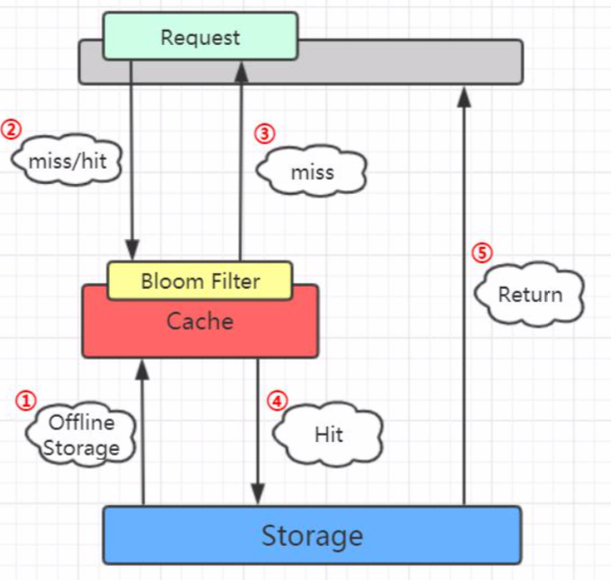

# 12-布隆过滤器

[TOC]

布隆过滤器可以理解为一个不是特别精确的 set 结构,可以使用 bf.exists 方法判断对象是否存在,它在去重的同时,空间上能节省 90%以上,但是存在一定的误判几率(默认误差是 1%)可以通过调节参数进行更改

- **布隆过滤器说有这个值的时候,这个值不一定存在**
- **布隆过滤器说不存在这个值的时候,这个值一定不存在**

## 使用

使用插件的形式集成到 redis

## 启动的时候指定参数

- key: 
- error_rate : 错误率,默认是 0.01
- initial_size: 标识预计放入的元素的数量, 默认是 100

如果 initial_size 配置的过大,会浪费存储空间,设置的过小,就会影响准确率,用户在使用之前一定要尽可能地精确评估元素的数量,还要加上一定的冗余空间避免实际元素可能意外高出评估值的值很多

布隆过滤器的 error_rate 越小,需要的存储空间就越大,对于不需要过于精确的场合,errror_rate 可以设置稍微大一点,比如新闻客户端去重,误判率高一点只会让小部分文章不能被合适的人看到,文章整体阅读量不会受到大的变化无伤大雅

## 布隆过滤器的原理

每个布隆过滤器对应到的 Redis 的数据结构就是一个大型的位数组和几个不一样的无偏 hash 函数

- 所谓的无偏 hash 函数,就是能够把元素的 hash 值算的比较均匀,让元素被 hash 映射到位数组中的位置比较随机

实现流程:

- add , 首先布隆过滤器会使用多个 hash 函数对 key进行 hash, 算得一个整数索引值,然后对数组长度进行一个取模运算,得到一个位置,每个 hash 函数得到的都会得到不同的位置,再把位数组的这几个位置都置为 1 

- bf.exists 操作, 和 add 一样,用不同的 hash 后取模数组长度获得位置,然后判断这几个位置是否都是 1,只要有一位是 0,那么说明这个 key不存在

## 为什么不精确

因为位置是 1 的地方有可能是别的 key 进行 hash 的时候碰撞了导致的

- 如果数组比较稀疏,那么正确率就高一点
- 如果数组比较拥挤,那么概率就会低一点

## 空间计算估计

## guava 中的布隆过滤器

```
<dependency> 
  <groupId>com.google.guava</groupId> 
  <artifactId>guava</artifactId>
  <version>21.0</version>
</dependency>
```

创建布隆过滤器:

```java
BloomFilter<String> bf = BloomFilter.create( Funnels.stringFunnel(Charsets.UTF_8), insertions);
```

布隆过滤器提供的存放元素的方法是 put()。 

布隆过滤器提供的判断元素是否存在的方法是 mightContain()。

```
if (bf.mightContain(data)) {
if (sets.contains(data)) {
  // 判断存在实际存在的时候，命中 right++;
  continue;
}
	// 判断存在却不存在的时候，错误
	wrong++; 
}
```

布隆过滤器把误判率默认设置为 0.03，也可以在创建的时候指定。

```java
public static <T> BloomFilter<T> create(Funnel<? super T> funnel, long expectedInsertions) { return create(funnel, expectedInsertions, 0.03D);
}
```

  位图的容量是基于元素个数和误判率计算出来的。

```java
long numBits = optimalNumOfBits(expectedInsertions, fpp);
```

根据位数组的大小，我们进一步计算出了哈希函数的个数。

```
int numHashFunctions = optimalNumOfHashFunctions(expectedInsertions, numBits);
```

存储 100 万个元素只占用了 0.87M 的内存，生成了 5 个哈希函数。

## 布隆过滤器在项目中的使用



因为要判断数据库的值是否存在，所以第一步是加载数据库所有的数据。在去 Redis 查询之前，先在布隆过滤器查询，如果 bf 说没有，那数据库肯定没有，也不用去查了。 如果 bf 说有，才走之前的流程。

#### 布隆过滤器的其他应用场景

布隆过滤器解决的问题是什么?如何在海量元素中快速判断一个元素是否存在。所 以除了解决缓存穿透的问题之外，我们还有很多其他的用途。

比如爬数据的爬虫，爬过的 url 我们不需要重复爬，那么在几十亿的 url 里面，怎么 判断一个 url 是不是已经爬过了?

还有我们的邮箱服务器，发送垃圾邮件的账号我们把它们叫做 spamer，在这么多的邮箱账号里面，怎么判断一个账号是不是 spamer 等等一些场景，我们都可以用到布隆 过滤器。

## 布隆过滤器如何删除元素

设置key的过期时间