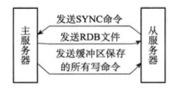
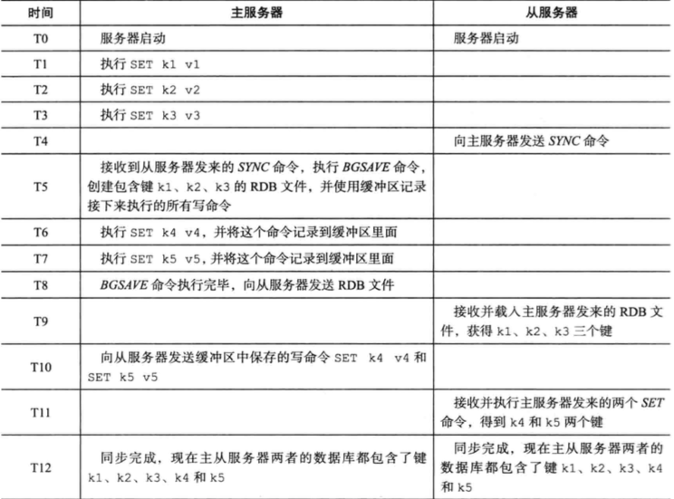
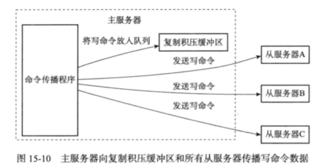
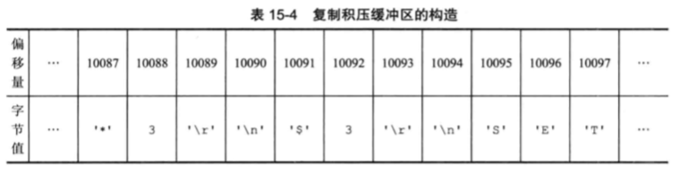

# 主从复制原理

## 一句话总结

主从复制是

- （快照同步）主节点fork 子线程 执行bgsave 保存rdb文件后传给从从节点， 主节点继续接受请求并写入本地缓存
- （增量同步）从节点接收到从节点并进行本地恢复，后续根据偏移量获取请求

## 目录

- [主从复制步骤](#主从复制步骤)
- [主从复制步骤图示](#主从复制步骤图示)
- [复制偏移量](#复制偏移量)
- [主从复制阶段总结](#主从复制阶段总结)

## 主从复制步骤

- 从服务器向主服务器发送SYNC 命令
- 收到SYNC命令的主服务器执行bgsave命令,后台生成一个rdb文件,并使用一个缓冲区记录从现在开始执行的所有写命令
- 主服务器的bgsave执行完毕时,主服务器会将bgsave命令生成的rbd文件发送给从服务器,从服务器接收并载入这个rdb文件,将自己的数据库状态更新至主服务器执行bgsave命令时的状态
- 主服务器将记录在**缓冲区**里面的所有写命令发送给从服务器,从服务器执行这些写命令,将自己的数据库状态更新至最新

## 主从复制步骤图示



## 主从复制同步过程



## 复制偏移量

主从双方都会维护一个复制偏移量

- 主服务器每次向从服务器传播N个字节的数据,就将自己的复制偏移量的值加上N
- 从服务器每次收到的主服务器传播过来的N个字节的数据时,就将自己的复制偏移量的值加上N

#### 为什么要有复制偏移量

如果从服务器发现自己的偏移量和主服务器的偏移量不一致,那么从服务器就会向主服务器发送psync命令,报告自己的偏移量位置,那么主服务器就根据这个偏移量发送数据补偿包

## 复制积压缓冲区

复制积压缓冲区是由主服务器维护的一个固定长度的FIFO队列,默认为1MB



主服务器的复制缓冲区里会保存着一部分最近传播的写命令,并且复制缓冲区会为队列中的每个字节记录相应的复制偏移量



当从服务器断开重连时,使用psync命令带上自己的偏移量

- 如果偏移量在缓冲区,那么就是增量给补偿包
- 如果不在缓冲区,那么就是重新复制

## 主从复制阶段总结

- [连接阶段](#连接阶段)
- [数据同步阶段](#数据同步阶段)
- [命令传播阶段](#命令传播阶段)
- [值得注意的问题](#值得注意的问题)

#### 主从复制的不足

#### 值得注意的问题

- [生成RDB期间master接收到的命令怎么处理](#生成RDB期间master接收到的命令怎么处理)

- [主节点和从节点之间有延迟怎么办](#主节点和从节点之间有延迟怎么办)

- [如果从节点有一段时间断开了与主节点的连接是不是要重新全量复制一遍](#如果从节点有一段时间断开了与主节点的连接是不是要重新全量复制一遍 ) 

## 连接阶段

- slave node 启动时 （执行 slaveof)命令， 会在自己本地保存 master node 的信息，包括master node 的 host 和 ip

- slave node 内部有个定时任务 replicationCon （源码 replication.c），**每隔 1 秒**钟检查是否有新的 master node 要连接和复制，如果发现，就跟 master node 建立  socket 网络连接，如果连接成功，从节点为该 socket 建立一个专门处理复制工作的文件 事件处理器，负责后续的复制工作，如接收 RDB 文件、接收命令传播等。

当从节点变成了主节点的一个客户端之后，会给主节点发送 ping 请求。 

## 数据同步阶段

- master node 第一次执行全量复制，通过 bgsave 命令在本地生成一份 RDB 快 照，将 RDB 快照文件发给 slave node（如果超时会重连，可以调大 repl-timeout 的值）。 

slave node 首先清除自己的旧数据，然后用 RDB 文件加载数据

## 命令传播阶段

- master node 持续将写命令，异步复制给 slave node

延迟是不可避免的，只能通过优化网络。

## 值得注意的问题

#### 生成RDB期间master接收到的命令怎么处理

开始生成 RDB 文件时，master 会把所有新的写命令缓存在内存中。在 slave node保存了 RDB 之后，再将新的写命令复制给 slave node。

#### 主节点和从节点之间有延迟怎么办

延迟是不可避免的，只能通过优化网络。

```
repl-disable-tcp-nodelay no -- 攒多个命令再发送
```

当设置为 yes 时，TCP 会对包进行合并从而减少带宽，但是发送的频率会降低，从 节点数据延迟增加，一致性变差；具体发送频率与 Linux 内核的配置有关，默认配置为 40ms。当设置为 no 时，TCP 会立马将主节点的数据发送给从节点，带宽增加但延迟变小。

一般来说，只有当应用对 Redis 数据不一致的容忍度较高，且主从节点之间网络状 况不好时，才会设置为 yes；多数情况使用默认值 no

#### 如果从节点有一段时间断开了与主节点的连接是不是要重新全量复制一遍

通过 master_repl_offset 记录的偏移量 ，从节点根据偏移量告诉主节点自己复制到哪了

> redis> info replication

## **主从复制的不足** 

主从模式解决了数据备份和性能（通过读写分离）的问题，但是还是存在一些不足：

- RDB 文件过大的情况下，同步非常耗时。
- 在一主一从或者一主多从的情况下，如果主服务器挂了，对外提供的服务就不可 用了，单点问题没有得到解决。如果每次都是手动把之前的从服务器切换成主服务器， 这个比较费时费力，还会造成一定时间的服务不可用。 

#### 无盘复制

主节点在进行快照同步时,会进行很耗时的文件 IO 操作,在非 SSD磁盘存储时,快照同步会对系统的负载产生较大影响,特别是当系统正在进行 AOF的 fsync 操作时,如果发生快照同步,fsync 将会被推迟执行,这样就会严重影响主节点的服务效率

所以需要无盘复制

主服务器一边遍历内存,一边将序列化的内容发给从节点,从节点还是跟以前一样,先接收到再存储到硬盘

#### wait 指令

wait 指令可以让一步复制变身为同步复制,确保系统的强一致性(不严格)

wait 指令时 Redis3.0 版本以后才出来的

```
set key value 
wait 1 0
```

- 第一个参数是从节点的数量 N, 

- 第二个参数是时间 t,以毫秒为单位

等待 wait 指令之前的所有写操作同步到 N个从节点上, 也就是确保 N 个节点的同步没有之后,最多等待 t 时间,如果 t=0 标识无线等待到 N 个从节点同步完成

> 假设这个时候出现网络分区,wait 指令第二个参数时间 t=0 会导致主从同步无法继续进行,wait 指令会永远在阻塞,Redis 会丧失一致性


