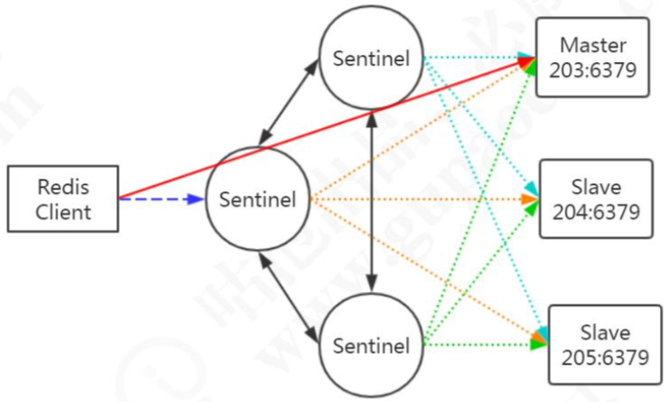
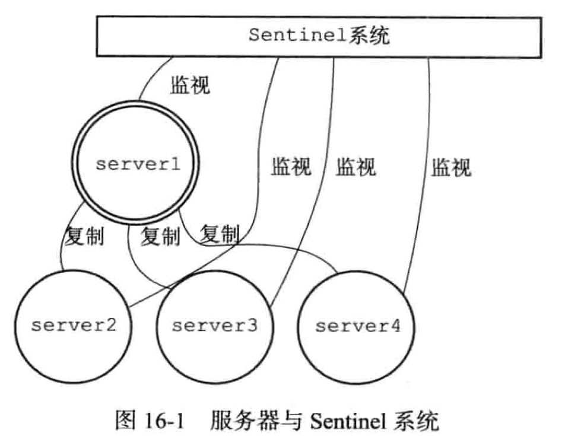
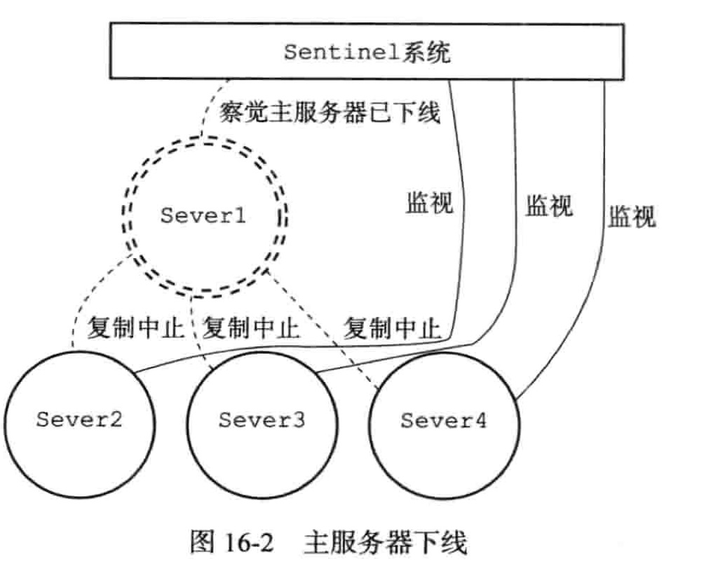
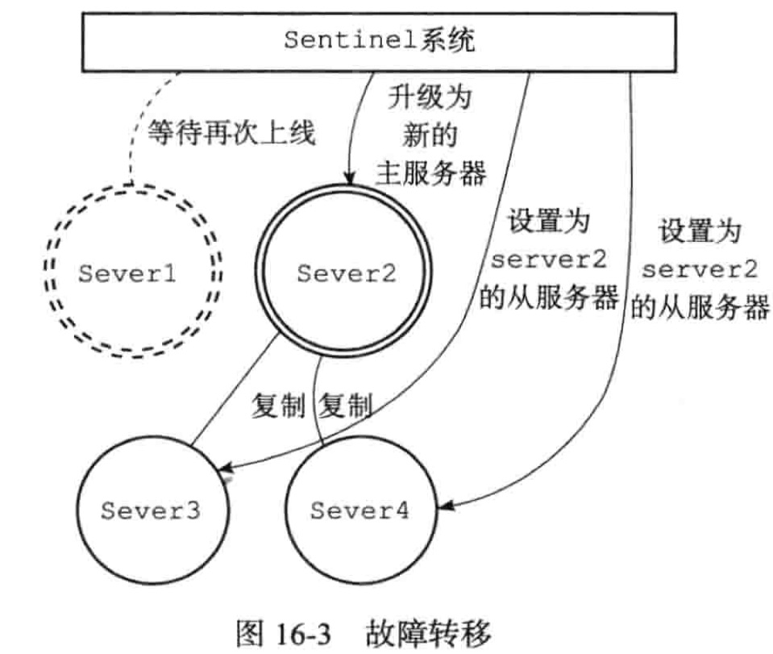
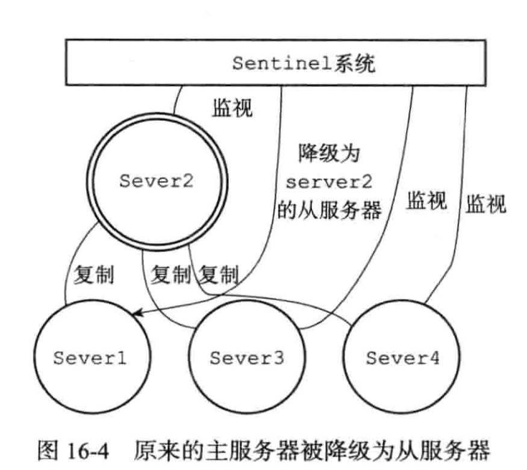

## 哨兵

### 主从复制的不足

主从模式解决了数据备份和性能(通过读写分离)的问题，但是还是存在一些不足:

- RDB 文件过大的情况下，同步非常耗时。
- 在一主一从或者一主多从的情况下，如果主服务器挂了，对外提供的服务就不可用了，单点问题没有得到解决。如果每次都是手动把之前的从服务器切换成主服务器， 这个比较费时费力，还会造成一定时间的服务不可用。

## 值得注意的问题

- [怎么让一个原来的slave节点成为主节点](#怎么让一个原来的slave节点成为主节点)
- [这么多从节点，选谁成为主节点](#这么多从节点，选谁成为主节点)

## Sentinel的功能总结

- 监控:Sentinel 会不断检查主服务器和从服务器是否正常运行。
- 通知:如果某一个被监控的实例出现问题，Sentinel 可以通过 API 发出通知。
- 自动故障转移(failover):如果主服务器发生故障，Sentinel 可以启动故障转移过 程。把某台服务器升级为主服务器，并发出通知。
- 配置管理:客户端连接到 Sentinel，获取当前的 Redis 主服务器的地址。

### 可用性保证之 Sentinel

Sentinel 负责持续监控主从节点的健康,当主节点挂掉时, 自动选择一个最优的从节点切换成为主节点

#### Sentinel 是 Redis 的高可用性(high availabilty) 解决方案:

由一个或者多个 Sentinel实例 组成的 Sentinel 系统可以监视任意多个主服务器和从服务器

- 当主服务器进入下线状态时, 自动将下线主服务器属下的某个从服务器升级为新的主服务器, 然后由新的主服务器代替挂掉的主服务器

注意:Sentinel 本身没有主从之分，只有 Redis 服务节点有主从之分。



## 服务下线

Sentinel 默认以每秒钟 1 次的频率向 Redis 服务节点发送 PING 命令。如果在 down-after-milliseconds 内都没有收到有效回复，Sentinel 会将该服务器标记为下线 (主观下线)。

配置如下

```\# sentinel.conf
sentinel down-after-milliseconds <master-name> <milliseconds>
```

这个时候 Sentinel 节点会继续询问其他的 Sentinel 节点，确认这个节点是否下线， 如果多数 Sentinel 节点都认为 master 下线，master 才真正确认被下线(**客观下线**)， 这个时候就需要重新选举 master。

## 故障转移

如果 master 被标记为下线，就会开始故障转移流程。

既然有这么多的 Sentinel 节点，由谁来做故障转移的事情呢? 故障转移流程的第一步就是在 Sentinel 集群选择一个 Leader，由 Leader 完成故障转移流程。Sentinle 通过 Raft 算法，实现 Sentinel 选举。




图中是一个正常情况下的主从复制系统 , server1 为主 ,server2, server3 和 server 4 为从



突然, 主服务器发生了故障, 哨兵无法连接上,如果在 down-after-milliseconds 内都没有收到有效回复，Sentinel 会将该服务器标记为下线 (主观下线)。



-  Sentinel 系统 会挑选 server1 属下的其中一个从服务器,并将这个被选中的从服务器升级成为新的主服务器

-  Sentinel 系统会向 server 1 属下所有的服务器发送新的复制指令, 让他们成为新的主服务器的从服务器,当所有从服务器都开始复制新的主服务器时,故障转移操作执行完毕




- Sentinel 还会机选监视已经下线的 server1 ,并在它重新上线时,将它设置为新的主服务器的从服务器

## 消息丢失

Redis 主从父子采用异步复制,意味着当主节点挂掉时,从节点可能没有收到全部的同步消息,这部分未同步的消息就丢失了

如果主从延迟特别大,那么丢失的数据就可能特别多, Sentinel 无法保证消息完全不丢失,但是也能尽量保证消息少丢失 , 可以通过两个现象属性主从延迟过大

```
min-slaves-to-write 1  //必须只要有一个从节点在进行正常复制,否则就停止对外写入服务,丧失可用性
min-slaves-max-lag 10  // 如果在 10s 内没有收到从节点的反馈,就意味着从节点同步不正常,要么网络断开了,要么一直没给反馈
```


## Ratf 算法

>  Raft 算法演示: http://thesecretlivesofdata.com/raft/

在分布式存储系统中，通常通过维护多个副本来提高系统的可用性，那么多个节点 之间必须要面对数据一致性的问题。

Raft 的目的就是通过复制的方式，使所有节点达成 一致，但是这么多节点，以哪个节点的数据为准呢?所以必须选出一个 Leader。

大体上有两个步骤:

- 领导选举
- 数据复制

Raft 是一个共识算法(consensus algorithm)。比如比特币之类的加密货币，就需要共识算法。

Spring Cloud 的注册中心解决方案 Consul 也用到了 Raft 协议。

Raft 的核心思想:先到先得，少数服从多数。

#### 总结:

Sentinle 的 Raft 算法和 Raft 论文略有不同。

- master 客观下线触发选举，而不是过了 election timeout 时间开始选举。 
- Leader 并不会把自己成为 Leader 的消息发给其他 Sentinel。

其他 Sentinel 等待 Leader 从 slave 选出 master 后，检测到新的 master 正常工作后，就会去掉客观下线的标识，从而不需要进入故障转移流程。

## 怎么让一个原来的slave节点成为主节点

- 选出 Sentinel Leader 之后，由 Sentinel Leader 向某个节点发送 slaveof no one 命令，让它成为独立节点
- 然后向其他节点发送 slaveof x.x.x.x xxxx(本机服务)，让它们成为这个节点的 子节点，故障转移完成。

## 这么多从节点，选谁成为主节点

关于从节点选举，一共有四个因素影响选举的结果，分别是断开连接时长、优先级 排序、复制数量、进程 id。

如果与哨兵连接断开的比较久，超过了某个阈值，就直接失去了选举权。如果拥有 选举权，那就看谁的优先级高，这个在配置文件里可以设置(replica-priority 100)， 数值越小优先级越高。

如果优先级相同，就看谁从 master 中复制的数据最多(复制偏移量最大)，选最多 的那个，如果复制数量也相同，就选择进程 id 最小的那个。

## 哨兵机制的不足

- 主从切换的过程中会丢失数据，因为只有一个 master。
- 只能单点写，没有解决水平扩容的问题。
- 如果数据量非常大，这个时候我们需要多个 master-slave 的 group，把数据分布到不同的 group 中。

