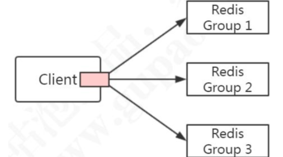

# Redis 分布式方案

[toc]

## 为什么要有分布式方案，主从不够用吗

1. 主从复制在切换的时候容易出现数据丢失的问题，因为只有一个master
2. Redis的从节点只能分担主节点**读的压力**，不能分担 **写**的压力，没有解决水平扩容的问题
3. Redis是单核CPU，单个Redis实例只能利用单个核心，这个核心要完成海量数据的存取和管理工作，压力非常大

## 常见的Redis分布式方案

- 客户端分片
  - [ShardedJedis](#ShardedJedis)
- 新增一个中间代理服务进行分片
  -  [Twemproxy.md](031-twemproxy.md) 
  -  [Codis](032-Codis.md) 
- 服务端分片
  - [Redis-cluster](040-Redis-cluster.md)

## ShardedJedis

客户端分片实际上就是对key进行一致性hash或取模对数据进行分片，查询和修改判断key的路由



Jedis 客户端提供了 Redis Sharding 的方案，并且支持连接池。 

```java

public class ShardingTest {
    public static void main(String[] args) {
        JedisPoolConfig poolConfig = new JedisPoolConfig();

        // Redis服务器
        JedisShardInfo shardInfo1 = new JedisShardInfo("127.0.0.1", 6379);
        JedisShardInfo shardInfo2 = new JedisShardInfo("127.0.0.1", 6380);
        // 连接池
        List<JedisShardInfo> infoList = Arrays.asList(shardInfo1, shardInfo2);
        ShardedJedisPool jedisPool = new ShardedJedisPool(poolConfig, infoList);

        ShardedJedis jedis = null;
        try{
            jedis = jedisPool.getResource();
            for(int i=0; i<100; i++){
                jedis.set("k"+i, ""+i);
            }
            for(int i=0; i<100; i++){
                Client client = jedis.getShard("k"+i).getClient();
                System.out.println("取到值："+jedis.get("k"+i)+"，"+"当前key位于：" + client.getHost() + ":" + client.getPort());
            }

        }finally{
            if(jedis!=null) {
                jedis.close();
            }
        }
    }
}
```

ShardedJedis 之类的客户端分片代码的优势是配置，不依赖于其他中间件，分区的逻辑可以自定义，比较灵活

**但是**

这是一种基于客户端的防范，不能实现动态服务的增减

### 代理方式 Proxy


|                           | Codis | Tewmproxy | Redis Cluster             |
| ------------------------- | ----- | --------- | ------------------------- |
| 重新分片不需要重启        | 是    | 否        | 是                        |
| pipeline                  | 是    | 是        |                           |
| 多 key 操作的 hash tags{} | 是    | 是        | 是                        |
| 重新分片时的多 key 操作   | 是    | -         | 否                        |
| 客户端支持                | 所有  | 所有      | 支持 cluster 协议的客户端 |

典型的代理分区方案有 Twitter 开源的 Twemproxy 和国内的豌豆荚开源的 Codis。

-  [Twemproxy.md](031-twemproxy.md) 
-  [Codis](032-Codis.md) 

## 服务端分片

[Redis-cluster](040-Redis-cluster.md)