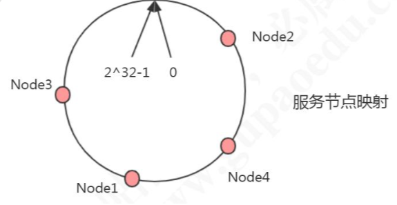

# Redis Cluster

> https://redis.io/topics/cluster-tutorial/
> 

Redis Cluster 是在 Redis 3.0 的版本正式推出的，用来解决分布式的需求，同时也 可以实现高可用。跟 Codis 不一样，它是去中心化的，客户端可以连接到任意一个可用 节点。

数据分片有几个关键的问题需要解决:

- 数据怎么相对均匀地分片 
- 客户端怎么访问到相应的节点和数据 
- 重新分片的过程，怎么保证正常服务

## 值得讨论的问题

- 集群节点
- 槽指派
- 命令执行
- 重新分片
- 转向
- 故障转移
- 消息


## 架构

Redis Cluster 可以看成是由多个 Redis 实例组成的数据集合。客户端不需要关注数 据的子集到底存储在哪个节点，只需要关注这个集合整体。

以 3 主 3 从为例，节点之间两两交互，共享数据分片、节点状态等信息。


## 搭建

> https://gper.club/articles/7e7e7f7ff7g5egc7g6d

配置
启动 进入客户端: redis-cli -p 7291 redis-cli -p 7292 redis-cli -p 7293

| 类型     | 命令                                                         |
| -------- | ------------------------------------------------------------ |
| 集群     | cluster info :打印集群的信息<br/>cluster nodes :列出集群当前已知的所有节点(node)，以及这些节点的相关信息。 |
| 节点     | cluster meet <ip> <port> :将 ip 和 port 所指定的节点添加到集群当中，让它成为集群的一份子。 cluster forget <node_id> :从集群中移除 node_id 指定的节点(保证空槽道)。<br/>cluster replicate <node_id> :将当前节点设置为 node_id 指定的节点的从节点。<br/>cluster saveconfig :将节点的配置文件保存到硬盘里面。 |
| 槽(slot) | cluster addslots <slot> [slot ...] :将一个或多个槽(slot)指派(assign)给当前节点。<br/>cluster delslots <slot> [slot ...] :移除一个或多个槽对当前节点的指派。<br/>cluster flushslots :移除指派给当前节点的所有槽，让当前节点变成一个没有指派任何槽的节点。 cluster setslot <slot> node <node_id> :将槽 slot 指派给 node_id 指定的节点，如果槽已经指派给另一个 节点，那么先让另一个节点删除该槽>，然后再进行指派。<br/>cluster setslot <slot> migrating <node_id> :将本节点的槽 slot 迁移到 node_id 指定的节点中。<br/>cluster setslot <slot> importing <node_id> :从 node_id 指定的节点中导入槽 slot 到本节点。<br/>cluster setslot <slot> stable :取消对槽 slot 的导入(import)或者迁移(migrate)。 |
| 键       | cluster keyslot <key> :计算键 key 应该被放置在哪个槽上。<br/>cluster countkeysinslot <slot> :返回槽 slot 目前包含的键值对数量。 cluster getkeysinslot <slot> <count> :返回 count 个 slot 槽中的键 |

**Cluster 解决分片的问题，数据怎么分布?**

### 数据分布

  如果是希望数据分布相对均匀的话，我们首先可以考虑哈希后取模。

哈希后取模

例如，hash(key)%N，根据余数，决定映射到那一个节点。

这种方式比较简单，属于静态的分片规则。但是一旦节点数量变化，新增或者减少，由于取模的 N 发生变化， 数据需要重新分布.

为了解决这个问题，我们又有了一致性哈希算法。

### 一致性哈希

把所有的哈希值空间组织成一个虚拟的圆环(哈希环)，整个空间按顺时针方向组 织。因为是环形空间，0 和 2^32-1 是重叠的。

假设我们有四台机器要哈希环来实现映射(分布数据)，我们先根据机器的名称或 者 IP 计算哈希值，然后分布到哈希环中(红色圆圈)。



现在有 4 条数据或者 4 个访问请求，对 key 计算后，得到哈希环中的位置(绿色圆圈)。沿哈希环顺时针找到的第一个 Node，就是数据存储的节点。


在这种情况下，新增了一个 Node5 节点，不影响数据的分布。


删除了一个节点 Node4，只影响相邻的一个节点。


谷歌的 MurmurHash 就是一致性哈希算法。在分布式系统中，负载均衡、分库分表 等场景中都有应用。

一致性哈希解决了动态增减节点时，所有数据都需要重新分布的问题，它只会影响 到下一个相邻的节点，对其他节点没有影响。

但是这样的一致性哈希算法有一个缺点，因为节点不一定是均匀地分布的，特别是 在节点数比较少的情况下，所以数据不能得到均匀分布。解决这个问题的办法是引入虚 拟节点(Virtual Node)。

比如:2 个节点，5 条数据，只有 1 条分布到 Node2，4 条分布到 Node1，不均匀。

Node1 设置了两个虚拟节点，Node2 也设置了两个虚拟节点(虚线圆圈)。

这时候有 3 条数据分布到 Node1，1 条数据分布到 Node2。


Redis 虚拟槽分区

Redis 既没有用哈希取模，也没有用一致性哈希，而是用虚拟槽来实现的。

Redis 创建了 16384 个槽(slot)，每个节点负责一定区间的 slot。比如 Node1 负 责 0-5460，Node2 负责 5461-10922，Node3 负责 10923-16383。


Redis 的每个 master 节点维护一个 16384 位(2048bytes=2KB)的位序列，比如:
序列的第 0 位是 1，就代表第一个 slot 是它负责;序列的第 1 位是 0，代表第二个 slot 不归它负责。

对象分布到 Redis 节点上时，对 key 用 CRC16 算法计算再%16384，得到一个 slot 的值，数据落到负责这个 slot 的 Redis 节点上。
查看 key 属于哪个 slot:

```
redis> cluster keyslot qingshan
```

注意:key 与 slot 的关系是永远不会变的，会变的只有 slot 和 Redis 节点的关系。

**怎么让相关的数据落到同一个节点上?**

比如有些 multi key 操作是不能跨节点的，如果要让某些数据分布到一个节点上，例 如用户 2673 的基本信息和金融信息，怎么办?

在 key 里面加入{hash tag}即可。Redis 在计算槽编号的时候只会获取{}之间的字符 串进行槽编号计算，这样由于上面两个不同的键，{}里面的字符串是相同的，因此他们可 以被计算出相同的槽。

user{2673}base=... user{2673}fin=...


**客户端连接到哪一台服务器?访问的数据不在当前节点上，怎么办?**

### 客户端重定向

比如在 7291 端口的 Redis 的 redis-cli 客户端操作:

```
127.0.0.1:7291> set qs 1
(error) MOVED 13724 127.0.0.1:7293
```

服务端返回 MOVED，也就是根据 key 计算出来的 slot 不归 7191 端口管理，而是 归 7293 端口管理，服务端返回 MOVED 告诉客户端去 7293 端口操作。

这个时候更换端口，用 redis-cli –p 7293 操作，才会返回 OK。或者用./redis-cli -c -p port 的命令(c 代表 cluster)。这样客户端需要连接两次。

Jedis 等客户端会在本地维护一份 slot——node 的映射关系，大部分时候不需要重 定向，所以叫做 smart jedis(需要客户端支持)。

**问题:新增或下线了 Master 节点，数据怎么迁移(重新分配)?**

#### 数据迁移

因为 key 和 slot 的关系是永远不会变的，当新增了节点的时候，需要把原有的 slot 分配给新的节点负责，并且把相关的数据迁移过来。

添加新节点(新增一个 7297):

```
redis-cli --cluster add-node 127.0.0.1:7291 127.0.0.1:7297
```

新增的节点没有哈希槽，不能分布数据，在原来的任意一个节点上执行:

```
redis-cli --cluster reshard 127.0.0.1:7291
```

输入需要分配的哈希槽的数量(比如 500)，和哈希槽的来源节点(可以输入 all 或者 id)。

**只有主节点可以写，一个主节点挂了，从节点怎么变成主节点?**

##  高可用和主从切换原理

当 slave 发现自己的 master 变为 FAIL 状态时，便尝试进行 Failover，以期成为新 的 master。由于挂掉的 master 可能会有多个 slave，从而存在多个 slave 竞争成为 master 节点的过程， 其过程如下:

- slave 发现自己的 master 变为 FAIL
- 将自己记录的集群 currentEpoch 加 1，并广播 FAILOVER_AUTH_REQUEST 信息
- 其他节点收到该信息，只有 master 响应，判断请求者的合法性，并发送`FAILOVER_AUTH_ACK`，对每一个 epoch 只发送一次 ack
- 尝试 failover 的 slave 收集 FAILOVER_AUTH_ACK
- 超过半数后变成新 Master
- 广播 Pong 通知其他集群节点。
- Redis Cluster 既能够实现主从的角色分配，又能够实现主从切换，相当于集成了 Replication 和 Sentinal 的功能。

## 总结:

优势
1. 无中心架构。
2. 数据按照 slot 存储分布在多个节点，节点间数据共享，可动态调整数据分布。 
3. 可扩展性，可线性扩展到 1000 个节点(官方推荐不超过 1000 个)，节点可动态添加或删除。
4. 高可用性，部分节点不可用时，集群仍可用。通过增加 Slave 做 standby 数据副
  本，能够实现故障自动 failover，节点之间通过 gossip 协议交换状态信息，用投票机制 完成 Slave 到 Master 的角色提升。
5. 降低运维成本，提高系统的扩展性和可用性。

不足

1. Client 实现复杂，驱动要求实现 Smart Client，缓存 slots mapping 信息并及时 更新，提高了开发难度，客户端的不成熟影响业务的稳定性。
2. 节点会因为某些原因发生阻塞(阻塞时间大于 clutser-node-timeout)，被判断 下线，这种 failover 是没有必要的。
3. 数据通过异步复制，不保证数据的强一致性。
4. 多个业务使用同一套集群时，无法根据统计区分冷热数据，资源隔离性较差，容 易出现相互影响的情况。