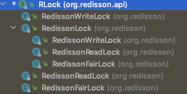

# Redission

[https://github.com/redisson/redisson/wiki/%E7%9B%AE%E5%BD%95](https://github.com/redisson/redisson/wiki/目录)

[TOC]

## 本质

Redisson 是一个在 Redis 的基础上实现的 **Java 驻内存数据网格(In-Memory Data Grid) **，提供了分布式和可扩展的 Java 数据结构。

> Redisson 跟 Jedis 定位不同，它不是一个单纯的 Redis 客户端，而是基于 Redis 实 现的分布式的服务，如果有需要用到一些分布式的数据结构，比如我们还可以基于 Redisson 的分布式队列实现分布式事务，就可以引入 Redisson 的依赖实现。

## 特点

- 基于 Netty 实现，采用非阻塞 IO，性能高
- 支持异步请求
- 支持连接池、pipeline、LUA Scripting、Redis Sentinel、Redis Cluster 不支持事务，官方建议以 LUA Scripting 代替事务 主从、哨兵、集群都支持。Spring 也可以配置和注入 RedissonClient。

## 实现分布式锁

在 Redisson 里面提供了更加简单的分布式锁的实现。

## 实现分布式锁

在 Redisson 里面提供了更加简单的分布式锁的实现。

# Redisson中实现的锁

| 名称                                     | 实现类                                     |                |
| ---------------------------------------- | ------------------------------------------ | -------------- |
| [可重入锁](031-Redission实现可重入锁.md) | org.redisson.RedissonLock                  | 2020年08月29日 |
| 公平锁                                   | org.redisson.RedissonFairLock              |                |
| 联锁                                     | org.redisson.RedissonMultiLock             |                |
| 红锁                                     | org.redisson.RedissonRedLock               |                |
| 读写锁                                   | org.redisson.RedissonReadWriteLock         |                |
| 信号量                                   | org.redisson.api.RSemaphore                |                |
| 可过期性信号量                           | org.redisson.api.RPermitExpirableSemaphore |                |
| 闭锁                                     | org.redisson.RedissonCountDownLatch        |                |

