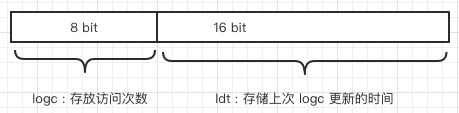

# 040-LFU算法

[TOC]

## 什么是LFU

LFU，Least Frequently Used，最不常用，4.0 版本新增 

之所以不使用 LRU 算法,是因为其需要消耗大量的额外内存, 需要对现有的数据结构进行较大的改造,

近似 LRU 算法很简单,在现有数据结构的基础上使用随机采样法来淘汰元素

## 值得注意的是

- [如果基于传统LRU算法实现Redis-LRU会有什么问题](#如果基于传统LRU算法实现Redis-LRU会有什么问题)
- [如何找出热度最低的数据](#如何找出热度最低的数据)
- [为什么不获取精确的时间而是放在全局变量中?不会有延迟的问题吗?](#为什么不获取精确的时间而是放在全局变量中?不会有延迟的问题吗?)
- [为什么要LFU算法](#为什么要LFU算法)

## 如果基于传统LRU算法实现Redis-LRU会有什么问题

需要额外的数据结构存储，消耗内存

如果淘汰策略是 LRU，则根据配置的采样值 **maxmemory_samples** (默认是 5 个),
随机从数据库中选择 m 个 key, 淘汰其中热度最低的 key 对应的缓存数据。所以采样参数**m**配置的数值越大, 就越能精确的查找到待淘汰的缓存数据,但是也消耗更多的CPU计算,执行效率降低。

## lRU和lFU 

IFU的全称是 Least Frequently Used ,  表示按最近的访问频率进行淘汰, 它比 LRU 更加精确地表达一个 key 被访问的热度

- 如果一个 key 长时间不被访问,只有刚刚偶然被用户访问了一下,那么在 LRU 算法里, 它是不容易被淘汰的. 因为 LRU 算法认为这个 key 是**热**的
- LFU 算法需要追踪最近一段时间的访问频率 , 如果某个 key 只是偶尔被访问那么一次 , 不足以变得很热,它需要在最近一段时间内被访问很多次才有机会被 LFU 算法任务很热

## Redis 对象的热度存在哪

头结构中有一个 24bit 的字段,这字段就来存

```c
typedef struct redisObject {
    unsigned type:4;
    unsigned encoding:4;
    unsigned lru:LRU_BITS; /* LRU time (relative to global lru_clock) or
                            * LFU data (least significant 8 bits frequency
                            * and most significant 16 bits access time). */
    int refcount;
    void *ptr;
} robj;
```

- 在 lru 模式下,默认是存时间

- lfu 模式下分为两个
  - logc 8 位存放访问频次, 新对象默认给 5, 会衰减**空闲分钟数**再除以衰减系数(默认 1)
  - ldt 16 位 ,存储上次 logc 更新的时间



## LFU

当这 24 bits 用作 LFU 时，其被分为两部分:

- 高 16 位用来记录访问时间 (单位为分钟，ldt，last decrement time) 

- 低 8 位用来记录访问频率，简称 counter (logc，logistic counter) counter 是用基于概率的对数计数器实现的，8 位可以表示百万次的访问频率。 对象被读写的时候，lfu 的值会被更新。

对象被读写的时候，lfu 的值会被更新。

增长的速率由 lfu-log-factor 决定, 该值越大，counter 增长的越慢 redis.conf 配置文件

> lfu-log-factor 10

如果计数器只会递增不会递减，也不能体现对象的热度。没有被访问的时候， 计数器怎么递减呢?
减少的值由**衰减因子** lfu-decay-time (分钟)来控制，如果值是 1 的话，N 分钟没有访问就要减少 N。

redis.conf 配置文件

>  lfu-decay-time 1

## 为什么不获取精确的时间而是放在全局变量中?不会有延迟的问题吗?

这样函数 lookupKey 中更新数据的 lru 热度值时,就不用每次调用系统函数 time，可以提高执行效率。