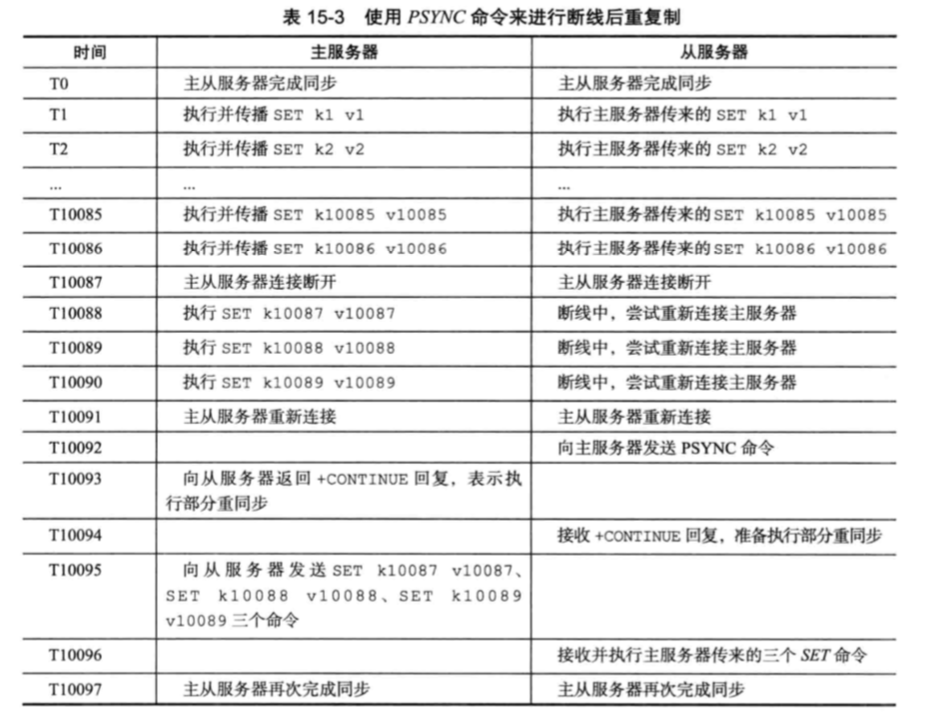

# 010-Redis主从复制基本原理

[TOC]

## 一言蔽之

主从复制分为两步

- （快照同步）主节点fork子线程执行 bgsave 保存rdb文件后传给从节点， 主节点继续接受请求并写入本地缓存
- （增量同步）从节点接收到从节点并进行本地恢复，后续根据偏移量获取请求

## 主从复制步骤

- 从服务器向主服务器发送SYNC命令
- 收到SYNC命令的主服务器执行bgsave命令,后台生成一个rdb文件,并使用一个缓冲区记录从现在开始执行的所有写命令
- 主服务器的bgsave执行完毕时,主服务器会将bgsave命令生成的rbd文件发送给从服务器,从服务器接收并载入这个rdb文件,将自己的数据库状态更新至主服务器执行bgsave命令时的状态
- 主服务器将记录在**缓冲区**里面的所有写命令发送给从服务器,从服务器执行这些写命令,将自己的数据库状态更新至最新

## 主从复制图示

2.8以后, Redis使用PSYNC命令替代了SYNC命令来执行复制时的同步操作

PSYNC命令

- 完整重同步(full resynchronization)
- 部分重同步(partal resynchronziation)

## 完整重同步

完整冲同步的执行步骤和SYNC命令一样, 让主服务器创建并发送RDB文件,以及向从服务器发送保存在缓冲区里的写命令来同步

## 部分重同步

当从服务器在断线后重新连接主服务器时, 如果条件允许, 

- 主服务器可以将从服务器连接断开期间执行的写命令发送给从服务器
- 从服务器只要接受并执行这些写命令, 就可以和主服务器同步

## 复制偏移量

主从双方都会维护一个复制偏移量

- 主服务器每次向从服务器传播N个字节的数据,就将自己的复制偏移量的值加上N
- 从服务器每次收到的主服务器传播过来的N个字节的数据时,就将自己的复制偏移量的值加上N

#### 为什么要有复制偏移量

如果从服务器发现自己的偏移量和主服务器的偏移量不一致,那么从服务器就会向主服务器发送psync命令,报告自己的偏移量位置,那么主服务器就根据这个偏移量发送数据补偿包

## 复制积压缓冲区

复制积压缓冲区是由主服务器维护的一个固定长度的FIFO队列,默认为1MB

主服务器的复制缓冲区里会保存着一部分最近传播的写命令,并且复制缓冲区会为队列中的每个字节记录相应的复制偏移量

当从服务器断开重连时,使用psync命令带上自己的偏移量

- 如果偏移量在缓冲区,那么就是增量给补偿包
- 如果不在缓冲区,那么就是重新复制

## 