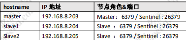

# 020-Redis-哨兵-实战

[TOC]

### **Sentinel 配置** 

为了保证 Sentinel 的高可用，Sentinel 也需要做集群部署，集群中至少需要三个 

Sentinel 实例（推荐奇数个，防止脑裂）。



以 Redis 安装路径/usr/local/soft/redis-5.0.5/为例。

在 204 和 205 的 src/redis.conf 配置文件中添加

> slaveof 192.168.8.203 6379

在 203、204、205 创建 sentinel 配置文件（安装后根目录下默认有 sentinel.conf）：

```
cd /usr/local/soft/redis-5.0.5 
mkdir logs 
mkdir rdbs 
mkdir sentinel-tmp vim sentinel.conf
```

三台服务器内容相同：

```
daemonize yes 
port 26379 
protected-mode no 
dir "/usr/local/soft/redis-5.0.5/sentinel-tmp"
sentinel monitor redis-master 192.168.8.203 6379 2
sentinel down-after-milliseconds 
redis-master 30000 sentinel failover-timeout 
redis-master 180000 sentinel parallel-syncs 
redis-master 1
```

上面出现了 4 个'redis-master'，这个名称要统一，并且使用客户端（比如 Jedis） 

连接的时候名称要正确。

```
protected-mode 是否允许外部网络访问 
dir 
sentinel 的工作目录 
sentinel monitor sentinel 监控的 redis 主节点 
down-after-milliseconds（毫秒） master 宕机多久，才会被 Sentinel 主观认为下线 
sentinel failover-timeout（毫秒） 
    1 同一个 sentinel 对同一个 master 两次 failover 之间的间隔时间。
    2. 当一个 slave 从一个错误的 master 那里同步数据开始计算时间。直到 slave 被纠正为向正确的 master 那里同步数据时。 
    3.当想要取消一个正在进行的 failover 所需要的时间。 
    4.当进行 failover 时，配置所有 slaves 指向新的 master 所需的最大时间。 

parallel-syncs  //这个配置项指定了在发生 failover 主备切换时最多可以有多少个 slave 同 时对新的 master 进行 同步，这个数字越小，完成 failover 所需的时间就 越长，但是如果这个数字越大，就意味着越 多的 slave 因为 replication 而 不可用。可以通过将这个值设为 1 来保证每次只有一个 slave 处于不能处 理命令请求的状态
```

## **Sentinel 验证** 

启动 Redis 服务和 Sentinel 

```
cd /usr/local/soft/redis-5.0.5/src 
# 启动 Redis 节点 
./redis-server ../redis.conf
# 启动 Sentinel 节点 
./redis-sentinel ../sentinel.conf 
#或者 
./redis-server ../sentinel.conf --sentinel
```

查看集群状态：

> redis> info replication 

## **Sentinel 连接使用**

Jedis 连接 Sentinel（gupao-jedis：JedisSentinelTest.java）

```
private static JedisSentinelPool createJedisPool() { 
    String masterName = "redis-master"; 
    Set<String> sentinels = new HashSet<String>(); 
    sentinels.add("192.168.8.203:26379"); 
    sentinels.add("192.168.8.204:26379"); 
    sentinels.add("192.168.8.205:26379"); 
    pool = new JedisSentinelPool(masterName, sentinels); 
    return pool; 
}

```

Spring Boot 连接 Sentinel（springboot-redis：RedisAppTest.java）

```
spring.redis.sentinel.master=redis-master spring.redis.sentinel.nodes=192.168.8.203:26379,192.168.8.204:26379,192.168.8.205:2637
```


无论是 Jedis 还是 Spring Boot（2.x 版本默认是 Lettuce），都只需要配置全部哨 兵的地址，由哨兵返回当前的 master 节点地址。

## **哨兵机制的不足**

主从切换的过程中会丢失数据，因为只有一个 master。 

只能单点写，没有解决水平扩容的问题。 

如果数据量非常大，这个时候我们需要多个 master-slave 的 group，把数据分布到 

不同的 group 中。 

问题来了，数据怎么分片？分片之后，怎么实现路由？