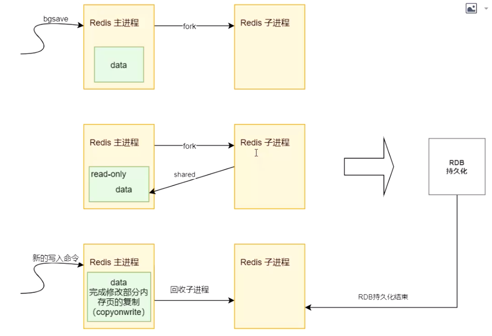

# 011-Redis持久化-RDB持久化-触发时机

[TOC]

## 触发时机检测

- 自动触发机制
- 手动触发机制



## 1.手动触发

- 主进程 fork 一个子进程
- 主进程的数据进入 readonly 状态,因为子进程会有指针指向这块内存
- 主进程修改的部分用 COW 机制

#### 手动触发的命令

-  save

save 在生成快照的时候会阻塞当前 Redis 服务器， Redis 不能处理其他命令。如果 内存中的数据比较多，会造成 Redis 长时间的阻塞。生产环境不建议使用这个命令。

-  bgsave

执行 bgsave 时，Redis 会在后台异步进行快照操作，快照同时还可以响应客户端请求。

具体操作是 Redis 进程执行 fork 操作创建子进程(copy-on-write)，RDB 持久化 过程由子进程负责，完成后自动结束。它不会记录 fork 之后后续的命令。阻塞只发生在 fork 阶段，一般时间很短。

用 lastsave 命令可以查看最近一次成功生成快照的时间。

## 1.2自动触发

- redis.conf 配置文件可以配置触发频率
- shutdown 触发,保证服务正常关闭
- flushall，RDB 文件是空的，没什么意义

#### 修改自动触发配置文件

```
save 900 1 # 900 秒内至少有一个 key 被修改(包括添加) 
save 300 10 # 400 秒内至少有 10 个 key 被修改
save 60 10000 # 60 秒内至少有 10000 个 key 被修改

# 文件路径，
dir ./
# 文件名称
dbfilename dump.rdb
# 是否是LZF压缩rdb文件 rdbcompression yes
# 开启数据校验 rdbchecksum yes
```

| 参数            | 说明                                                         |
| --------------- | ------------------------------------------------------------ |
| dir             | rdb 文件默认在启动目录下(相对路径)                           |
| dbfilename      | 文件名称                                                     |
| rdbcompiression | 开启压缩可以节省存储空间，但是会消耗一些 CPU 的计算时间，默认开启 |
| rdbchecksum     | 使用 CRC64 算法来进行数据校验，但是这样做会增加大约 10%的性能消耗，如果希望获取到最 大的性能提升，可以关闭此功能 |
