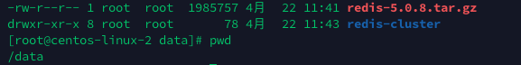
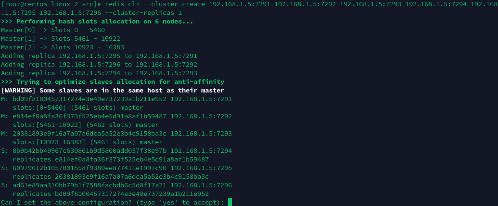

# 041-Redis分布式方案-RedisCluster安装

[TOC]



##### 创建目录

```shell
mkdir 7291 7292 7293 7294 7295 7296
```

##### 复制配置文件

```
[root@centos-linux-2 redis-cluster]# ll
总用量 1940
drwxr-xr-x 2 root root       6 4月  22 11:43 7291
drwxr-xr-x 2 root root       6 4月  22 11:43 7292
drwxr-xr-x 2 root root       6 4月  22 11:43 7293
drwxr-xr-x 2 root root       6 4月  22 11:43 7294
drwxr-xr-x 2 root root       6 4月  22 11:43 7295
drwxr-xr-x 2 root root       6 4月  22 11:43 7296
drwxrwxr-x 6 root root     334 3月  12 23:07 redis-5.0.8
-rw-r--r-- 1 root root 1985757 4月  22 11:41 redis-5.0.8.tar.gz
```

```shell
cp /data/redis-cluster/redis-5.0.8/redis.conf /data/redis-cluster/7291
```

##### 编辑配置文件

```shell
vim /data/redis-cluster/7291/redis.conf
```

```
cd 729
```

##### 把7291下的redis.conf复制到其他5个目录。

```
cp redis.conf ../7292
cp redis.conf ../7293
cp redis.conf ../7294
cp redis.conf ../7295
cp redis.conf ../7296
```

##### 批量替换内容

```
cd /data/redis-cluster
sed -i 's/7291/7292/g' 7292/redis.conf
sed -i 's/7291/7293/g' 7293/redis.conf
sed -i 's/7291/7294/g' 7294/redis.conf
sed -i 's/7291/7295/g' 7295/redis.conf
sed -i 's/7291/7296/g' 7296/redis.conf
```

##### 启动6个Redis节点

```
cd /data/redis-cluster/redis-5.0.8/src
redis-server /data/redis-cluster/7291/redis.conf
redis-server /data/redis-cluster/7292/redis.conf
redis-server /data/redis-cluster/7293/redis.conf
redis-server /data/redis-cluster/7294/redis.conf
redis-server /data/redis-cluster/7295/redis.conf
redis-server /data/redis-cluster/7296/redis.conf
```

是否启动了6个进程

```
ps -ef|grep redis
```

创建集群
旧版本中的redis-trib.rb已经废弃了，直接用–cluster命令
注意用绝对IP，不要用127.0.0.1

```
cd /data/redis-cluster/redis-5.0.8/src
redis-cli --cluster create 192.168.1.5:7291 192.168.1.5:7292 192.168.1.5:7293 192.168.1.5:7294 192.168.1.5:7295 192.168.1.5:7296 --cluster-replicas 1
```

Redis会给出一个预计的方案，对6个节点分配3主3从，如果认为没有问题，输入yes确认



注意看slot的分布：

```
7291  [0-5460] (5461个槽) 
7292  [5461-10922] (5462个槽) 
7293  [10923-16383] (5461个槽)
```

集群创建完成

```
>>> Nodes configuration updated
>>> Assign a different config epoch to each node
>>> Sending CLUSTER MEET messages to join the cluster
Waiting for the cluster to join
....
>>> Performing Cluster Check (using node 192.168.1.5:7291)
M: bd09f8100457317274e3e40e737239a1b211e952 192.168.1.5:7291
   slots:[0-5460] (5461 slots) master
   1 additional replica(s)
S: ad61e89aa310bb79b1f7588facbdb6c5d8f17a21 192.168.1.5:7296
   slots: (0 slots) slave
   replicates bd09f8100457317274e3e40e737239a1b211e952
S: 8b9b42bb49967c630801b9d5800add037f38e97b 192.168.1.5:7294
   slots: (0 slots) slave
   replicates e814ef0a8fa36f373f525eb4e5d91a8af1b59487
M: 20381893e9f16a7a07a6dca5a52e3b4c9158ba3c 192.168.1.5:7293
   slots:[10923-16383] (5461 slots) master
   1 additional replica(s)
M: e814ef0a8fa36f373f525eb4e5d91a8af1b59487 192.168.1.5:7292
   slots:[5461-10922] (5462 slots) master
   1 additional replica(s)
S: 60979012b1057001558f9389ee877411e1997c90 192.168.1.5:7295
   slots: (0 slots) slave
   replicates 20381893e9f16a7a07a6dca5a52e3b4c9158ba3c
[OK] All nodes agree about slots configuration.
>>> Check for open slots...
>>> Check slots coverage...
[OK] All 16384 slots covered.
```

重置集群的方式是在每个节点上个执行`cluster reset`，然后重新创建集群

连接到客户端

```
redis-cli -p 7291
redis-cli -p 7292
redis-cli -p 7293
```

批量写入值

```
cd /data/redis-cluster
vim setkey.sh
```

脚本内容

```
#!/bin/bash
for ((i=0;i<20000;i++))
do
echo -en "helloworld" | redis-cli -h 192.168.1.5 -p 7291 -c -x set name$i >>redis.log
done
chmod +x setkey.sh
./setkey.sh
```

每个节点分布的数据

```
127.0.0.1:7292> dbsize
(integer) 6683
127.0.0.1:7293> dbsize
(integer) 6665
127.0.0.1:7291> dbsize
(integer) 6652
```

其他命令，比如添加节点、删除节点，重新分布数据：

```
redis-cli --cluster help
Cluster Manager Commands:
  create         host1:port1 ... hostN:portN
                 --cluster-replicas <arg>
  check          host:port
                 --cluster-search-multiple-owners
  info           host:port
  fix            host:port
                 --cluster-search-multiple-owners
  reshard        host:port
                 --cluster-from <arg>
                 --cluster-to <arg>
                 --cluster-slots <arg>
                 --cluster-yes
                 --cluster-timeout <arg>
                 --cluster-pipeline <arg>
                 --cluster-replace
  rebalance      host:port
                 --cluster-weight <node1=w1...nodeN=wN>
                 --cluster-use-empty-masters
                 --cluster-timeout <arg>
                 --cluster-simulate
                 --cluster-pipeline <arg>
                 --cluster-threshold <arg>
                 --cluster-replace
  add-node       new_host:new_port existing_host:existing_port
                 --cluster-slave
                 --cluster-master-id <arg>
  del-node       host:port node_id
  call           host:port command arg arg .. arg
  set-timeout    host:port milliseconds
  import         host:port
                 --cluster-from <arg>
                 --cluster-copy
                 --cluster-replace
  help           

For check, fix, reshard, del-node, set-timeout you can specify the host and port of any working node in the cluster.
```

附录：

### 集群命令

cluster info ：打印集群的信息
cluster nodes ：列出集群当前已知的所有节点（node），以及这些节点的相关信息。
cluster meet ：将 ip 和 port 所指定的节点添加到集群当中，让它成为集群的一份子。
cluster forget <node_id> ：从集群中移除 node_id 指定的节点(保证空槽道)。
cluster replicate <node_id> ：将当前节点设置为 node_id 指定的节点的从节点。
cluster saveconfig ：将节点的配置文件保存到硬盘里面。

### 槽slot命令

cluster addslots [slot …] ：将一个或多个槽（slot）指派（assign）给当前节点。
cluster delslots [slot …] ：移除一个或多个槽对当前节点的指派。
cluster flushslots ：移除指派给当前节点的所有槽，让当前节点变成一个没有指派任何槽的节点。
cluster setslot node <node_id> ：将槽 slot 指派给 node_id 指定的节点，如果槽已经指派给另一个节点，那么先让另一个节点删除该槽>，然后再进行指派。
cluster setslot migrating <node_id> ：将本节点的槽 slot 迁移到 node_id 指定的节点中。
cluster setslot importing <node_id> ：从 node_id 指定的节点中导入槽 slot 到本节点。
cluster setslot stable ：取消对槽 slot 的导入（import）或者迁移（migrate）。

### 键命令

cluster keyslot ：计算键 key 应该被放置在哪个槽上。
cluster countkeysinslot ：返回槽 slot 目前包含的键值对数量。
cluster getkeysinslot ：返回 count 个 slot 槽中的键