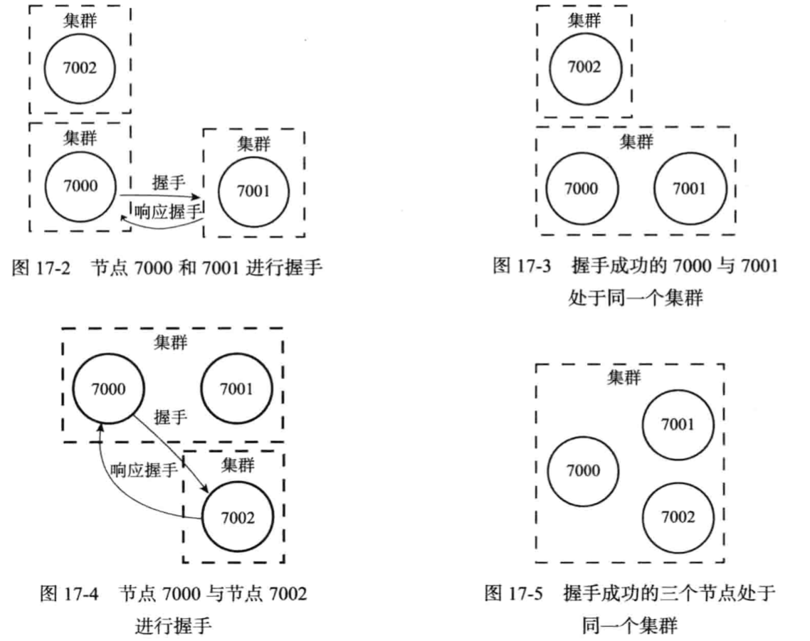

# 042-Redis分布式方案-RedisCluster-节点

[toc]

## 什么是Redis集群节点

一个Redis集群通常由多个节点(node)组成, 在刚开始的时候, 每个节点都是相互独立的, 将独立的节点连接起来使用命令

```java
CLUSTER MEET <IP> <PORT>
```

向一个节点node发送 cluster meet 命令, 可以让node 节点与 ip 和port 所指定的节点进行 握手(handshake) , 当握手成功时, node节点就会将ip和port锁指定的节点添加到当前的集群中

## 握手过程




## 客户端重定向

比如在 7291 端口的 Redis 的 redis-cli 客户端操作:

```
127.0.0.1:7291> set qs 1
(error) MOVED 13724 127.0.0.1:7293
```

服务端返回 MOVED，也就是根据 key 计算出来的 slot 不归 7191 端口管理，而是 归 7293 端口管理，服务端返回 MOVED 告诉客户端去 7293 端口操作。

这个时候更换端口，用 redis-cli –p 7293 操作，才会返回 OK。或者用./redis-cli -c -p port 的命令(c 代表 cluster)。这样客户端需要连接两次。

Jedis 等客户端会在本地维护一份 slot——node 的映射关系，大部分时候不需要重 定向，所以叫做 smart jedis(需要客户端支持)。

**问题:新增或下线了 Master 节点，数据怎么迁移(重新分配)?**


## 跳转

当客户端向一个错误的节点发出指令后，该节点会发现指令的key所在的槽位并不归自己管理，这时它会向客户端发送一个特殊的跳转命令携带目标操作的节点地址，告诉客户端去连接这个节点以获取数据

```
GET X
-MOVED 8999 127.0.0.1:6379
```

MOVED 指令的第一个参数3999 是key对应的槽位编号，后面是目标节点的地址， MOVED 指令前面有一个减号，表示该节点是一个错误信息

客户端在收到MOVED 指令后，要立即纠正本地的槽位映射表，后续所有的key将使用新的槽位映射表