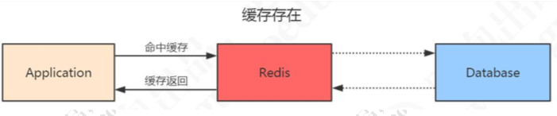
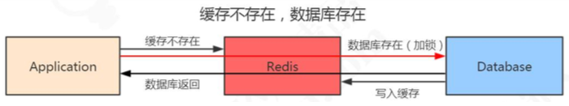

# 缓存一致性

[TOC]

## 一致性问题的定义

当缓存的数据发生变化的时候，我们既要操作数据库的数据，也要操作 Redis 的数据， 所以问题来了。现在我们有两种选择:

- 先操作 Redis 的数据再操作数据库的数据
- 先操作数据库的数据再操作 Redis 的数据

首先需要明确的是，不管选择哪一种方案， 我们肯定是希望 **两个操作同时成功**。不然就会发生 Redis 跟数据库的**数据不一致**的问题。

但是，Redis 的数据和数据库的数据是不可能通过事务达到统一的，我们只能根据相应的场景和所需要付出的代价来采取一些措施降低数据不一致的问题出现的概率，在数据**一致性**和**性能**之间取得一个权衡

**由于我们是以数据库的数据为准的，所以给缓存设置一个过期时间，是保证最终一致性的解决方案。**

## 缓存使用场景

针对读多写少的高并发场景，我们可以使用缓存来提升查询速度。

当我们使用 Redis 作为缓存的时候，一般流程是这样的:

- 如果数据在 Redis 存在，应用就可以直接从 Redis 拿到数据，不用访问数据库。

  > 

- 如果 Redis 里面没有，先到数据库查询，然后写入到 Redis，再返回给应用。

  > 


#### 对于实时性要求不高的场合

比如 T +1 的报表,我们可以采用定时任务查询数据库数据同步到 Redis 的方案

### 方案选择

- [先更新数据库再更新缓存](#先更新数据库再更新缓存)
- [先删除缓存再更新数据库](#先删除缓存再更新数据库)

#### 先更新数据库再更新缓存

如果更新数据库成功,更新缓存失败会造成数据的一致性问题

> **解决办法: 重试机制**

- 代码造成侵入方式

> 如果删除缓存失败,要捕获这个异常,然后将需要删除的 key 发送到消息队列, 消费者尝试删除这个 key, 缺点很明显,

- 异步更新缓存策略

> 写入数据库的时候要更新 binlog, 我们可以通过一个服务来监听 binLog的变化,(比如阿里的 cannal ) ,然后客户端完成删除 key 的操作 ,  如果删除失败,再发送到消息队列

#### 先删除缓存再更新数据库

异常情况, 单线程下没有问题,多线程下会有问题

- 线程 A 需要更新数据,首先删除了 Redis 缓存
- 线程 B 查询数据,发现缓存不存在,到数据库查旧的值,写入到 Redis
- 线程 A 更新了数据库

Redis 是旧的值，数据库是新的值

#### 解决方法

延时双删的策略，在写入数据之后，再删除一次缓存

A 线程: 

- 删除缓存
- 更新数据库
- 休眠 500ms (这个时间，依据读取数据的耗时而定) 
- 再次删除缓存

```java
//伪代码
public void write(String key,Object data){ 
  	redis.delKey(key);
	db.updateData(data); 
  	Thread.sleep(500);
	redis.delKey(key); 
}
```

