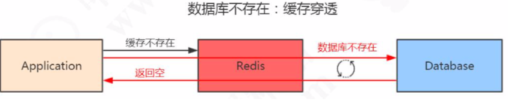
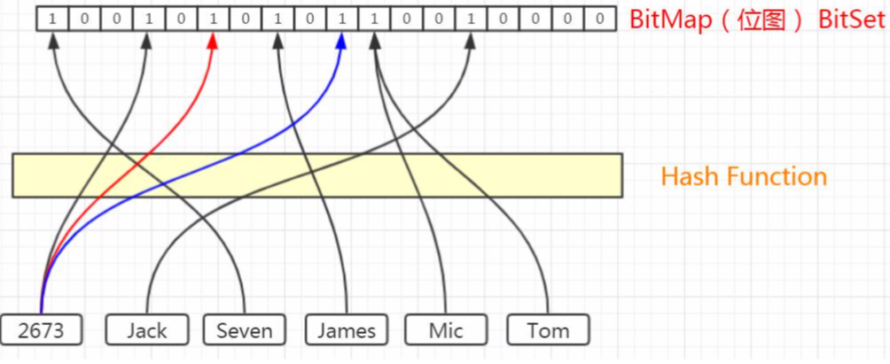

# 缓存穿透

数据在数据库和 Redis 里面都不存在,直接打在数据库上

## 为什么会出现缓存穿透

- 频繁访问数据库和 Redis 都不存在的数据, 比如查询 id= -1 的数据

  > #### 解决办法:
  >
  > - 接口层增加校验，比如用户鉴权校验，参数做校验，不合法的参数直接代码Return，比如：id 做基础校验，id <=0的直接拦截等
  >
  > - 缓存空数据
  > - 缓存特殊字符串 比如 &&
  >

- 频繁查询,每次查询的不存在的值是不一样的

  > 即使你每次都缓存特殊字符串也没用,因为值不一样,比如用户登录,我每次都生成一个符合 ID 规则的账号,但是这个账号在缓存和数据库中都没有

针对第二种查询符号条件的数据的问题,我们可以使用布隆过滤器来实现

> 换句话问, 如何在海量元素中(例如 10 亿无需,不定长,不重复) 快速判断一个元素是否存在

## 布隆过滤器

 [12-布隆过滤器.md](../03-Redis的基本数据结构/12-布隆过滤器.md) 

