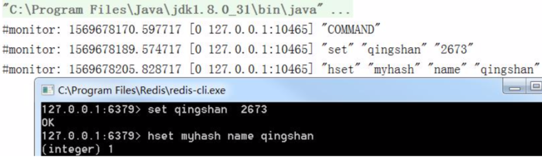

# 04-热点数据

[TOC]

## 什么是热点数据

在 Redis 存储的数据中, 有一部分是频繁访问的 , 两个原因

- 用户集中访问的数据, 比如抢购的商品，明星结婚和明星出轨的 微博

- 数据进行分片的情况下，负载不均衡，超过了单个服务器的承受能力

热点问题可能引起缓存服务的不可用，最终造成压力堆积到数据库。

## 如何获取热点数据

- [客户端](#客户端)
- [代理层](#代理层)
- [服务端](#服务端)

- [机器层面](#机器层面)

## 客户端

在 get/set 方法的地方加入 key 的计数 

缺点:

- 不知道存了多少个 key,可能会发生内存泄漏问题
- 会对客户端端的代码造成侵入
- 只能统计当前客户端的热点 key

## 代理层

在代理层实现,比如 TwemProxy 或者 Codis , 但是不是所有项目都使用了代理架构

## 服务端

基于服务端统计,Redis 有一个 monitor 命令, 可以监控到所有的 Redis 执行的命令

```java
jedis.monitor(new JedisMonitor() {
@Override
public void onCommand(String command) {
	System.out.println("#monitor: " + command); }
});
```



Facebook的开源项目 [redis-faina](https://github.com/facebookarchive/redis-faina.git) 就是基于这个原理实现的。 它是一个 python 脚本，可以分析 monitor 的数据。

缺点:

- monitor 命令在高并发场景下,会影响性能,所以不适合长时间使用
- 只能统计一个 Redis 节点的 热点 key

## 机器层面

机器层面通过 TCP 协议进行抓包,有一些开源方案, 如 ELK 的 packetbeat

## 热点key在高并发场景下会出现的问题

-  [缓存雪崩](05-缓存雪崩.md) 
-  [缓存穿透](03-缓存穿透.md) 
-  [缓存击穿](08-缓存击穿.md) 

