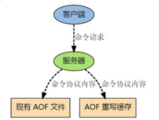

# 持久化机制

Redis 有两个持久化机制

- RDB (Redis DataBase) 快照 , 全量备份,是内存数据的二进制序列化存储,恢复速度快
- AOF (Append Only File)日志 , 增量备份,是内存数据修改的指令记录的文本 ,恢复速度慢

## RDB快照

Redis 是单线程的,内存快照肯定会用到 IO,可文件 IO 不能使用多路复用的 API

RDB 是 Redis 默认的持久化方案。当满足一定条件的时候，会把当前内存中的数 据写入磁盘，生成一个快照文件 dump.rdb。Redis 重启会通过加载 dump.rdb 文件恢复数据。

### 什么时候触发

- 自动触发机制
- 手动触发机制

#### 自动触发机制

- redis.conf 配置文件可以配置触发频率

  ```
  save 900 1 # 900 秒内至少有一个 key 被修改(包括添加) 
  save 300 10 # 400 秒内至少有 10 个 key 被修改
  save 60 10000 # 60 秒内至少有 10000 个 key 被修改
  
  # 文件路径，
  dir ./
  # 文件名称
  dbfilename dump.rdb
  # 是否是LZF压缩rdb文件 rdbcompression yes
  # 开启数据校验 rdbchecksum yes
  ```

| 参数            | 说明                                                         |
| --------------- | ------------------------------------------------------------ |
| dir             | rdb 文件默认在启动目录下(相对路径)                           |
| dbfilename      | 文件名称                                                     |
| rdbcompiression | 开启压缩可以节省存储空间，但是会消耗一些 CPU 的计算时间，默认开启 |
| rdbchecksum     | 使用 CRC64 算法来进行数据校验，但是这样做会增加大约 10%的性能消耗，如果希望获取到最 大的性能提升，可以关闭此功能 |

- shutdown 触发,保证服务正常关闭
- flushall 触发,空文件

#### 手动触发机制

- save
- bgsave

##### save

save 在生成快照的时候会阻塞当前 Redis 服务器， Redis 不能处理其他命令。如果 内存中的数据比较多，会造成 Redis 长时间的阻塞。生产环境不建议使用这个命令。

##### bgsave

执行 bgsave 时，Redis 会在后台异步进行快照操作，快照同时还可以响应客户端请求。

具体操作是 Redis 进程执行 fork 操作创建子进程(copy-on-write)，RDB 持久化 过程由子进程负责，完成后自动结束。它不会记录 fork 之后后续的命令。阻塞只发生在 fork 阶段，一般时间很短。

用 lastsave 命令可以查看最近一次成功生成快照的时间。


#### COW 机制 

Redis 使用 Copy on Write (cow) 机制来实现快照持久化, Redis 在持久化的过程中会 fork 一个子线程,快照持久化完全按照子进程处理,父进程继续处理客户端

子进程过程:

- 父进程在接受客户端请求时,使用操作系统的 cow 机制,复制原有的页数据,在复制的基础上更改

- 遍历原有的页数据数据结构,读取后序列化到磁盘中

### RDB优势与劣势

#### 优势

- RDB 是一个非常紧凑(compact)的文件，它保存了 redis 在某个时间点上的数据
  集。这种文件非常适合用于进行备份和灾难恢复。
- 生成 RDB 文件的时候，redis 主进程会 fork()一个子进程来处理所有保存工作，主
  进程不需要进行任何磁盘 IO 操作。
- RDB 在恢复大数据集时的速度比 AOF 的恢复速度要快。

#### 劣势

- RDB 方式数据没办法做到实时持久化/秒级持久化。因为 bgsave 每次运行都要
  执行 fork 操作创建子进程，频繁执行成本过高。
- 在一定间隔时间做一次备份，所以如果 redis 意外 down 掉的话，就会丢失最后
  一次快照之后的所有修改(数据有丢失)。
- 如果数据相对来说比较重要，希望将损失降到最小，则可以使用 AOF 方式进行持久
  化。

## AOF

AOF:Redis 默认不开启。AOF 采用日志的形式来记录每个写操作，并追加到文件中。开启后，执行更改 Redis 数据的命令时，就会把命令写入到 AOF 文件中。
Redis 重启时会根据日志文件的内容把写指令从前到后执行一次以完成数据的恢复
工作。

####  AOF 配置

```
# 开关 Redis 默认只开启 RDB 持久化，开启 AOF 需要修改为 yes
appendonly no
# 文件名 路径也是通过 dir 参数配置 config get dir
appendfilename "appendonly.aof"
```

#### 数据都是实时持久化到磁盘吗?

由于操作系统的缓存机制，AOF 数据并没有真正地写入硬盘，而是进入了系统的硬盘缓存。什么时候把缓冲区的内容写入到 AOF 文件?

| 参数                 | 说明                                                         |
| -------------------- | ------------------------------------------------------------ |
| appendfsync everysec | AOF 持久化策略(硬盘缓存到磁盘)，默认 everysec<br/>no表示不执行fsync，由操作系统保证数据同步到磁盘，速度最快，但是不太安全;  always表示每次写入都执行fsync，以保证数据同步到磁盘，效率很低;<br/>everysec 表示每秒执行一次 fsync，可能会导致丢失这 1s 数据。通常选择 everysec ，<br/>兼顾安全性和效率。 |

AOF 日志存储的 Redi服务器的顺序序列,AOF 日志只记录对内存操作进行修改的指令,随着Redis 运行时间边长,AOF 日志也会越来越臃肿,如果实例宕机,重放整个 aof 日志非常耗时,所以需要对 AOF 进行重写瘦身

#### 文件越来越大，怎么办?

AOF 重写

## AOF 重写

aof 日志在长期运行过程中会变得无比强大,数据库重启的时候需要加载 aof 日志进行指令的重返,这个时间无比漫长,所以要对 AOF 定期重写, 给 AOF 瘦身

> bgrewriteaof 指令 用于对 AOF日志进行瘦身

AOF 文件重写并不是对原文件进行重新整理，而是直接读取服务器现有的键值对， 然后用一条命令去代替之前记录这个键值对的多条命令，生成一个新的文件后去替换原 来的 AOF 文件。

原理就是开辟一个子进程对内存进行遍历,序列化到一个新的 aof 日志文件中,序列化完成之后再讲操作期间发生的增量 aof日志追加到这个新的 aof 日志文件中,追加完毕之后就立即替代就的 aof 文件了,瘦身工作就完成了

```
# 重写触发机制 
auto-aof-rewrite-percentage 100 
auto-aof-rewrite-min-size 64mb
```

| 参数                         | 说明                                                         |
| ---------------------------- | ------------------------------------------------------------ |
| auto-aof-rewrite-percentag e | 默认值为 100。aof 自动重写配置，当目前 aof 文件大小超过上一次重写的 aof 文件大小的 百分之多少进行重写，即当 aof 文件增长到一定大小的时候，Redis 能够调用 bgrewriteaof 对日志文件进行重写。当前 AOF 文件大小是上次日志重写得到 AOF 文件大小的二倍(设 置为 100)时，自动启动新的日志重写过程。 |
| auto-aof-rewrite-min-size    | 默认 64M。设置允许重写的最小 aof 文件大小，避免了达到约定百分比但尺寸仍然很小的 情况还要重写。 |

#### 重写过程中,AOF 文件被更改了怎么办

> 使用子线程进行 AOF 重写



子进程在进行 AOF 重写的时候,主进程需要执行以下三个任务

1. 处理命令请求
2. 将写命令追加到现有的 AOF 文件中
3. 将写命令追加到 AOF 重写缓存中

另外有两个与 AOF 相关的参数:


| 参数                      | 说明                                                         |
| ------------------------- | ------------------------------------------------------------ |
| no-appendfsync-on-rewrite | 在 aof 重写或者写入 rdb 文件的时候，会执行大量 IO，此时对于 everysec 和 always 的 aof 模式来说，执行 fsync 会造成阻塞过长时间，no-appendfsync-on-rewrite 字段设置为默认设 置为 no。如果对延迟要求很高的应用，这个字段可以设置为 yes，否则还是设置为 no，这 样对持久化特性来说这是更安全的选择。设置为 yes 表示 rewrite 期间对新写操作不 fsync, 暂时存在内存中,等 rewrite 完成后再写入，默认为 no，建议修改为 yes。Linux 的默认 fsync 策略是 30 秒。可能丢失 30 秒数据。 |
| aof-load-truncated        | aof 文件可能在尾部是不完整的，当 redis 启动的时候，aof 文件的数据被载入内存。重启 可能发生在 redis 所在的主机操作系统宕机后，尤其在 ext4 文件系统没有加上 data=ordered 选项，出现这种现象。redis 宕机或者异常终止不会造成尾部不完整现象，可以选择让 redis 退出，或者导入尽可能多的数据。如果选择的是 yes，当截断的 aof 文件被导入的时候， 会自动发布一个 log 给客户端然后 load。如果是 no，用户必须手动 redis-check-aof 修复 AOF 文件才可以。默认值为 yes。 |

### fsync

Linux 的 glibc 提供了fsync 函数可以将制定文件从内核缓存总刷到磁盘,但是 fsync 是个磁盘 IO 操作,很慢

生产环境中,通常是使用每隔 1s 刷新一次

### 优势与劣势

#### 优势

- AOF 持久化的方法提供了多种的同步频率，即使使用默认的同步频率每秒同步 一次，Redis 最多也就丢失 1 秒的数据而已。

#### 缺点:

- 对于具有相同数据的的 Redis，AOF 文件通常会比 RDF 文件体积更大(RDB 存的是数据快照)。
- 虽然 AOF 提供了多种同步的频率，默认情况下，每秒同步一次的频率也具有较 高的性能。在高并发的情况下，RDB 比 AOF 具好更好的性能保证。

## Redis 4.0 混合持久化

- RDB恢复快,但是会丢失数据
- AOF恢复慢,但是数据不会丢失

所以要混合持久化

Redis 在重启的时候,先加载 rdb 的内容,然后再重放增量 aof ,就可以完全替代之前的 AOF 全量文件重放


```
aof-use-rdb-preamble yes   
```

