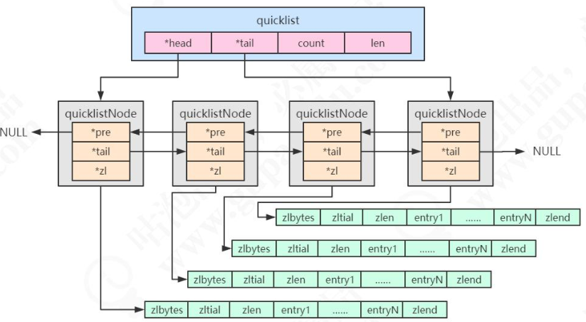

# 快速列表(QuickList)

[TOC]

## 简介

Redis 3.2 之前,存储 list 使用的是数据结构zipList 和普通的双向链表 LinkedList ,  元素少时使用的是 zipList, 元素多的时使用的 linkedList

## 快速列表是什么

quicklist 是 ziplist 和 linkedlist 的混合体, 它将 linkedlist 按段切分,每一段使用 ziplist 让存储紧凑,多个 ziplist 之使用双向指针连接起来

## 为什么要有快速列表

- 链表的 prev, next 指针 浪费空间,都要 16 个字节
- 每个节点的内存都是单独分配,会加剧内存的碎片化,影响内存管理效率

所以要使用 quickList 代替 zipList + linkedList 组合,实际上,quicklist 就是 ziplist 和 linkedList 的混合体

## quickList 源码

```c
typedef struct quicklist {
    quicklistNode *head;			/* 指向双向列表的表头 */
    quicklistNode *tail;			/* 指向双向列表的表尾 */
    unsigned long count;        /* ziplist 里面一共存储了多少个元素 */
    unsigned long len;          /*  quicklistNodes 的数量 */
    int fill : QL_FILL_BITS;              /* 双向链表的长度 */
    unsigned int compress : QL_COMP_BITS; /* depth of end nodes not to compress;0=off */
    unsigned int bookmark_count: QL_BM_BITS;   /* 压缩深度，0:不压缩; */
    quicklistBookmark bookmarks[];
} quicklist;

```

两个配置文件

| 参数                              | 含义                                                         |
| --------------------------------- | ------------------------------------------------------------ |
| **list-max-ziplist-size(fill)**   | 正数表示单个 ziplist 最多所包含的 entry 个数。 负数代表单个 ziplist 的大小，默认 8k。 -1:4KB;-2:8KB;-3:16KB;-4:32KB;-5:64KB |
| **list-compress-depth(compress)** | 压缩深度，默认是 0。1:首尾的 ziplist 不压缩;2:首尾第一第二个 ziplist 不压缩，以此类推, 为了防止内存碎片化 |

quicklistNode 中的*zl 指向一个 ziplist，一个 ziplist 可以存放多个元素。

```c
typedef struct quicklistNode {
    struct quicklistNode *prev; /* 前一个节点 */
    struct quicklistNode *next; /* 后一个节点 */
    unsigned char *zl; /* 指向实际的 ziplist */
    unsigned int sz; /* 当前 ziplist 占用多少字节 */
    unsignedintcount:16;/* 当前ziplist中存储了多少个元素，占16bit(下同)，最大65536个*/ unsigned int   encoding : 2; /* 是否采用了 LZF 压缩算法压缩节点，1:RAW 2:LZF */
    unsigned int   container : 2; /* 2:ziplist，未来可能支持其他结构存储 */
    unsigned int   recompress : 1; /* 当前 ziplist 是不是已经被解压出来作临时使用 */
    unsigned int   attempted_compress : 1; /* 测试用 */
    unsigned int   extra : 10; /* 预留给未来使用 */
} quicklistNode;
```




#### 每个 ziplist 存储多少个元素

- quicklist 快速列表中.默认的单个 ziplist 长度时 8 字节,超出这个字节,超出这个字节数就会另启一个 ziplist ,可以配置

```
list-max-ziplist-size
```

## 压缩深度

quicklist 默认的压缩深度是 0, 也就是不压缩, 压缩的实际深度可以用

```
list-compress-depth(compress)
```

来配置

- 为了支持快速的 push/pop 操作 ,quicklist 的首位两个 ziplist 不压缩,此时压缩深度就是 1
- 如果压缩深度是 2 ,就标识 quicklist 的首位第一个 ziplist 以及首位第二个 ziplist 都不压缩

