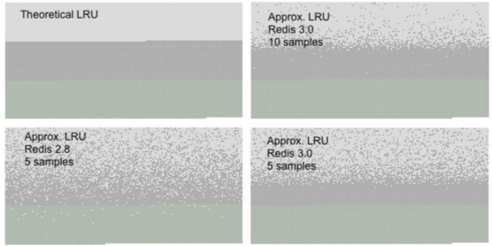

# 02-淘汰策略

---

[TOC]

## 为什么要进行内存淘汰

Redis 内存超出物理内存限制时,内存的数据会开始和磁盘产生频繁的交换,交换会让 Redis 的性能急剧下降

> 在生产环境中我们不允许 Redis 出现交换行为,为了限制最大使用内存,Redis 提供了配置参数 maxmemory 来限制内存超出预期的大小

## Redis 提供的策略

Redis 的内存淘汰策略，是指当内存使用达到最大内存极限时，需要使用淘汰算法来决定清理掉哪些数据，以保证新数据的存入。

### 最大内存设置

redis.conf

```
maxmemory <bytes>
```

如果不设置 maxmemory 或者设置为 0，64 位系统不限制内存，32 位系统最多使 用 3GB 内存。

动态修改

```
redis> config set maxmemory 2GB
```

## 淘汰算法

淘汰算法总共有3类, 针对有过期时间的key淘汰、通过比较过期时间过期、所有key过期

- volatile-xxx 策略只会针对**带过期时间**的 key 进行淘汰
- volatile-ttl 比较过期时间进行淘汰
- allkeys-xxx 策略会对所有key进行淘汰

| 策略                | 含义                                                         |
| ------------------- | ------------------------------------------------------------ |
| **noeviction**      | 不会继续服务写请求(del 请求可以继续服务), 读请求可以继续进行, 这样可以保证不会丢失数据, 但是会让线上的业务不能持续进行, 这是默认的**淘汰策略** |
| **volatile-lru**    | 根据 LRU 算法删除设置了超时属性(expire)的键，直到腾出足够内存为止。如果没有可删除的键对象，回退到 noeviction 策略。 |
| **volatile-ttl**    | 跟上面几乎一样,不过淘汰策略不是 LRU, 而是比较 key 的剩余寿命 ttl , ttl越小越优先淘汰 |
| **volatile-random** | 和 **allkeys-lru** 几乎一模一样,不过淘汰的 key 是过期 key 集合中随机 key |
| **allkeys-lru**     | 区别于 volatile-lru 这个策略要淘汰的 key 对象时全体 key 集合,没有设置过期的 key 也会被剔除 |
| **allkeys-random**  | 跟上面几乎一模一样,不过淘汰的 key 是随机的 key               |
| **allkeys-lfu**     | 在所有的键中选择最不常用的，不管数据有没有设置超时属性。     |
| **volatile-lfu**    | 在带有过期时间的键中选择最不常用的。                         |

### 动态修改淘汰策略:

> redis> config set maxmemory-policy volatile-lru

建议使用 **volatile-lru**，在保证正常服务的情况下，优先删除最近最少使用的 key。

## 应用场景

- 如果你只是拿 Redis 做缓存,那么应该使用 allkey 策略,客户端写缓存时不必携带过期时间
- 如果你同时想使用 Redis 持久化功能,那就使用 volatile-xxx 策略,这样可以保留没有设置过期时间的 key,他们是永久的 key,不会被 LRU 算法淘汰

 [03-LRU算法.md](03-LRU算法.md) 

 [04-LFU算法.md](04-LFU算法.md) 

## 实现

为了能够实现这种近似 LRU 算法,给每个 key 增加了一个额外的字段 , 这个字段的长度时 24 个 bit, 也就是最后一次被访问时间戳

### 如何采样

当内存超出 maxmemory 的时候,就会执行一次 LRU 算法淘汰,算法是

- 随机采样超出 5 (可设置) ,然后淘汰掉最旧的 key
- 如果淘汰后 内存还是超过 maxmemory ,那就继续采样淘汰,知道内存低于配置 `maxmemory`



- 绿色部分是新加入的 key
- 灰色部分是老旧的 key
- 浅灰色部分是通过 LRU 算法淘汰掉的 key

我们可以看出采样数量越大,近似 LRU算法的效果越接近严格的 LRU 算法 , 同时 Redis 3.0 在算法中增加淘汰池, 进一步提升了近似 LRU 算法的效果

淘汰池是一种数组,它的大小是 **maxmemory_samples** , 是一次淘汰循环中,新的随机得出 key列表进行融合, 淘汰掉最旧的一个 key 之后,保留剩余较旧的 key 列表进行融合,淘汰掉最旧的一个 key 之后,保留剩余较旧的 key 的 key 列表放入淘汰池中留待下一个循环

