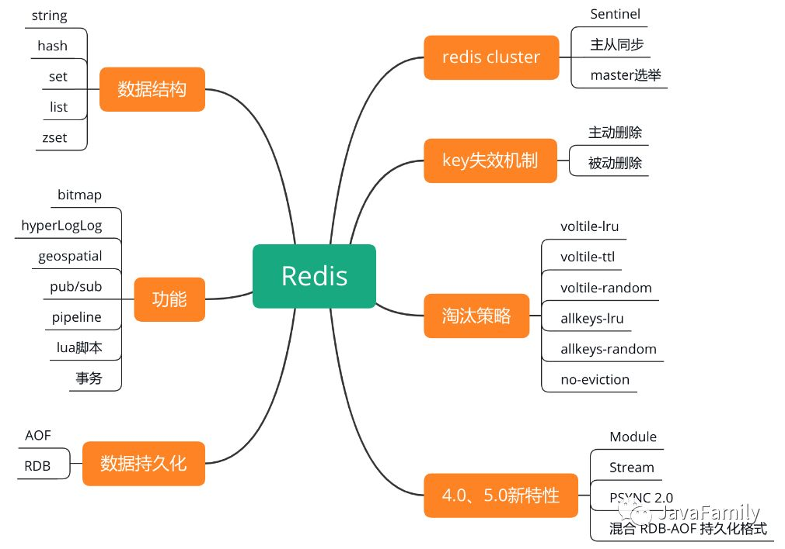

# Redis

## **RE**mote **DI**ctionary **S**ervice

官网介绍:https://redis.io/topics/introduction
中文网站:http://www.redis.cn

硬件层面有 CPU 的缓存;浏览器也有缓存;手机的应用也有缓存。我们把数据缓存
起来的原因就是从原始位置取数据的代价太大了，放在一个临时位置存储起来，取回就 可以快一些。

## Redis 的特性:

- 更丰富的数据类型 
- 进程内与跨进程;单机与分布式 
- 功能丰富:持久化机制、过期策略 
- 支持多种编程语言 
- 高可用，集群

## Redis的数据类型

- String
- Hash
- Set
- List
- Zset
- Hyperloglog
- Geo
- Streams

## Redis 的典型使用场景

1. 记录点赞数,评论数和点击数--hash
2. 记录用户的帖子 ID 列表(排序),便于快速显示用户的帖子列表--zset
3. 记录帖子的标题,摘要,作者和封面信息,用于列表页展示--hash
4. 记录帖子的点赞用户 ID 列表,评论 ID 列表,用于显示和去重计数---zset
5. 缓存近期热帖内容,帖子内容的空间占用比较大,减少数据库压力--hash
6. 记录帖子的相关文章 ID, 格局内容推荐相关帖子---list
7. 如果帖子 ID 是整数自增的,可以使用 Redis 来分配帖子 ID---计数器
8. 收藏集和帖子之间的关系--zset
9. 记录热榜帖子 ID 列表,总热榜和分类热榜
10. 缓存用户行为历史,过滤恶意行为-zet-hash

## 数据一致性

 [02-缓存一致性.md](06-模式以及常见问题/02-缓存一致性.md) 

## 为什么Redis快

总结:1)纯内存结构、2)单线程、3)多路复用

#### 内存

- KV 结构的内存数据库，时间复杂度 O(1)。
- 要实现这么高的并发性能，是不是要创建非常多的线程?
  恰恰相反，Redis 是单线程的。

### 单线程

单线程有什么好处呢?

- 没有创建线程、销毁线程带来的消耗 
- 避免了上线文切换导致的 CPU 消耗 
- 避免了线程之间带来的竞争问题，例如加锁释放锁死锁等等

#### 异步非阻塞

异步非阻塞 I/O，多路复用处理并发连接。

## Redis为什么是单线程的

因为单线程已经够用了，CPU 不是 redis 的瓶颈。Redis 的瓶颈最有可能是机器内存 或者网络带宽。既然单线程容易实现，而且 CPU 不会成为瓶颈，那就顺理成章地采用单 线程的方案了。

- 单线程模型，指的是执行 Redis 命令的核心模块是单线程的，而不是整个 Redis 实例就一个线程，Redis 其他模块还有各自模块的线程的。
- 背后也有几个异步线程
  - Redis在实现淘汰策略 LFU LRU 时都要使用系统时间,会启动线程访问 Redis 时钟
  - 定时任务,渐进式 rehash