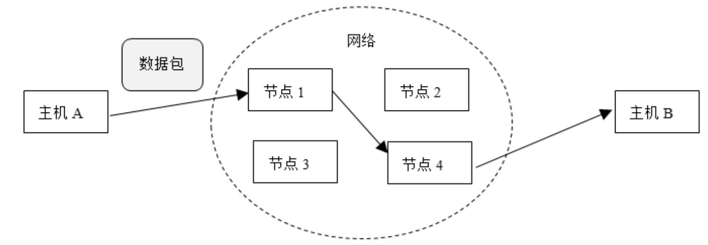

# OSI 七层模型

## 物理层（Physical Layer）

> 主要定义了**物理设备的标准**,主要作用是传输比特流,这一层的数据叫做比特
>
> 比特流: 数模转换和模数转换 
>
> 物理层协议：EIA/TIA RS-232、EIA/TIA RS-449、V.35、RJ-45等。

传输信息离不开物理介质，如双纽线和同轴电缆等，但物理介质并不在OSI的7层之内，有人把物理介质当作OSI的第零层。物理层的任务就是为它的上一层提供物理连接，以及规定通信节点之间的机械和电气等特性，如规定电缆和接头的类型、传送信号的电压等。在这一层上，数据作为原始的比特（bit）流被传输。本层的典型设备是集线器（Hub）。

## 数据链路层（Data Link Layer）

> Mac 地址的解析和封装, 这一层的数据叫做帧
>
> 数据链路层协议：HDLC、PPP、IEEE 802.3/802.2等。

数据链路层负责在两个相邻节点间的线路上，无差错地传送以帧为单位的数据。每一帧包括一定数量的数据和一些必要的控制信息。数据链路层要负责建立、维持和释放数据链路的连接。在传送数据时，如果接收方检测到所传数据中有差错，就要通知发送方重发这一帧。本层的典型设备是交换机（Switch）。

## 网络层（Network Layer）

> ip 地址的封装和解析
>
> 网络层协议：IP、IPX、ICMP、IGMP、AppleTalk DDP等。

在计算机网络中进行通信的两个计算机之间可能会经过很多个数据链路，也可能还要经过很多个通信子网。网络层的任务就是选择合适的网间路由和交换节点，确保数据被及时地传送到目标主机。网络层将数据链路层提供的帧组成数据包，包中封装有网络层包头，包头中含有逻辑地址信息——源主机和目标主机的网络地址。本层的典型设备是路由器（Router）。

主机A发送的数据先后经过节点1和节点4，最后到达主机B。相邻两个节点之间的线路被称为数据链路，比如主机A与节点1、节点1与节点4，以及节点4与主机B之间的线路。数据链路层负责数据链路上的数据传输。从主机A到主机B的整个路径被称为路由，网络层负责选择合适的路由。

## 传输层（Transport Layer）

> 定义了传输数据的协议和端口号
>
> 传输层协议：TCP、UDP、SPX等。

该层的任务是根据通信子网的特性来充分利用网络资源，为两个端系统（也就是源主机和目标主机）的会话层提供建立、维护和取消传输连接的功能，以可靠方式或者不可靠方式传输数据。所谓可靠方式，指保证把源主机发送的数据正确地送达目标主机；所谓不可靠方式，则指不保证把源主机发送的数据正确地送达目标主机，数据有可能丢失，或出错。在这一层，信息的传送单位是报文。

## 会话层（Session Layer）

> 建立链接并访问验证和会话关联
>
> 会话层协议：NetBIOS、RPC、NFS、AppleTalk等。

这一层也可以被称为会晤层或对话层，在会话层及以上层次中，数据传送的单位不再另外命名，统称为报文。会话层管理进程之间的会话过程，即负责建立、管理、终止进程之间的会话。会话层还通过在数据中插入校验点来实现数据的同步。

## 表示层（Presentation Layer）

> 建立连接并访问验证和会话管理
>
> 数据加解密,数据编解码,数据压缩和解压缩
>
> 表示层协议：ASCII、GIF、JPEG、MPEG等。

表示层对上层数据进行转换，以保证一个主机的应用层的数据可以被另一个主机的应用层理解。表示层的数据转换包括对数据的加密、解密、压缩、解压和格式转换等。

## 应用层（Application Layer）

> 访问网络的服务接口
>
> 应用层协议：TELNET、FTP、HTTP、SNMP、SMTP等。

应用层确定进程之间通信的实际用途，以满足用户实际需求。浏览Web站点、收发E-mail、上传或下载文件以及远程登入服务器等都可以看作是进程之间通信的实际用途。

## 相比之下, 因特网往往使用 TCP/IP协议簇  

>  [02-TCP-IP四层网络模型.md](02-TCP-IP四层网络模型.md) 

