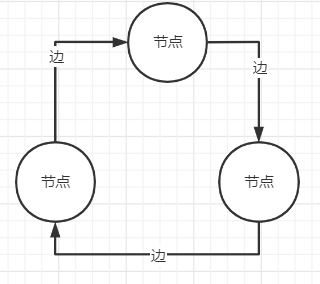
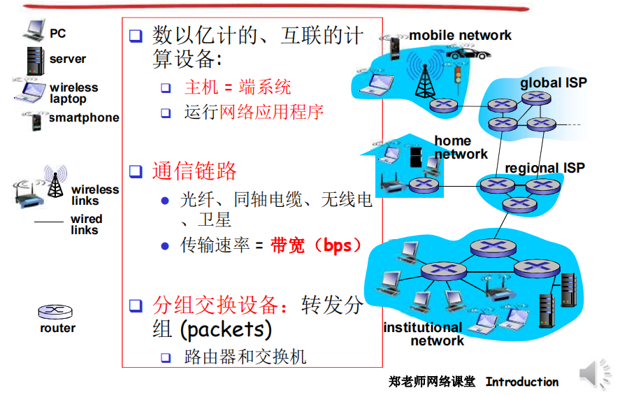
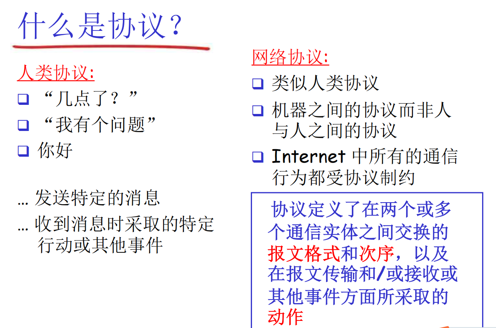
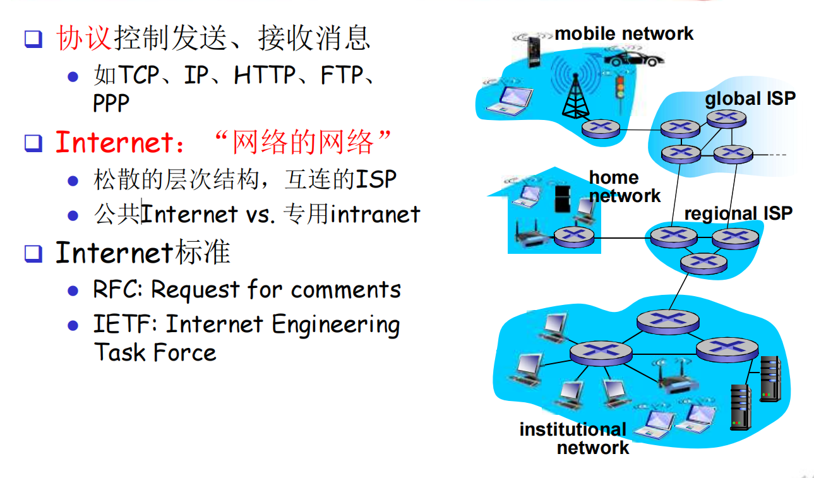
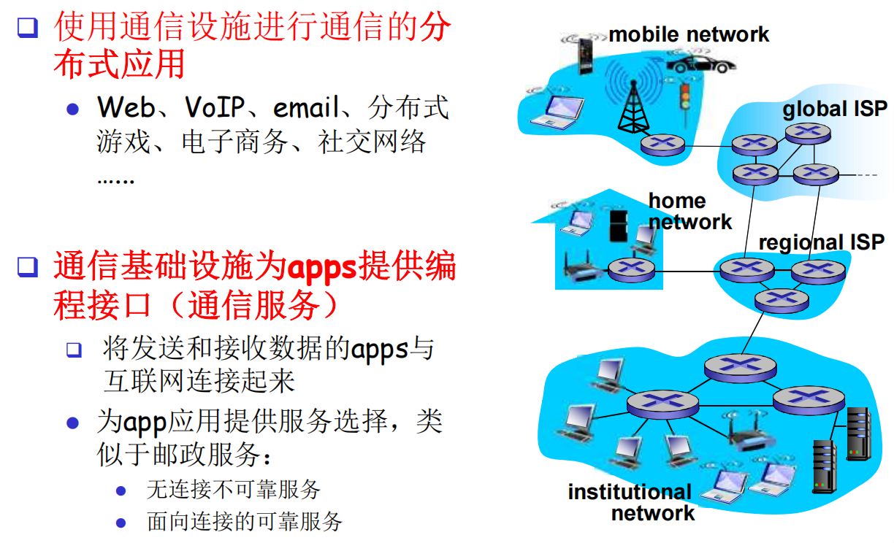

# 010-什么是互联网&协议

[TOC]

## 什么是网络

网络是由节点和边组成的大小无关的拓补

## 什么是计算机网络

联网的计算机系统， 由节点和边构成的系统， 我们把它叫做计算机网络

## 什么是Internet：从具体构成角度

**节点**

- 主机节点： 主机及其上运行的应用程序 

- 数据交换节点：路由器、交换机等网络交换设备

**边：通信链路** 

- 接入网链路（Access）：主机连接到互联网的链路 
- 主干链路(backbone)：路由器间的链路、交换机与路由器之间

**协议**

> 网络协议（protocol)定义了在两个或者多个通讯实体之间交换的报文的格式和顺序， 以及报文发送或者接收一条报文或者其他事件所采取的动作

## 因特网基础概念

### 1 因特网

互联了遍及全世界设备的网络。一般称之为the internet。

#### 1.1 主机/端系统（Hosts/End system）：

主机，即连接网络的设备，如PC、Linux服务器、个人数字助手、TV等等。 因为这些设备处在因特网的边缘，因此又被称作端系统（end system）。

#### 1.2 通信链路和分组交换机

端系统通过通信链路和分组交换机连接到一起。

### 2 通信链路（communication link）

通信链路由不同物理媒体组成，包括同轴电缆、铜线、光纤等等。这些物理媒体可以划分为两类：导引型媒体（guided media）和非导引型媒体（unguided media）。对于导引型媒体，电波沿着固体媒体（如光缆、双绞铜线或同轴电缆）被导引。对于非导引型媒体，电波在空气或者外层空间（例如在无线局域网或者数字卫星频道）中传播。
不同的链路以不同的速率传输数据。链路的传输速率以bps度量。

#### 2.1 双绞铜线：

双绞铜线是最便宜并且最为普遍的导引型传输媒体。一百多年来，它一直普遍应用于电话网。

双绞线由两根隔离的铜线组成，每根大约1mm粗，以规则的螺旋形式排列。两根线互相绞合，能够减少临近双绞线的电气干扰。通常会把许多双绞线捆扎在一起形成一根电缆，并在双绞线外面覆盖上保护性防护层。
非屏蔽双绞线常常用于局域网中，数据传输速率在10Mbps到1Gbps之间。具体的传输速率取决于线的厚度以及传输方与接收方间的距离。

#### 2.2 同轴电缆

同轴电缆由两个同心的铜导体组成，能够具有高比特速率。
同轴电缆能够被用作引导式共享媒体。许多端系统能够直接与该电缆相连，并且所有端系统都能够接收由其它端系统发送的东西。

#### 2.3 光缆

光缆是一种细而柔软的、能偶引导光脉冲的媒体，其中一个脉冲表示一个比特。一根光缆可以支持极高的比特速率，高达数十甚至数百Gbps。它们不受电磁干扰，长距离信号衰减极低，并且很难接头。因此，光纤常用作长途引导型媒体。然而光设备成本较高，因此难以在短途传输，如局域网，中应用。

#### 2.4 陆地无线电信道

无线电信道承载电磁频谱中的信号。它不需要安装物理线路，能够穿透墙壁，能够提供移动用户的连接，并且具备长距离承载信号的能力。无线电信道依赖于传播环境和传输信号的距离。

### 3.2 分组（packet）

发送端系统在发送数据时，会将数据分段并为每段加上首部字节。一段分组数据及其首部字节构成了信息包，也就是分组（packet）。

#### 3.3 分组交换机（packet switch）

分组交换机会从它的输入通信链路上接收到达的分组，并且从它的输出通信链路上转发该分组。两种最著名的分组交换机类型是路由器（router）和链路层交换机（link-layer switch）。

#### 3.4 路径（route/path）

从发射端到接收端，一个分组所经历的一系列通信链路和分组交换机成为通过该网络的路径（route/path）。

因特网服务商（Internet Service Provider,ISP）

端系统通过通过因特网服务提供商接入因特网。每个ISP是一个由多个分组交换机和多段通信网络组成的网络。

### 4 协议（protocol）

端系统、分组交换机和其它因特网部件，都要运行控制因特网中信息接收和发送的一系列协议。协议定义了在两个或者多个通信实体之间交换的报文格式和次序，以及在报文传输和接收其它事件方面所采取的动作。

TCP（Transmisson Control Protocol，传输控制协议）和IP（Internet Protocol，网际协议）是因特网中最重要的两个协议。IP协议定义了在路由器和端系统中发送和接收的分组的格式。这两个因特网主要的协议统称为TCP/IP。

### 5 标准

标准存在的目的是让每个人就各个协议的作用达成共识。因特网标准由因特网工程任务组研发。

应用程序编程接口（Application Programming Interface,API）
API规定了运行在一个端系统上的软件请求因特网基础设施向运行在另一个端系统上的特定目的的软件交付数据的方式。

## 什么是Internet：从服务角度

