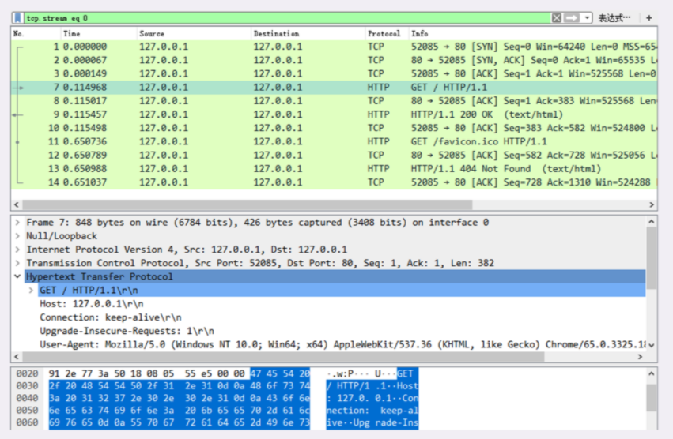
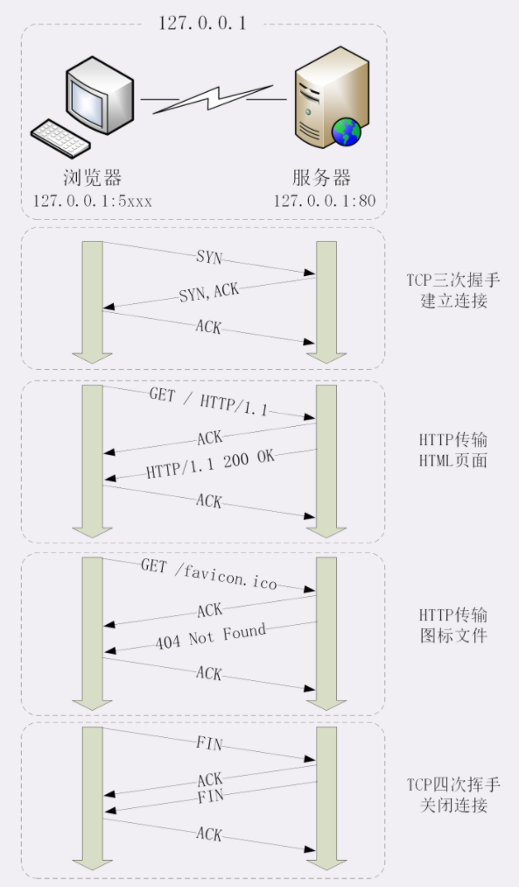
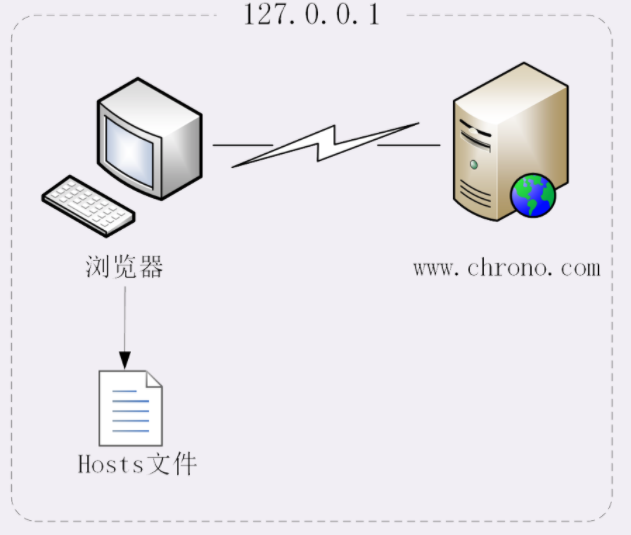

# 080-键入网址再按下回车，后面究竟发生了什么.md

[TOC]

## 总结

1. HTTP 协议基于底层的 TCP/IP 协议，所以必须要用 IP 地址建立连接；
2. 如果不知道 IP 地址，就要用 DNS 协议去解析得到 IP 地址，否则就会连接失败；
3. 建立 TCP 连接后会顺序收发数据，请求方和应答方都必须依据 HTTP 规范构建和解析报文；
4. 为了减少响应时间，整个过程中的每一个环节都会有缓存，能够实现“短路”操作；
5. 虽然现实中的 HTTP 传输过程非常复杂，但理论上仍然可以简化成实验里的“两点”模型。

## Wireshark捕获数据包

在 Chrome 浏览器的地址栏里输入“http://127.0.0.1/”，再按下回车键，等欢迎页面显示出来后 Wireshark 里就会有捕获的数据包，如下图所示。

## 抓包分析

在 Wireshark 里你可以看到，这次一共抓到了 11 个包（这里用了滤包功能，滤掉了 3 个包，原本是 14 个包），耗时 0.65 秒，下面我们就来一起分析一下"键入网址按下回车"后数据传输的全过程。

HTTP 协议是运行在 TCP/IP 基础上的，依靠 TCP/IP 协议来实现数据的可靠传输。所以浏览器要用 HTTP 协议收发数据，**首先要做的就是建立 TCP 连接。**

对应到 Wireshark 里，就是最开始的三个抓包，浏览器使用的端口是 52085，服务器使用的端口是 80，经过 SYN、SYN/ACK、ACK 的三个包之后，浏览器与服务器的 TCP 连接就建立起来了。

有了可靠的 TCP 连接通道后，HTTP 协议就可以开始工作了。于是，浏览器按照 HTTP 协议规定的格式，通过 TCP 发送了一个“GET / HTTP/1.1”请求报文，也就是 Wireshark 里的第四个包。

随后，Web 服务器回复了第五个包，在 TCP 协议层面确认：“刚才的报文我已经收到了”，不过这个 TCP 包 HTTP 协议是看不见的。

Web 服务器收到报文后在内部就要处理这个请求。同样也是依据 HTTP 协议的规定，解析报文，看看浏览器发送这个请求想要干什么。

它一看，原来是要求获取根目录下的默认文件，好吧，那我就从磁盘上把那个文件全读出来，再拼成符合 HTTP 格式的报文，发回去吧。这就是 Wireshark 里的第六个包“HTTP/1.1 200 OK”，底层走的还是 TCP 协议。

同样的，浏览器也要给服务器回复一个 TCP 的 ACK 确认，“你的响应报文收到了，多谢。”，即第七个包。

这时浏览器就收到了响应数据，但里面是什么呢？所以也要解析报文。一看，服务器给我的是个 HTML 文件，好，那我就调用排版引擎、JavaScript 引擎等等处理一下，然后在浏览器窗口里展现出了欢迎页面。

这之后还有两个来回，共四个包，重复了相同的步骤。这是浏览器自动请求了作为网站图标的“favicon.ico”文件，与我们输入的网址无关。但因为我们的实验环境没有这个文件，所以服务器在硬盘上找不到，返回了一个“404 Not Found”。

至此，“键入网址再按下回车”的全过程就结束了。

我为这个过程画了一个交互图，你可以对照着看一下。不过要提醒你，图里 TCP 关闭连接的“四次挥手”在抓包里没有出现，这是因为 HTTP/1.1 长连接特性，默认不会立即关闭连接。

再简要叙述一下这次最简单的浏览器 HTTP 请求过程：

1. 浏览器从地址栏的输入中获得服务器的 IP 地址和端口号；
2. 浏览器用 TCP 的三次握手与服务器建立连接；
3. 浏览器向服务器发送拼好的报文；
4. 服务器收到报文后处理请求，同样拼好报文再发给浏览器；
5. 浏览器解析报文，渲染输出页面。

## 使用域名访问 Web 服务器

浏览器看到了网址里的“www.Chrono.com”，发现它不是数字形式的 IP 地址，那就肯定是域名了，于是就会发起域名解析动作，通过访问一系列的域名解析服务器，试图把这个域名翻译成 TCP/IP 协议里的 IP 地址。

不过因为域名解析的全过程实在是太复杂了，如果每一个域名都要大费周折地去网上查一下，那我们上网肯定会慢得受不了。

所以，在域名解析的过程中会有多级的缓存，

- 浏览器首先看一下自己的缓存里有没有
- 如果没有就向操作系统的缓存要
- 还没有就检查本机域名解析文件 hosts，也就是上一讲中我们修改的“C:\WINDOWS\system32\drivers\etc\hosts”。

刚好，里面有一行映射关系“127.0.0.1 www.Chrono.com”，于是浏览器就知道了域名对应的 IP 地址，就可以愉快地建立 TCP 连接发送 HTTP 请求了。

我把这个过程也画出了一张图，但省略了 TCP/IP 协议的交互部分，里面的浏览器多出了一个访问 hosts 文件的动作，也就是本机的 DNS 解析。

