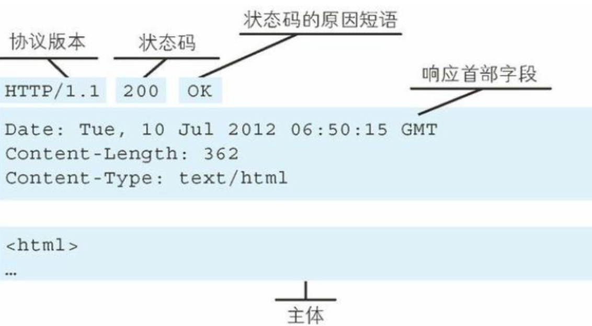
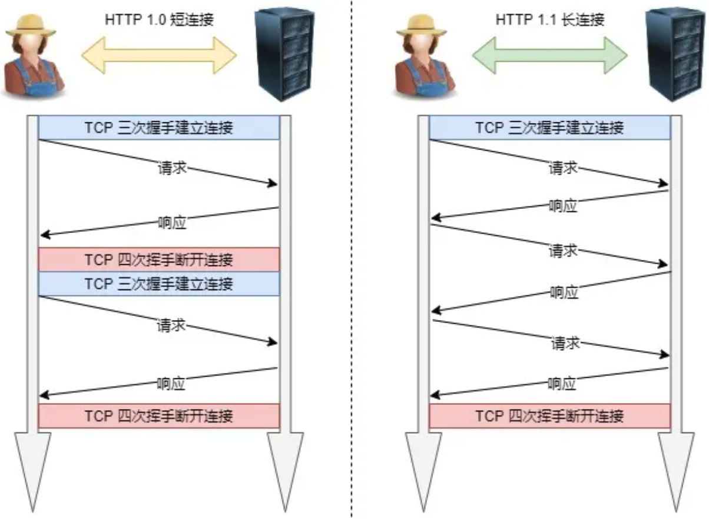
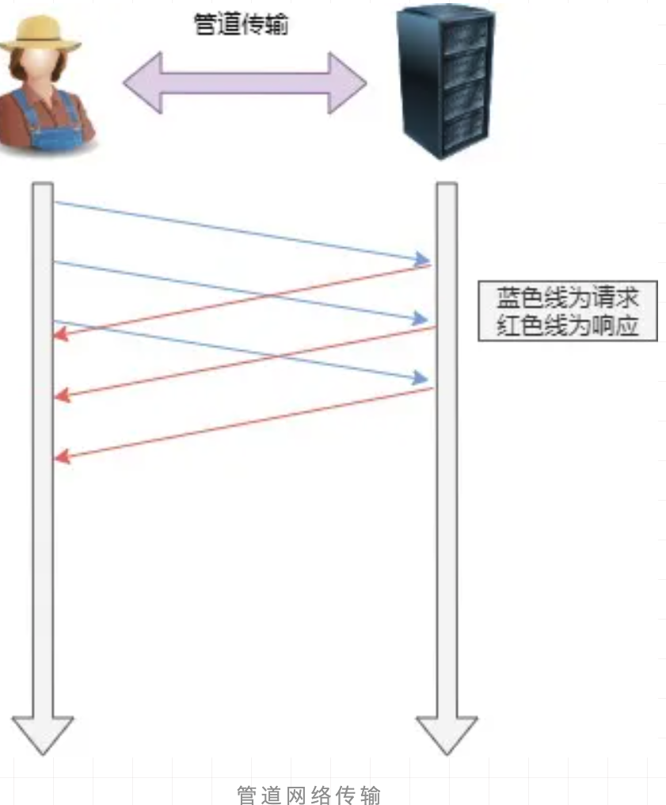
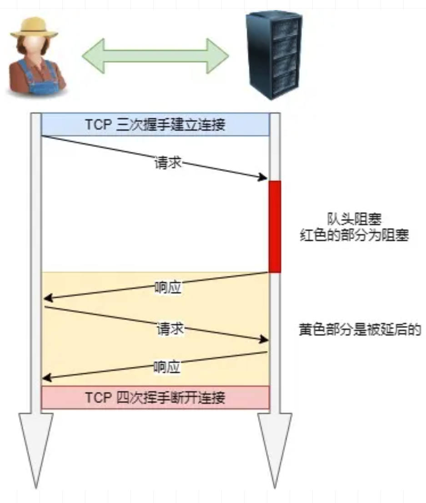

# HTTP 报文

> HTTP 是超文本传输协议，也就是**H**yperText **T**ransfer **P**rotocol。

HTTP是一个无状态的协议,

无状态指的是客户端和服务器之间不需要建立一个持久的链接,

在一个客户端向服务端发出请求并且服务器收到该请求并返回响应(response)后,本次通讯结束,

HTTP 链接将会被关闭,服务器不保留连接的相关信息


## HTTP传输流程

- 地址解析
- 封装 HTTP 数据包
- 封装 TCP数据包
- 建立 TCP 连接
- 客户端发送请求
- 服务端响应
- 服务端关闭 TCP连接

#### 地址解析

通过 DNS (域名服务解析 ip地址),例如

```
http://localhost:8080/index.html
```

- 协议名 http
- 主机名 localhost
- 端口 8080
- 对象路径 index.html

#### 封装 http 包

结合本机的信息封装一个数据包, 例如 浏览器类型, 支持的文件格式等等

#### 建立 TCP 包

将 HTTP请求数据包进一步封装成 TCP 数据包

#### 客户端发送请求

建立连接后,客户端发送TCP 数据包给服务器

#### 服务器响应

服务器在接受到请求后,结合业务逻辑进行数据处理,然后向客户端返回相应的相应信息

- 状态行
- 协议版本号
- 成功或者失败的代码
- 消息体等

#### 服务端关闭 TCP 链接

- 响应结束后就关闭 TCP 链接

- 如果客户端在请求头中加入了 Connection:keep-alive ,则 TCP 链接请求会在响应后保持链接状态

## 常用状态码

- 1XX 提示信息,表示目前是协议处理的中间状态,还需要后续的操作

- **20X 表示成功,报文已经收到并被正确处理** 

  > 「**200 OK**」是最常见的成功状态码，表示一切正常。如果是非 `HEAD` 请求，服务器返回的响应头都会有 body 数据。
  >
  > 「**204 No Content**」也是常见的成功状态码，与 200 OK 基本相同，但响应头没有 body 数据。
  >
  > 「**206 Partial Content**」是应用于 HTTP 分块下载或断电续传，表示响应返回的 body 数据并不是资源的全部，而是其中的一部分，也是服务器处理成功的状态。

- **30X 表示网络重定向; 资源位置发生了变动,需要客户端重新发送请求**

  > `3xx` 类状态码表示客户端请求的资源发送了变动，需要客户端用新的 URL 重新发送请求获取资源，也就是**重定向**。
  >
  > 「**301 Moved Permanently**」表示永久重定向，说明请求的资源已经不存在了，需改用新的 URL 再次访问。
  >
  > 「**302 Moved Permanently**」表示临时重定向，说明请求的资源还在，但暂时需要用另一个 URL 来访问。
  >
  > 301 和 302 都会在响应头里使用字段 `Location`，指明后续要跳转的 URL，浏览器会自动重定向新的 URL。
  >
  > 「**304 Not Modified**」不具有跳转的含义，表示资源未修改，重定向已存在的缓冲文件，也称缓存重定向，用于缓存控制。

- **40X表示客户端错误; 请求报文有误,服务器无法处理**

  > 「**400 Bad Request**」表示客户端请求的报文有错误，但只是个笼统的错误。
  >
  > 「**403 Forbidden**」表示服务器禁止访问资源，并不是客户端的请求出错。
  >
  > 「**404 Not Found**」表示请求的资源在服务器上不存在或未找到，所以无法提供给客户端。

- **50X 表示服务端错误;服务器处理请求时发生了错误**

> `5xx` 类状态码表示客户端请求报文正确，但是**服务器处理时内部发生了错误**，属于服务器端的错误码。
>
> 「**500 Internal Server Error**」与 400 类型，是个笼统通用的错误码，服务器发生了什么错误，我们并不知道。
>
> 「**501 Not Implemented**」表示客户端请求的功能还不支持，类似“即将开业，敬请期待”的意思。
>
> 「**502 Bad Gateway**」通常是服务器作为网关或代理时返回的错误码，表示服务器自身工作正常，访问后端服务器发生了错误。
>
> 「**503 Service Unavailable**」表示服务器当前很忙，暂时无法响应服务器，类似“网络服务正忙，请稍后重试”的意思。


## HTTP 报文的内容


### 请求报文

请求报文格式包含三个部分，**(**

- **请求行**, 请求方法,协议版本,URI

- **请求头** , 请求内容的类型,请求长度等 

  > 

- **请求体** , 内容实体

  


- `Content-Length` 的单位是字节

- HTTP/1.1 版本的默认连接都是持久连接，但为了兼容老版本的 HTTP，需要指定 `Connection` 首部字段的值为 `Keep-Alive`。

- `Content-Encoding` 字段说明数据的压缩方法。表示服务器返回的数据使用了什么压缩格式

  > Content-Encoding: gzip
  >
  > 上面表示服务器返回的数据采用了 gzip 方式压缩，告知客户端需要用此方式解压。
  >
  > 客户端在请求时，用 `Accept-Encoding` 字段说明自己可以接受哪些压缩方法。
  >
  > Accept-Encoding: gzip, deflate

### 响应报文

也是分为

-  **状态行:** 协议版本, 状态码的原因
- **响应头** : 相应的类型
- **响应体 **




#### URL 和 URI

URI 用字符串标识网络资源，而 URL 表示资源的地点(互联网上所处的位置)。可见 URL 是 URI 的子集。

```
http://www.baidu.com:80/java/index.html?name=mic#head
schema://host[:port#]/path/.../?[url-params]#[ query-string]
```

- shcema : **应用层**的协议 (http, ftp, https)
- host : 主机的 ip 或者域名,如果是域名会访问 DNS 服务器获取 ip 地址
- port : 端口, http 默认是 80 , https 默认是 443
- path :  访问资源的路径
- query-string 查询字符串
- `#` 标识跳转页面内的位置

### MIME Type

服务器根据用户请求的资源找到对应的文件以后，会返回一个资源给到客户端浏览器，浏览 器会对这个资源解析并且渲染。但是服务器上的资源类型有很多，比如图片类型、视频类型、 Js、Css、文本等。浏览器如何识别当前类型做不同的渲染呢?

**MIME Type: 是描述消息内容类型的因特网标准，常见的几种类型**

- 文本文件:text/html,text/plain,text/css,application/xhtml+xml,application/xml
- 图片文件:image/jpeg,image/gif,image/png.
- 视频文件:video/mpeg,video/quicktime

我们可以通过两种方式来设置文件的渲染类型，第一种是 Accept，第二种是 Content-Type

- Accept: 表示客户端希望接受的数据类型，即告诉服务器我需要什么媒体类型的数据，此时 服务器应该根据 Accept 请求头生产指定媒体类型的数据
- Content-Type: 表示发送端发送的实体数据类型，比如我们应该写过类似的: `resposne.setContentType(“application/json;charset=utf-8”)`的代码，表示服务端返回的数据 格式是 json。

如果 Accept 和 Content-Type 不一致，假如说 Accept 要接收的类型是 image/gif，但是服务 端返回的数据是 text/html，那么浏览器将会无法解析。

### 如果传输的文件过大怎么办

服务器上返回的资源文件比较大，比如有些 js 文件大小可能就有几兆。文件过大就会影响传 输的效率，同时也会带来带宽的消耗。怎么办呢?

常见的手段是 文件压缩和分割传输

- 对文件进行压缩，减少文件大小。那压缩和解压缩的流程怎么实现呢? 首先服务端需要能支持文件的压缩功能，其次浏览器能够针对被压缩的文件进行解压缩。

浏览器可以指定 `Accept-Encoding` 来高速服务器我当前支持的编码类型` Accept-Encoding:gzip,deflate` 那服务端会根据支持的编码类型，选择合适的类型进行压缩。常见的编码方式有:gzip/deflate

- 分割传输 在传输大容量数据时，通过把数据分割成多块，能够让浏览器逐步显示页面。这种把实体主 体分块的功能称为分块传输编码(Chunked Transfer Coding)。

## 持久连接

在最早的 http 协议中，每进行一次 http 通信，就需要做一次 tcp 的连接。

而一次连接需要进 行 3 次握手，这种通信方式会增加通信量的开销。

HTTP/1.1 持久连接在默认情况下是激活的，除非特别指明，否则 HTTP/1.1 假定所有的连接都是持久的，要在事务处理结束之后将连接关闭，HTTP/1.1 应用程序必须向报文中显示地添加 一个 Connection:close 首部。

HTTP1.1 客户端加载在收到响应后，除非响应中包含了 Connection:close 首部，不然 HTTP/1.1 连接就仍然维持在打开状态。但是，客户端和服务器仍然可以随时关闭空闲的连接。不发送 Connection:close 并不意味这服务器承诺永远将连接保持在打开状态。

#### 管道化连接

 http/1.1 允许在持久连接上使用请求管道。以前发送请求后需等待并收到响应， 才能发送下一个请求。管线化技术出现后，不用等待响应亦可直接发送下一个请求。这样就 能够做到同时并行发送多个请求，而不需要一个接一个地等待响应了。

## Http 协议的特点

- Http 无状态协议
- 客户端支持的 cookie
- 服务端支持的 session

#### http 是无状态协议

HTTP 协议是无状态的，什么是无状态呢?就是说 HTTP 协议本身不会对请求和响应之间的 通信状态做保存。

但是现在的应用都是有状态的，如果是无状态，那这些应用基本没人用，你想想，访问一个 电商网站，先登录，然后去选购商品，当点击一个商品加入购物车以后又提示你登录。这种 用户体验根本不会有人去使用。那我们是如何实现带状态的协议呢?

#### 客户端支持的 cookie

Http 协议中引入了 cookie 技术，用来解决 http 协议无状态的问题。通过在请求和响应报文 中写入 Cookie 信息来控制客户端的状态;

服务器端的响应头上有一个 set-cookie ,通知客户端保存 Cookie。当下次客户端再往该服务器 发送请求时，客户端会自动在请求报文中加入 Cookie 值后发送出去。

#### 那你说下 HTTP/1.1 的性能如何？

早期 HTTP/1.0 性能上的一个很大的问题，那就是每发起一个请求，都要新建一次 TCP 连接（三次握手），而且是串行请求，做了无谓的 TCP 连接建立和断开，增加了通信开销。

为了解决上述 TCP 连接问题，HTTP/1.1 提出了**长连接**的通信方式，也叫持久连接。这种方式的好处在于减少了 TCP 连接的重复建立和断开所造成的额外开销，减轻了服务器端的负载。

持久连接的特点是，只要任意一端没有明确提出断开连接，则保持 TCP 连接状态。



#### *管道网络传输*

HTTP/1.1 采用了长连接的方式，这使得管道（pipeline）网络传输成为了可能。

即可在同一个 TCP 连接里面，客户端可以发起多个请求，只要第一个请求发出去了，不必等其回来，就可以发第二个请求出去，可以**减少整体的响应时间。**

举例来说，客户端需要请求两个资源。以前的做法是，在同一个TCP连接里面，先发送 A 请求，然后等待服务器做出回应，收到后再发出 B 请求。管道机制则是允许浏览器同时发出 A 请求和 B 请求。



但是服务器还是按照**顺序**，先回应 A 请求，完成后再回应 B 请求。要是 前面的回应特别慢，后面就会有许多请求排队等着。这称为「队头堵塞」。

#### *队头阻塞*

「请求 - 应答」的模式加剧了 HTTP 的性能问题。

因为当顺序发送的请求序列中的一个请求因为某种原因被阻塞时，在后面排队的所有请求也一同被阻塞了，会招致客户端一直请求不到数据，这也就是「**队头阻塞**」。**好比上班的路上塞车**。



总之 HTTP/1.1 的性能一般般，后续的 HTTP/2 和 HTTP/3 就是在优化 HTTP 的性能。