# HTTPS

> HTTPS 是安全版的 HTTP , 它在 HTTP 中加入了 SSL 层以提高数据传输的安全性,HTTP 被用于在 web 浏览器和网站服务器之间传输消息,但以明文方式发送内容,不提供任何方式的数据加密
>
> HTTP 不适合传输一些敏感信息,比如身份证号,密码等
>
> 为了数据安全,HTTPS 在 HTTP 的基础上添加了 SSL 协议,SSL 依靠证书来验证服务器的身份,并对浏览器和服务器之间的通讯进行数据加密,保证数据的安全

由于 HTTP 协议在通信过程中，是基于明文通信，并且底层是基于 TCP/IP 协议进行通信，那 么按照 TCP/IP 协议族的工作机制，通信内容在所有的通信线路上都有可能遭到拦截和窃取。 窃取这个过程其实很简单，通过抓包工具 Wireshark 就可以截获请求和响应的内容

由于 HTTP 协议通信的不安全性，所以人们为了防止信息在传输过程中遭到泄漏或者篡改， 就想出来对传输通道进行加密的方式 https。

https 是一种加密的超文本传输协议，它与 HTTP 在协议差异在于对数据传输的过程中，https 对数据做了完全加密。由于 http 协议或者 https 协议都是处于 TCP 传输层之上，同时网络协 议又是一个分层的结构，所以在 tcp 协议层之上增加了一层 **SSL(Secure Socket Layer**，安全层)或者 **TLS(Transport Layer Security)** 安全层传输协议组合使用用于构造加密通道;

## 什么是 SSL 和 TLS

Ssl 是 netscape 公司设计的(Secure sockets layer)，后来互联网标准化组织 ISOC 接替了 NETScape 公司，发布了 SSL 的升级版 TLS。接着 TLS 的版本又进行了多次升级; 实际上我 们现在的 HTTPS 都是用的 TLS 协议，但是由于 SSL 出现的时间比较早，并且依旧被现在浏 览器所支持，因此 SSL 依然是 HTTPS 的代名词。

Https 是在 http 的基础上加了 SSL 层来提高数据传输安全性,SSL 依靠证书来校验服务器的身份,并对浏览器和服务器之间的通讯进行数据加密,以保障数据传输的安全性,端口 443

- **发送请求**

客户端通过 TCP和服务端建立连接后,发出一个请求证书的消息给服务器,在请求头里会加上自己可以实现的算法列表以及其他信息

- **证书返回**

服务端接受到消息后返回证书,证书中包含服务器信息,域名,注册公司,公钥,数据加密算法等

- **证书校验**
  - 客户端收到证书后,判断证书签发机构是否正确,
  - 判断证书签发机构的公钥确定签名是否有效
  - 判断证书中列出的域名是否是正在连接的域名
  - 以上都正确,生成对称秘钥,并使用公钥将对称秘钥加密

- 密钥交换

客户端将加密后的对称秘钥发送给服务端,服务端在接受到对称秘钥后使用私钥解密

- 数据传输

使用对称加密进行通讯,加密和解密使用相同的秘钥的加密算法

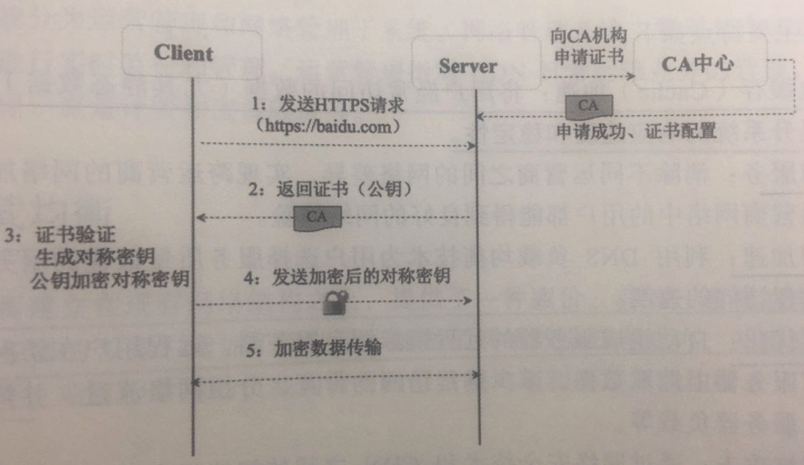

## 逆向推导 https 的设计过程

- 裸奔, 不带任何加密算法
- 对称加密
  - 如果所有浏览器都使用同一个密钥,跟裸奔无异
  - 如果每个客户端生成不同的秘钥, 那么在建立连接的时候,肯定有协商算法的过程,这个过程是明文的,不安全
- 非对称加密
  - 传输过程,公钥有可能会被掉包
- 第三方机构(https CA)

#### 裸奔时代

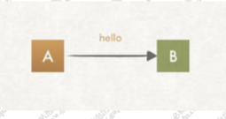

客户端 A 向服务端 B 发送一条消息，这个消息可能会被拦截以及篡改，我们如何做到 A 发送 给 B 的数据包，及时被拦截了，也没办法得知消息内容并且也不能查看呢?

#### 对称加密

要做到消息不能被第三方查看以及篡改，那么第一想法就是对内容进行加密，同时，该消息还需要能被服务端进行解密。所以我们可以使用对称加密算法来实现，密钥 S 扮演着加密和 解密的角色。在密钥 S 不公开的情况下，就可以保证安全性?

##### **直接使用对称加密的缺陷**

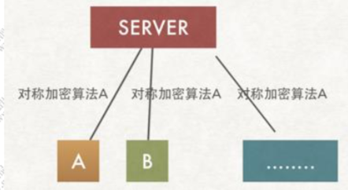

一个服务器对应多个客户端, 所以会存在多个客户端和服务端产生连接，而这个客户端也许是一个潜伏者，如果他也有对称密 钥 S，那相当于上面的方案是不可行的?如果服务端和每个客户端通信的时候使用不同的加密算法呢?

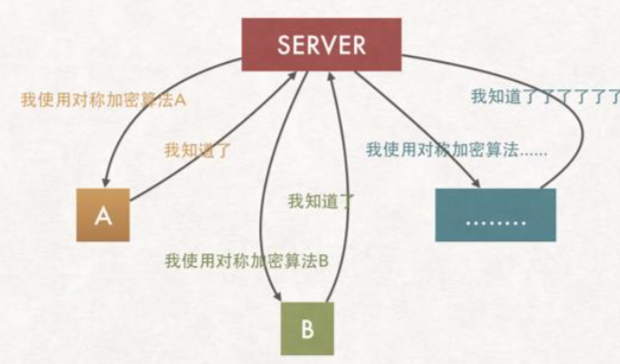

##### 问题:协商过程不安全

不同的客户端在连接服务器的时候,就需要去获取到一对公私钥,客户端请求服务器获取私钥,这个过程又不安全,可能被拦截

## 引入认证中心

引入认证中心

- 服务端把 要传递给客户端的公钥 通过第三方机构提供的私钥进行加密,加上其他信息后形成证书

- 客户端拿到证书(使用第三方秘钥加密)以后,通过验签进行解密拿到服务端的公钥

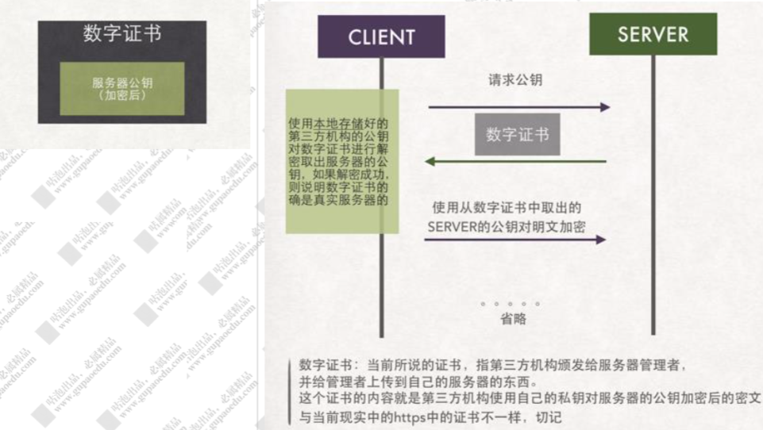

#### 证书颁发过程和客户端解密过程

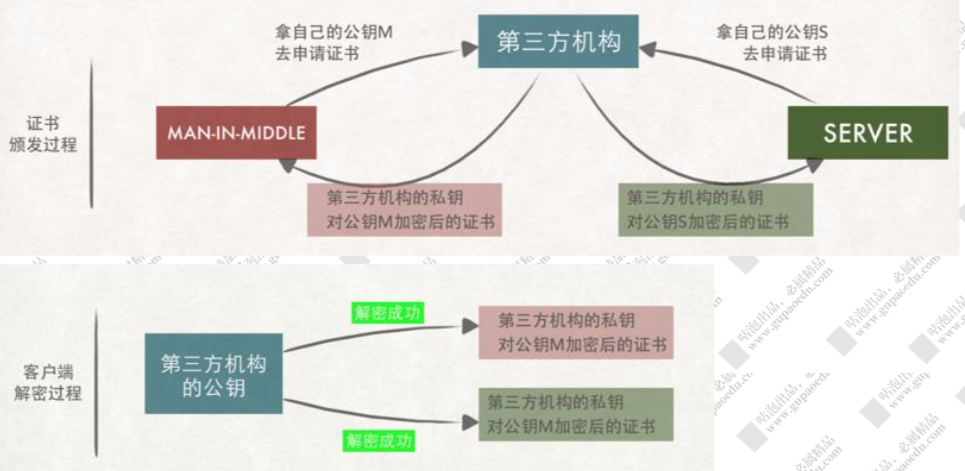

## 非对称加密

非对称加密算法的特点是:私钥加密后的密文，只要有公钥，都能解密，但是公钥加密后的密文，只有私钥可以解密。

私钥只有一个人有，而公钥可以发给所有人

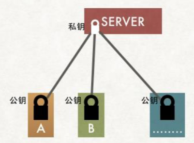

这样就可以保证 A/B 向服务器端方向发送的消息是安全的

##### 问题:公钥有可能被掉包

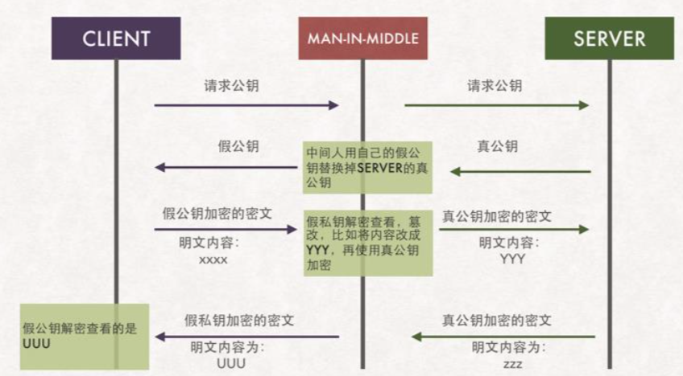

## 验证证书的有效性

客户端拿到证书后根据证书上的方法自己生 成一个证书编号，如果生成的证书编号与证书上的证书编号相同，那么说明这个证书是真实 的。这块有点类似于 md5 的验证，我们下载一个软件包，都会提供一个 md5 的值，我们可 以拿到这个软件包以后通过一个第三方软件去生成一个 md5 值去做比较，是不是一样如果 一样表示这个软件包没被篡改过

对服务端的数据进行 MD5 算法得到一个 MD5 的值，生成证书编号，使用第三方机构 的私钥对这个证书编号进行加密，并且会在 证书中添加证书编号的生成算法

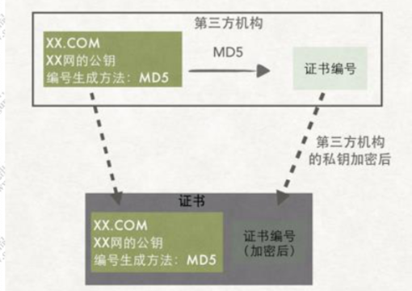

浏览器内置的 CA 公钥可以解密服务端 CA 私钥加密的证书，通过浏览器内置的 CA 证书的 证书编号算法对服务端返回的证书编号进行验签

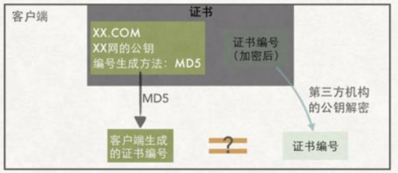

#### 第三方机构的公钥证书存哪里?

浏览器和操作系统都会维护一个权威的第三方机构列表(包括他们的公钥) 因为客户端接收到的证书中会些颁发机构，客户端就根据这个办法机构的值在本地找到响应 的公钥

## HTTPS 申请过程

1. 服务器上生成 CSR 文件(证书申请文件，内容包括证书公钥、使用的 Hash 签名算法、申 请的域名、公司名称、职位等信息)

   > 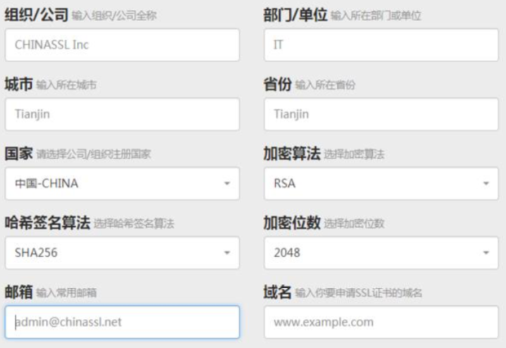
   >
   > 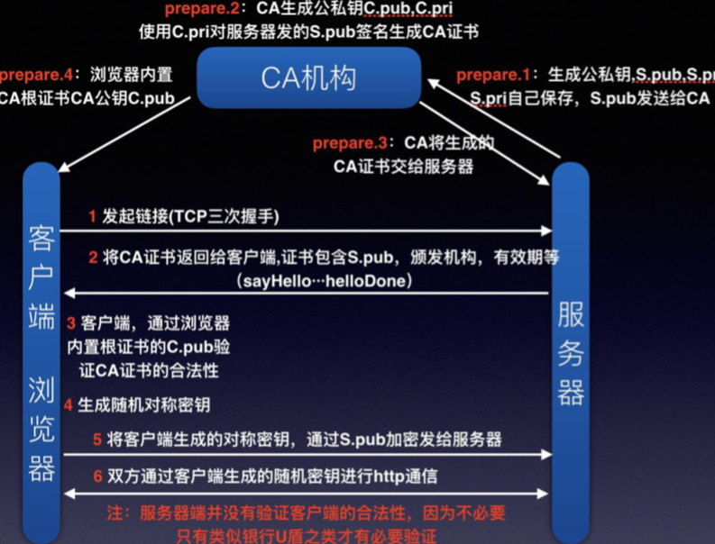

2. 把 CSR 文件和其他可能的证件上传到 CA 认证机构，CA 机构收到证书申请之后，使用申请 中的 Hash 算法，对部分内容进行摘要，然后使用 CA 机构自己的私钥对这段摘要信息进行 签名(相当于证书的唯一编号)

3.  然后 CA 机构把签名过的证书通过邮件形式发送到申请者手中。 4. 申请者收到证书之后部署到自己的 web 服务器中

## HTTPS 交互过程

https 应用实战

1. 客户端发起请求(Client Hello 包)
  - 三次握手，建立 TCP 连接 
  - 支持的协议版本(TLS/SSL)
  - 客户端生成的随机数  client.random，后续用于生成“对话密钥”
  -  客户端支持的加密算法
  - sessionid，用于保持同一个会话(如果客户端与服务器费尽周折建立了一个 HTTPS 链接， 刚建完就断了，也太可惜)
2. 服务端收到请求，然后响应(Server Hello)
  - 确认加密通道协议版本
  - 服务端生成的随机数 server.random，后续用于生成“对话密钥” 
  - 确认使用的加密算法(用于后续的握手消息进行签名防止篡改) 
  - 服务器证书(CA 机构颁发给服务端的证书)
3. 客户端收到证书进行验证
  1. 验证证书是否是上级 CA 签发的, 在验证证书的时候，浏览器会调用系统的证书管理器
    接口对证书路径中的所有证书一级一级的进行验证，只有路径中所有的证书都是受信的，
    整个验证的结果才是受信
  2. 服务端返回的证书中会包含证书的有效期，可以通过失效日期来验证 证书是否过期
  3. 验证证书是否被吊销了
  4. 前面我们知道 CA 机构在签发证书的时候，都会使用自己的私钥对证书进行签名
    证书里的签名算法字段 sha256RSA 表示 CA 机构使用 sha256 对证书进行摘要，然后 使用 RSA 算法对摘要进行私钥签名，而我们也知道 RSA 算法中，使用私钥签名之后， 只有公钥才能进行验签。
  5. 浏览器使用内置在操作系统上的 CA 机构的公钥对服务器的证书进行验签。确定这个证 书是不是由正规的机构颁发。验签之后得知 CA 机构使用 sha256 进行证书摘要，然后 客户端再使用 sha256 对证书内容进行一次摘要，如果得到的值和服务端返回的证书验 签之后的摘要相同，表示证书没有被修改过
  6. 验证通过后，就会显示绿色的安全字样
  7. 客户端生成随机数，验证通过之后，客户端会生成一个随机数 pre-master secret，客户
    端根据之前的:`Client.random + sever.random + pre-master` 生成对称密钥然后使用证书中的公钥进行加密，同时利用前面协商好的 HASH 算法,把握手消息取 HASH 值， 然后用 随机数加密 “握手消息+握手消息 HASH 值(签名)” 并一起发送给服务端 (在 这里之所以要取握手消息的 HASH 值，主要是把握手消息做一个签名，用于验证握手 消息在传输过程中没有被篡改过。)

4. 服务端接收随机数
  1. 服务端收到客户端的加密数据以后，用自己的私钥对密文进行解密。然后得到
    `client.random/server.random/pre-master secret`, HASH 值，并与传过来的 HASH 值做
    对比确认是否一致。
  2.  然后用随机密码加密一段握手消息(握手消息+握手消息的 HASH 值 )给客户端
5. 客户端接收消息
  1. 客户端用随机数解密并计算握手消息的 HASH，如果与服务端发来的 HASH 一致，此
    时握手过程结束，
  2. 之后所有的通信数据将由之前交互过程中生成的` pre master secret /client.random/server.random` 通过算法得出 session Key，作为后续交互过程中的对称 密钥

