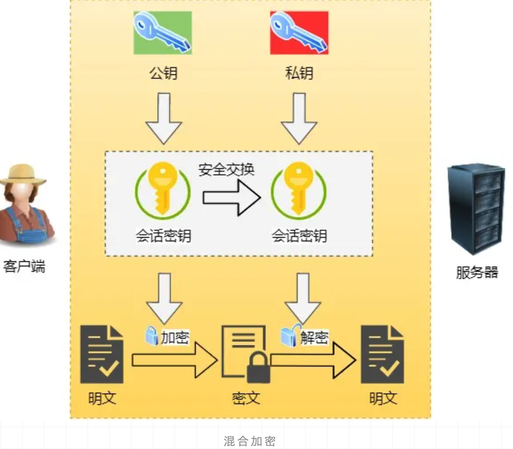
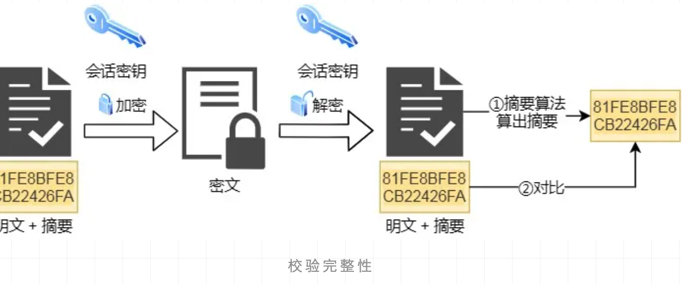
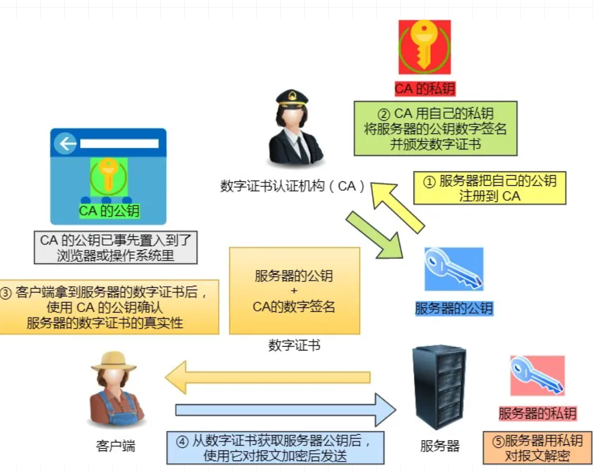
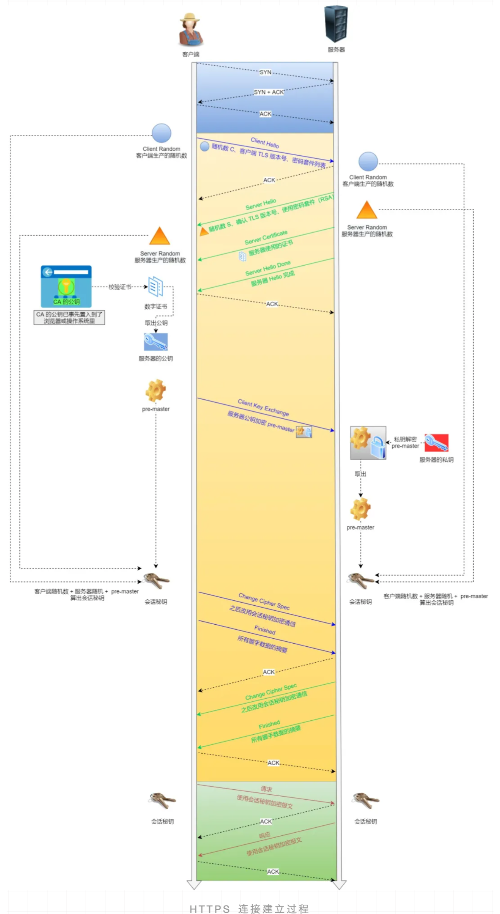
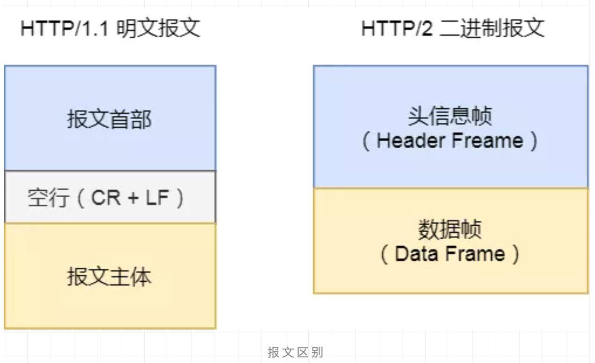
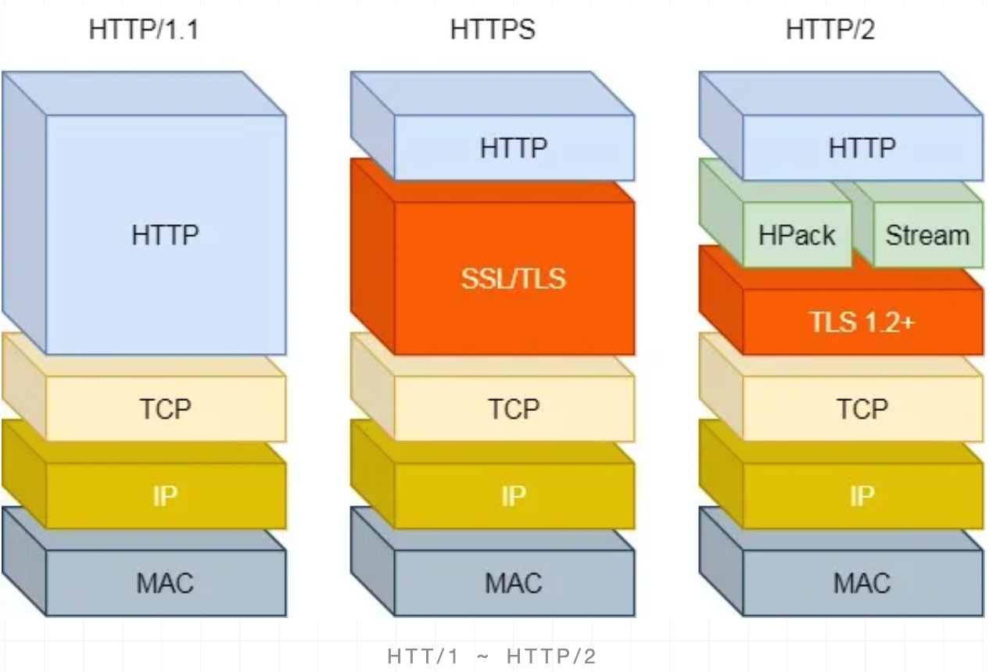
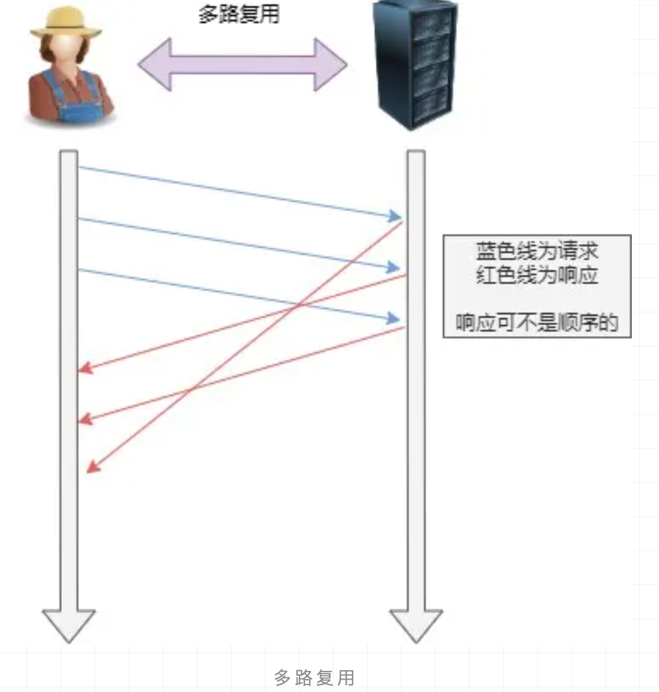
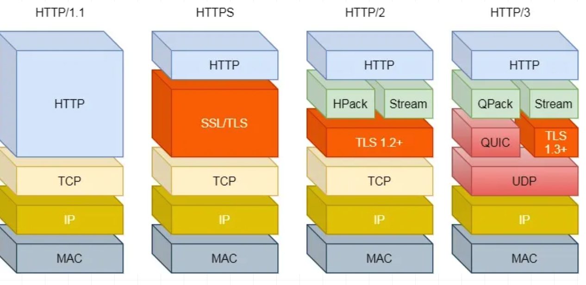
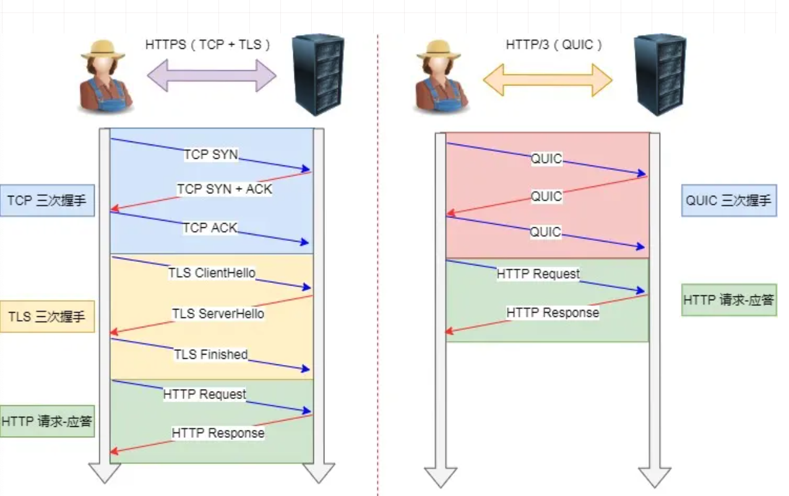

# HTTPS

> HTTPS 是安全版的 HTTP , 它在 HTTP 中加入了 SSL 层以提高数据传输的安全性,HTTP 被用于在 web 浏览器和网站服务器之间传输消息,但以明文方式发送内容,不提供任何方式的数据加密
>
> HTTP 不适合传输一些敏感信息,比如身份证号,密码等
>
> 为了数据安全,HTTPS 在 HTTP 的基础上添加了 SSL 协议,SSL 依靠证书来验证服务器的身份,并对浏览器和服务器之间的通讯进行数据加密,保证数据的安全
>
> 

由于 HTTP 协议在通信过程中，是基于明文通信，并且底层是基于 TCP/IP 协议进行通信，那 么按照 TCP/IP 协议族的工作机制，通信内容在所有的通信线路上都有可能遭到拦截和窃取。 窃取这个过程其实很简单，通过抓包工具 Wireshark 就可以截获请求和响应的内容

由于 HTTP 协议通信的不安全性，所以人们为了防止信息在传输过程中遭到泄漏或者篡改， 就想出来对传输通道进行加密的方式 https。

https 是一种加密的超文本传输协议，它与 HTTP 在协议差异在于对数据传输的过程中，https 对数据做了完全加密。由于 http 协议或者 https 协议都是处于 TCP 传输层之上，同时网络协 议又是一个分层的结构，所以在 tcp 协议层之上增加了一层 **SSL(Secure Socket Layer**，安全层)或者 **TLS(Transport Layer Security)** 安全层传输协议组合使用用于构造加密通道;

## 什么是 SSL 和 TLS

Ssl 是 netscape 公司设计的(Secure sockets layer)，后来互联网标准化组织 ISOC 接替了 NETScape 公司，发布了 SSL 的升级版 TLS。接着 TLS 的版本又进行了多次升级; 实际上我 们现在的 HTTPS 都是用的 TLS 协议，但是由于 SSL 出现的时间比较早，并且依旧被现在浏 览器所支持，因此 SSL 依然是 HTTPS 的代名词。

Https 是在 http 的基础上加了 SSL 层来提高数据传输安全性,SSL 依靠证书来校验服务器的身份,并对浏览器和服务器之间的通讯进行数据加密,以保障数据传输的安全性,端口 443

- **发送请求**

客户端通过 TCP和服务端建立连接后,发出一个请求证书的消息给服务器,在请求头里会加上自己可以实现的算法列表以及其他信息

- **证书返回**

服务端接受到消息后返回证书,证书中包含服务器信息,域名,注册公司,公钥,数据加密算法等

- **证书校验**
  - 客户端收到证书后,判断证书签发机构是否正确,
  - 判断证书签发机构的公钥确定签名是否有效
  - 判断证书中列出的域名是否是正在连接的域名
  - 以上都正确,生成对称秘钥,并使用公钥将对称秘钥加密

- 密钥交换

客户端将加密后的对称秘钥发送给服务端,服务端在接受到对称秘钥后使用私钥解密

- 数据传输

使用对称加密进行通讯,加密和解密使用相同的秘钥的加密算法

## 逆向推导 https 的设计过程

- 裸奔, 不带任何加密算法
- 对称加密
  - 如果所有浏览器都使用同一个密钥,跟裸奔无异
  - 如果每个客户端生成不同的秘钥, 那么在建立连接的时候,肯定有协商算法的过程,这个过程是明文的,不安全
- 非对称加密
  - 传输过程,公钥有可能会被掉包
- 第三方机构(https CA)

#### 裸奔时代

客户端 A 向服务端 B 发送一条消息，这个消息可能会被拦截以及篡改，我们如何做到 A 发送 给 B 的数据包，及时被拦截了，也没办法得知消息内容并且也不能查看呢?

#### 对称加密

要做到消息不能被第三方查看以及篡改，那么第一想法就是对内容进行加密，同时，该消息还需要能被服务端进行解密。所以我们可以使用对称加密算法来实现，密钥 S 扮演着加密和 解密的角色。在密钥 S 不公开的情况下，就可以保证安全性?

##### **直接使用对称加密的缺陷**

一个服务器对应多个客户端, 所以会存在多个客户端和服务端产生连接，而这个客户端也许是一个潜伏者，如果他也有对称密 钥 S，那相当于上面的方案是不可行的?如果服务端和每个客户端通信的时候使用不同的加密算法呢?

##### 问题:协商过程不安全

不同的客户端在连接服务器的时候,就需要去获取到一对公私钥,客户端请求服务器获取私钥,这个过程又不安全,可能被拦截

## 引入认证中心

引入认证中心

- 服务端把 要传递给客户端的公钥 通过第三方机构提供的私钥进行加密,加上其他信息后形成证书

- 客户端拿到证书(使用第三方秘钥加密)以后,通过验签进行解密拿到服务端的公钥

#### 证书颁发过程和客户端解密过程

## 非对称加密

非对称加密算法的特点是:私钥加密后的密文，只要有公钥，都能解密，但是公钥加密后的密文，只有私钥可以解密。

私钥只有一个人有，而公钥可以发给所有人

这样就可以保证 A/B 向服务器端方向发送的消息是安全的

##### 问题:公钥有可能被掉包

## 验证证书的有效性

客户端拿到证书后根据证书上的方法自己生 成一个证书编号，如果生成的证书编号与证书上的证书编号相同，那么说明这个证书是真实 的。这块有点类似于 md5 的验证，我们下载一个软件包，都会提供一个 md5 的值，我们可 以拿到这个软件包以后通过一个第三方软件去生成一个 md5 值去做比较，是不是一样如果 一样表示这个软件包没被篡改过

对服务端的数据进行 MD5 算法得到一个 MD5 的值，生成证书编号，使用第三方机构 的私钥对这个证书编号进行加密，并且会在 证书中添加证书编号的生成算法

浏览器内置的 CA 公钥可以解密服务端 CA 私钥加密的证书，通过浏览器内置的 CA 证书的 证书编号算法对服务端返回的证书编号进行验签

#### 第三方机构的公钥证书存哪里?

浏览器和操作系统都会维护一个权威的第三方机构列表(包括他们的公钥) 因为客户端接收到的证书中会些颁发机构，客户端就根据这个办法机构的值在本地找到响应 的公钥

## HTTPS 申请过程

1. 服务器上生成 CSR 文件(证书申请文件，内容包括证书公钥、使用的 Hash 签名算法、申 请的域名、公司名称、职位等信息)

   > 
   >
   > 

2. 把 CSR 文件和其他可能的证件上传到 CA 认证机构，CA 机构收到证书申请之后，使用申请 中的 Hash 算法，对部分内容进行摘要，然后使用 CA 机构自己的私钥对这段摘要信息进行 签名(相当于证书的唯一编号)

3.  然后 CA 机构把签名过的证书通过邮件形式发送到申请者手中。 4. 申请者收到证书之后部署到自己的 web 服务器中

## HTTPS 交互过程

https 应用实战

1. 客户端发起请求(Client Hello 包)
  - 三次握手，建立 TCP 连接 
  - 支持的协议版本(TLS/SSL)
  - 客户端生成的随机数  client.random，后续用于生成“对话密钥”
  -  客户端支持的加密算法
  - sessionid，用于保持同一个会话(如果客户端与服务器费尽周折建立了一个 HTTPS 链接， 刚建完就断了，也太可惜)
2. 服务端收到请求，然后响应(Server Hello)
  - 确认加密通道协议版本
  - 服务端生成的随机数 server.random，后续用于生成“对话密钥” 
  - 确认使用的加密算法(用于后续的握手消息进行签名防止篡改) 
  - 服务器证书(CA 机构颁发给服务端的证书)
3. 客户端收到证书进行验证
  1. 验证证书是否是上级 CA 签发的, 在验证证书的时候，浏览器会调用系统的证书管理器
    接口对证书路径中的所有证书一级一级的进行验证，只有路径中所有的证书都是受信的，
    整个验证的结果才是受信
  2. 服务端返回的证书中会包含证书的有效期，可以通过失效日期来验证 证书是否过期
  3. 验证证书是否被吊销了
  4. 前面我们知道 CA 机构在签发证书的时候，都会使用自己的私钥对证书进行签名证书里的签名算法字段 sha256RSA 表示 CA 机构使用 sha256 对证书进行摘要，然后 使用 RSA 算法对摘要进行私钥签名，而我们也知道 RSsA 算法中，使用私钥签名之后， 只有公钥才能进行验签。
  5. 浏览器使用内置在操作系统上的 CA 机构的公钥对服务器的证书进行验签。确定这个证 书是不是由正规的机构颁发。验签之后得知 CA 机构使用 sha256 进行证书摘要，然后 客户端再使用 sha256 对证书内容进行一次摘要，如果得到的值和服务端返回的证书验 签之后的摘要相同，表示证书没有被修改过
  6. 验证通过后，就会显示绿色的安全字样
  7. 客户端生成随机数，验证通过之后，客户端会生成一个随机数 pre-master secret，客户
    端根据之前的:`Client.random + sever.random + pre-master` 生成对称密钥然后使用证书中的公钥进行加密，同时利用前面协商好的 HASH 算法,把握手消息取 HASH 值， 然后用 随机数加密 “握手消息+握手消息 HASH 值(签名)” 并一起发送给服务端 (在 这里之所以要取握手消息的 HASH 值，主要是把握手消息做一个签名，用于验证握手 消息在传输过程中没有被篡改过。)
  
4. 服务端接收随机数
  1. 服务端收到客户端的加密数据以后，用自己的私钥对密文进行解密。然后得到
    `client.random/server.random/pre-master secret`, HASH 值，并与传过来的 HASH 值做
    对比确认是否一致。
  2.  然后用随机密码加密一段握手消息(握手消息+握手消息的 HASH 值 )给客户端
5. 客户端接收消息
  1. 客户端用随机数解密并计算握手消息的 HASH，如果与服务端发来的 HASH 一致，此
    时握手过程结束，
  2. 之后所有的通信数据将由之前交互过程中生成的` pre master secret /client.random/server.random` 通过算法得出 session Key，作为后续交互过程中的对称 密钥

## 问题

> https://mp.weixin.qq.com/s/amOya0M00LwpL5kCS96Y6w

> HTTP 与 HTTPS 有哪些区别？

1. HTTP 是超文本传输协议，信息是明文传输，存在安全风险的问题。HTTPS 则解决 HTTP 不安全的缺陷，在 TCP 和 HTTP 网络层之间加入了 SSL/TLS 安全协议，使得报文能够加密传输。
2. HTTP 连接建立相对简单， TCP 三次握手之后便可进行 HTTP 的报文传输。而 HTTPS 在 TCP 三次握手之后，还需进行 SSL/TLS 的握手过程，才可进入加密报文传输。
3. HTTP 的端口号是 80，HTTPS 的端口号是 443。
4. HTTPS 协议需要向 CA（证书权威机构）申请数字证书，来保证服务器的身份是可信的。

> HTTPS 解决了 HTTP 的哪些问题？

HTTP 由于是明文传输，所以安全上存在以下三个风险：

- **窃听风险**，比如通信链路上可以获取通信内容，用户号容易没。
- **篡改风险**，比如强制入垃圾广告，视觉污染，用户眼容易瞎。
- **冒充风险**，比如冒充淘宝网站，用户钱容易没。

HTTP**S** 在 HTTP 与 TCP 层之间加入了 `SSL/TLS` 协议。可以很好的解决了上述的风险：

- **信息加密**：交互信息无法被窃取，但你的号会因为「自身忘记」账号而没。
- **校验机制**：无法篡改通信内容，篡改了就不能正常显示，但百度「竞价排名」依然可以搜索垃圾广告。
- **身份证书**：证明淘宝是真的淘宝网，但你的钱还是会因为「剁手」而没。

> HTTPS 是如何解决上面的三个风险的？

- **混合加密**的方式实现信息的**机密性**，解决了窃听的风险。
- **摘要算法**的方式来实现**完整性**，它能够为数据生成独一无二的「指纹」，指纹用于校验数据的完整性，解决了篡改的风险。
- 将服务器公钥放入到**数字证书**中，解决了冒充的风险。

## *混合加密*

通过**混合加密**的方式可以保证信息的**机密性**，解决了窃听的风险。

HTTPS 采用的是**对称加密**和**非对称加密**结合的「混合加密」方式：

- 在通信建立前采用**非对称加密**的方式交换「会话秘钥」，后续就不再使用非对称加密。
- 在通信过程中全部使用**对称加密**的「会话秘钥」的方式加密明文数据。

采用「混合加密」的方式的原因：

- **对称加密**只使用一个密钥，运算速度快，密钥必须保密，无法做到安全的密钥交换。
- **非对称加密**使用两个密钥：公钥和私钥，公钥可以任意分发而私钥保密，解决了密钥交换问题但速度慢。

## *摘要算法*

**摘要算法**用来实现**完整性**，能够为数据生成独一无二的「指纹」，用于校验数据的完整性，解决了篡改的风险。

客户端在发送明文之前会通过摘要算法算出明文的「指纹」，发送的时候把「指纹 + 明文」一同
加密成密文后，发送给服务器，服务器解密后，用相同的摘要算法算出发送过来的明文，通过比较客户端携带的「指纹」和当前算出的「指纹」做比较，若「指纹」相同，说明数据是完整的。

## *数字证书*

客户端先向服务器端索要公钥，然后用公钥加密信息，服务器收到密文后，用自己的私钥解密。

这就存在些问题，如何保证公钥不被篡改和信任度？

所以这里就需要借助第三方权威机构 `CA` （数字证书认证机构），将**服务器公钥放在数字证书**（由数字证书认证机构颁发）中，只要证书是可信的，公钥就是可信的。

> HTTPS  是如何建立连接的？其间交互了什么？

SSL/TLS 协议基本流程：

- 客户端向服务器索要并验证服务器的公钥。
- 双方协商生产「会话秘钥」。
- 双方采用「会话秘钥」进行加密通信。

前两步也就是 SSL/TLS 的建立过程，也就是握手阶段。

SSL/TLS 的「握手阶段」涉及**四次**通信，可见下图：

SSL/TLS 协议建立的详细流程：

*1. ClientHello*

首先，由客户端向服务器发起加密通信请求，也就是 `ClientHello` 请求。

在这一步，客户端主要向服务器发送以下信息：

（1）客户端支持的 SSL/TLS 协议版本，如 TLS 1.2 版本。

（2）客户端生产的随机数（`Client Random`），后面用于生产「会话秘钥」。

（3）客户端支持的密码套件列表，如 RSA 加密算法。

*2. SeverHello*

服务器收到客户端请求后，向客户端发出响应，也就是 `SeverHello`。服务器回应的内容有如下内容：

（1）确认 SSL/ TLS 协议版本，如果浏览器不支持，则关闭加密通信。

（2）服务器生产的随机数（`Server Random`），后面用于生产「会话秘钥」。

（3）确认的密码套件列表，如 RSA 加密算法。

（4）服务器的数字证书。

*3.客户端回应*

客户端收到服务器的回应之后，首先通过浏览器或者操作系统中的 CA 公钥，确认服务器的数字证书的真实性。

如果证书没有问题，客户端会从数字证书中取出服务器的公钥，然后使用它加密报文，向服务器发送如下信息：

（1）一个随机数（`pre-master key`）。该随机数会被服务器公钥加密。

（2）加密通信算法改变通知，表示随后的信息都将用「会话秘钥」加密通信。

（3）客户端握手结束通知，表示客户端的握手阶段已经结束。这一项同时把之前所有内容的发生的数据做个摘要，用来供服务端校验。

上面第一项的随机数是整个握手阶段的第三个随机数，这样服务器和客户端就同时有三个随机数，接着就用双方协商的加密算法，**各自生成**本次通信的「会话秘钥」。

*4. 服务器的最后回应*

服务器收到客户端的第三个随机数（`pre-master key`）之后，通过协商的加密算法，计算出本次通信的「会话秘钥」。然后，向客户端发生最后的信息：

（1）加密通信算法改变通知，表示随后的信息都将用「会话秘钥」加密通信。

（2）服务器握手结束通知，表示服务器的握手阶段已经结束。这一项同时把之前所有内容的发生的数据做个摘要，用来供客户端校验。

至此，整个 SSL/TLS 的握手阶段全部结束。接下来，客户端与服务器进入加密通信，就完全是使用普通的 HTTP 协议，只不过用「会话秘钥」加密内容。

##  HTTP/1.1、HTTP/2、HTTP/3 演变

> 说说 HTTP/1.1 相比 HTTP/1.0 提高了什么性能？

HTTP/1.1 相比 HTTP/1.0 性能上的改进：

- 使用 TCP 长连接的方式改善了 HTTP/1.0 短连接造成的性能开销。
- 支持 管道（pipeline）网络传输，只要第一个请求发出去了，不必等其回来，就可以发第二个请求出去，可以减少整体的响应时间。

但 HTTP/1.1 还是有性能瓶颈：

- 请求 / 响应头部（Header）未经压缩就发送，首部信息越多延迟越大。只能压缩 `Body` 的部分；
- 发送冗长的首部。每次互相发送相同的首部造成的浪费较多；
- 服务器是按请求的顺序响应的，如果服务器响应慢，会招致客户端一直请求不到数据，也就是队头阻塞；
- 没有请求优先级控制；
- 请求只能从客户端开始，服务器只能被动响应。

> 那上面的 HTTP/1.1 的性能瓶颈，HTTP/2 做了什么优化？

HTTP/2 协议是基于 HTTPS 的，所以 HTTP/2 的安全性也是有保障的。

那 HTTP/2 相比 HTTP/1.1 性能上的改进：

*1. 头部压缩*

HTTP/2 会**压缩头**（Header）如果你同时发出多个请求，他们的头是一样的或是相似的，那么，协议会帮你**消除重复的分**。

这就是所谓的 `HPACK` 算法：在客户端和服务器同时维护一张头信息表，所有字段都会存入这个表，生成一个索引号，以后就不发送同样字段了，只发送索引号，这样就**提高速度**了。

*2. 二进制格式*

HTTP/2 不再像 HTTP/1.1 里的纯文本形式的报文，而是全面采用了**二进制格式。**

头信息和数据体都是二进制，并且统称为帧（frame）：**头信息帧和数据帧**。

这样虽然对人不友好，但是对计算机非常友好，因为计算机只懂二进制，那么收到报文后，无需再将明文的报文转成二进制，而是直接解析二进制报文，这**增加了数据传输的效率**。

 *数据流*

HTTP/2 的数据包不是按顺序发送的，同一个连接里面连续的数据包，可能属于不同的回应。因此，必须要对数据包做标记，指出它属于哪个回应。

每个请求或回应的所有数据包，称为一个数据流（`Stream`）。

每个数据流都标记着一个独一无二的编号，其中规定客户端发出的数据流编号为奇数， 服务器发出的数据流编号为偶数

客户端还可以**指定数据流的优先级**。优先级高的请求，服务器就先响应该请求。

*多路复用*

HTTP/2 是可以在**一个连接中并发多个请求或回应，而不用按照顺序一一对应**。

移除了 HTTP/1.1 中的串行请求，不需要排队等待，也就不会再出现「队头阻塞」问题，**降低了延迟，大幅度提高了连接的利用率**。

举例来说，在一个 TCP 连接里，服务器收到了客户端 A 和 B 的两个请求，如果发现 A 处理过程非常耗时，于是就回应 A 请求已经处理好的部分，接着回应 B 请求，完成后，再回应 A 请求剩下的部分。

#### *服务器推送*

HTTP/2 还在一定程度上改善了传统的「请求 - 应答」工作模式，服务不再是被动地响应，也可以**主动**向客户端发送消息。

举例来说，在浏览器刚请求 HTML 的时候，就提前把可能会用到的 JS、CSS 文件等静态资源主动发给客户端，**减少延时的等待**，也就是服务器推送（Server Push，也叫 Cache Push）。

> HTTP/2 有哪些缺陷？HTTP/3 做了哪些优化？

HTTP/2 主要的问题在于：多个 HTTP 请求在复用一个 TCP 连接，下层的 TCP 协议是不知道有多少个 HTTP 请求的。

所以一旦发生了丢包现象，就会触发 TCP 的重传机制，这样在一个 TCP 连接中的**所有的 HTTP 请求都必须等待这个丢了的包被重传回来**。

- HTTP/1.1 中的管道（ pipeline）传输中如果有一个请求阻塞了，那么队列后请求也统统被阻塞住了
- HTTP/2 多请求复用一个TCP连接，一旦发生丢包，就会阻塞住所有的 HTTP 请求。

这都是基于 TCP 传输层的问题，所以 **HTTP/3 把 HTTP 下层的 TCP 协议改成了 UDP！**

UDP 发生是不管顺序，也不管丢包的，所以不会出现 HTTP/1.1 的队头阻塞 和 HTTP/2 的一个丢包全部重传问题。

大家都知道 UDP 是不可靠传输的，但基于 UDP 的 **QUIC 协议** 可以实现类似 TCP 的可靠性传输。

- QUIC 有自己的一套机制可以保证传输的可靠性的。当某个流发生丢包时，只会阻塞这个流，**其他流不会受到影响**。
- TL3 升级成了最新的 `1.3` 版本，头部压缩算法也升级成了 `QPack`。
- HTTPS 要建立一个连接，要花费 6 次交互，先是建立三次握手，然后是 `TLS/1.3` 的三次握手。QUIC 直接把以往的 TCP 和 `TLS/1.3` 的 6 次交互**合并成了 3 次，减少了交互次数**。

所以， QUIC 是一个在 UDP 之上的**伪** TCP + TLS + HTTP/2 的多路复用的协议。

QUIC 是新协议，对于很多网络设备，根本不知道什么是 QUIC，只会当做 UDP，这样会出现新的问题。所以 HTTP/3 现在普及的进度非常的缓慢，不知道未来 UDP 是否能够逆袭 TCP。

