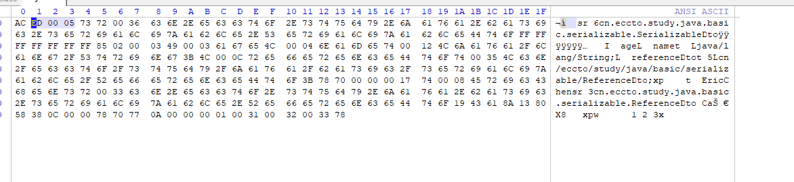

# 序列化和反序列化

**序列化本质上指把一个 java 对象转换成字节数组的过程,反序列化是把字节数组转化成 Java 对象的过程**

> java.io.NotSerializableException 如果不实现接口

## 什么序列化,为什么我们要序列化

Java 对象在 JVM 运行的时候被创建, 更新, 或者销毁, 当 JVM 退出时,对象也会随之销毁

在现实应用中,我们常常需要将对象以及其状态在多个应用之间传递, 共享, 例如在一个应用中将对象以及其状态持久化, 在其他地方重新读取被保存的对象以及其状态继续进行处理

**序列化就是将对象以及其状态保存成一组字节数组中,其中**

- **序列化和反序列化必须序列化 ID 一致**,如果不一致会报错,没有写,jvm 会默认生成一个(安全校验)

```java
private static final long serialVersionUid = 1234567889L
```

- **静态变量不会被序列化**
- **transient 修饰的变量不会被序列化**
- 可以通过写` writeObject `方法和 `readObject` 方法定制序列化实现

## 开发中怎么实现序列化

- 对象实现`Serializable`接口, 可以实现默认的序列化机制,可以通过定义`writeObject` 和 `readObject`来自定义序列化的实现

- 对象实现 `Externalizable` 接口, 重写`writeExternal`方法和`readExternal`方来定义序列化的实现

## Transient

Transient 关键字的作用是控制变量的序列化，在变量声明前加上该关键字，可以阻止该变 量被序列化到文件中，在被反序列化后，transient 变量的值被设为初始值，如 int 型的是 0，对象型的是 null。

#### 绕开 transient 机制的办法

在标有 transient 在序列化时会被忽略,我们可以通过在实体类中写`writeObject`方法和`readObject`方法在自定义序列化机制

#### writeObject 和 readObject 原理

writeObject 和 readObject 是两个私有的方法，他们是`ObjectInputStream` 和 `ObjectOutPutStream`中触发的


readObject 方法会在反序列化时通过反射调用


#### Java 序列化的一些简单总结

1. Java 序列化只是针对对象的状态进行保存，至于对象中的方法，序列化不关心
2. 当一个父类实现了序列化，那么子类会自动实现序列化，不需要显示实现序列化接口
3. 当一个对象的实例变量引用了其他对象，序列化这个对象的时候会自动把引用的对象也进
 行序列化(实现深度克隆),引用对象也需要实现序列化接口
4. 当某个字段被申明为 transient 后，默认的序列化机制会忽略这个字段
5. 被申明为 transient 的字段，如果需要序列化，可以添加两个私有方法:writeObject 和
readObject


## 序列化方式

- JDK 自带的序列化,将对象转化为字节数组
- XML 序列化,可读性比较好,缺点是数组长度太长,传输效率低
- JSON 序列化,字节流更小，而且可读性也非常好,比较主流
- Hessian 序列化框架

Hessian 是一个支持跨语言传输的二进制序列化协议，相对于 Java 默认的序列化机制来说， Hessian 具有更好的性能和易用性，而且支持多种不同的语言,实际上 Dubbo 采用的就是 Hessian 序列化来实现，只不过 Dubbo 对 Hessian 进行了重构， 性能更高

- Avro 序列化

Avro 是一个数据序列化系统，设计用于支持大批量数据交换的应用。它的主要特点有:支持 二进制序列化方式，可以便捷，快速地处理大量数据;动态语言友好，Avro 提供的机制使动 态语言可以方便地处理 Avro 数据

- kyro 序列化框架

Kryo 是一种非常成熟的序列化实现，已经在 Hive、Storm)中使用得比较广泛，不过它不能 跨语言. 目前 dubbo 已经在 2.6 版本支持 kyro 的序列化机制。它的性能要优于之前的 hessian2

- Protobuf 序列化框架

Protobuf 是 Google 的一种数据交换格式，它独立于语言、独立于平台。Google 提供了多种 语言来实现，比如 Java、C、Go、Python，每一种实现都包含了相应语言的编译器和库文件， Protobuf 是一个纯粹的表示层协议，可以和各种传输层协议一起使用。
Protobuf 使用比较广泛，主要是空间开销小和性能比较好，非常适合用于公司内部对性能要 求高的 RPC 调用。 另外由于解析性能比较高，序列化以后数据量相对较少，所以也可以应 用在对象的持久化场景中
但是要使用 Protobuf 会相对来说麻烦些，因为他有自己的语法，有自己的编译器，如果需要 用到的话必须要去投入成本在这个技术的学习中
protobuf 有个缺点就是要传输的每一个类的结构都要生成对应的 proto 文件，如果某个类发 生修改，还得重新生成该类对应的 proto 文件

## 序列化技术的选型

技术层面

1. 序列化空间开销，也就是序列化产生的结果大小，这个影响到传输的性能
2. 序列化过程中消耗的时长，序列化消耗时间过长影响到业务的响应时间
3. 序列化协议是否支持跨平台，跨语言。因为现在的架构更加灵活，如果存在异构系统通信
 需求，那么这个是必须要考虑的
4. 可扩展性/兼容性，在实际业务开发中，系统往往需要随着需求的快速迭代来实现快速更新，
这就要求我们采用的序列化协议基于良好的可扩展性/兼容性，比如在现有的序列化数据结
 构中新增一个业务字段，不会影响到现有的服务
5. 技术的流行程度，越流行的技术意味着使用的公司多，那么很多坑都已经淌过并且得到了解决，技术解决方案也相对成熟 6. 学习难度和易用性

选型建议
1. 对性能要求不高的场景，可以采用基于 XML 的 SOAP 协议
2. 对性能和间接性有比较高要求的场景，那么 Hessian、Protobuf、Thrift、Avro 都可以。
3. 基于前后端分离，或者独立的对外的 api 服务，选用 JSON 是比较好的，对于调试、可读
性都很不错
4. Avro 设计理念偏于动态类型语言，那么这类的场景使用 Avro 是可以的

各个序列化技术的性能比较

>  这 个 地 址 有 针 对 不 同 序 列 化 技 术 进 行 性 能 比 较 : https://github.com/eishay/jvm- serializers/wiki

## Protobuf 序列化的原理

protobuf 的基本应用
使用 protobuf 开发的一般步骤是

1. 配置开发环境，安装 protocol compiler 代码编译器
2. 编写.proto 文件，定义序列化对象的数据结构
3. 基于编写的.proto 文件，使用 protocol compiler 编译器生成对应的序列化/反序列化工具
类
4. 基于自动生成的代码，编写自己的序列化应用

## QA

#### 什么是序列化和反序列化

> 序列化本质上指把一个 java 对象转换成字节数组的过程,反序列化是把字节数组转化成 Java 对象的过程
>
> 我们都知道,Java对象随着 JVM退出就销毁了,但是在应用中,我们往往要在其他地方重新读取被保存的对象以及其状态,比如应用之间传递对象状态,持久化对象,

#### 怎么实现序列化

- 对象实现`Serializable`接口, 可以实现默认的序列化机制,可以通过定义`writeObject` 和 `readObject`来自定义序列化的实现
- 对象实现 `Externalizable` 接口, 重写`writeExternal`方法和`readExternal`方来定义序列化的实现 (Externalizable 继承了 Seriablizable

```
public interface Externalizable extends Serializable {
    void writeExternal(ObjectOutput var1) throws IOException;

    void readExternal(ObjectInput var1) throws IOException, ClassNotFoundException;
}
```

#### 实现序列化的细节

- 序列化和反序列化的 serialVersionUID要一致,不然会报错确保数据的版本
- 序列化不保存静态变量
- Transient 可以指定变量不序列化

##### 常见的序列化框架

>  看上面

#### 序列化底层实现

生成一个`ObjectStreamClass`类文件描述对象


## 源码分析

ObjectOutputStream的实现很复杂，建议读者们先对ObjectOutputStream源码的主要方法先过一遍再往下看。
ObjectOutputStream类定义：

```
public class ObjectOutputStream extends OutputStream 
        implements ObjectOutput, ObjectStreamConstants {
    //...
}
```

ObjectOutputStream继承了OutputStream类，实现了ObjectOutput接口和ObjectStreamConstants接口
ObjectStreamConstants接口并没有定义方法，其内部定义了很多byte类型常量，表示序列化后的单个字节数据的含义。

了解完这些成员变量后，我们从几个最常用的序列化操作为切入点分析：ObjectOutputStream的构造方法和writeObject方法。
ObjectOutputStream的构造方法：

```public ObjectOutputStream(OutputStream out) throws IOException {
public ObjectOutputStream(OutputStream out) throws IOException {
    //检查继承权限
    verifySubclass();
    //构造一个BlockDataOutputStream用于向out写入序列化数据
    bout = new BlockDataOutputStream(out);
    //构造一个大小为10，负载因子为3的HandleTable和ReplaceTable
    handles = new HandleTable(10, (float) 3.00);
    subs = new ReplaceTable(10, (float) 3.00);
    //恒为false，除非子类调用protected构造方法
    enableOverride = false;
    writeStreamHeader();
    //将缓存模式打开，写入数据时先写入缓冲区
    bout.setBlockDataMode(true);
    if (extendedDebugInfo) {
        debugInfoStack = new DebugTraceInfoStack();
    } else {
        debugInfoStack = null;
    }
}

```


BlockDataOutputStream是ObjectOutputStream的内部类，它将构造ObjectOutputStream传入的OutputStream实例包装起来，当外部类ObjectOutputStream需要向这个OutputStream写入序列化数据时，就由这个类来完成实际的写入操作。

构造方法首先调用verifySubclass方法分析现在构造的是不是ObjectOutputStream的子类，即：

```
private void verifySubclass() {
    Class<?> cl = getClass();
    //如果构造的不是ObjectOutputStream的子类则直接返回
    if (cl == ObjectOutputStream.class)
        return;
    //否则获取安全管理器检查是否有继承ObjectOutputStream的权限
    SecurityManager sm = System.getSecurityManager();
    if (sm == null)
        return;
    //移除Caches中已经失去引用的Class对象
    processQueue(Caches.subclassAuditsQueue, Caches.subclassAudits);
    //将ObjectOutputStream的子类存入Caches
    WeakClassKey key = new WeakClassKey(cl, Caches.subclassAuditsQueue);

    Boolean result = Caches.subclassAudits.get(key);
    if (result == null) {
        result = Boolean.valueOf(auditSubclass(cl));
        Caches.subclassAudits.putIfAbsent(key, result);
    }
    if (result.booleanValue())
        return;
    //如果没有权限则抛出SecurityException异常
    sm.checkPermission(SUBCLASS_IMPLEMENTATION_PERMISSION);
}
```

该方法如果识别到构造的是ObjectOutputStream的子类，则会检查是否拥有SUBCLASS_IMPLEMENTATION_PERMISSION权限，否则抛出SecurityException异常。
另外，ObjectOutputStream通过一个Cache静态内部类中的ConcurrentHashMap来缓存ObjectOutputStream子类信的息。Class类通过内部类WeakClassKey（继承WeakReference，将一个弱引用指向一个Class对象）存储。


```
private static class Caches {
    static final ConcurrentMap<WeakClassKey,Boolean> subclassAudits = new ConcurrentHashMap<>();
    static final ReferenceQueue<Class<?>> subclassAuditsQueue = new ReferenceQueue<>();
}
```


在进行完ObjectOutputStream的类型检查后，构造方法会随之构建一个BlockDataOutputStream用于向传入的OutputStream写入对象信息，并构建长度为10，负载因子为3的HandleTable和ReplaceTable。随后，将魔数(0xACED)和版本标识符(0x0005)写入文件头，用来检测是不是一个序列化对象。

```
protected void writeStreamHeader() throws IOException {
    bout.writeShort(STREAM_MAGIC); //写入两个字节：0xAC和0xED
    bout.writeShort(STREAM_VERSION); //写入两个字节:0x00和0x05
}
```

```
/**
     * Magic number that is written to the stream header. 序列化文件的魔数 ACED
     */
    final static short STREAM_MAGIC = (short)0xaced;

    /**
     * Version number that is written to the stream header.
     */
    final static short STREAM_VERSION = 5;
```



最后根据sun.io.serialization.extendedDebugInfo配置信息决定是否启用调式信息栈。

```
private static final boolean extendedDebugInfo =
        java.security.AccessController.doPrivileged(
            new sun.security.action.GetBooleanAction(
                "sun.io.serialization.extendedDebugInfo")).booleanValue();

```


如果extendedDebugInfo为true，则构造方法会构造一个DebugTraceInfoStack，否则置为null。

构造完ObjectOutputStream对象后，我们一般会随之调用writeObject(Object)方法将对象写入


```
public final void writeObject(Object obj) throws IOException {
    //在ObjectOutputStream中这个变量恒为false，只有子类为true
    if (enableOverride) {
        //实现为空，供子类重写用
        writeObjectOverride(obj);
        return;
    }
    try {
        writeObject0(obj, false);
    } catch (IOException ex) {
        if (depth == 0)
            writeFatalException(ex);
        throw ex;
    }
}
```


writeObject方法首先会检查是否是ObjectOutputStream的子类，如果是则调用writeObjectOverride方法，这个方法默认实现为空，需要子类根据实际业务需求定制序列化方法。
随后调用writeObject0方法

```
private void writeObject0(Object obj, boolean unshared) throws IOException {
    //关闭缓冲模式，直接向目标OutputStream写入数据
    boolean oldMode = bout.setBlockDataMode(false);
    depth++;
    try {
        int h;
        //处理以前写过的和不可替换的对象
        //如果obj为null(只有当obj为null时才会返回null)
        if ((obj = subs.lookup(obj)) == null) {
            writeNull();
            return;
        } else if (!unshared && (h = handles.lookup(obj)) != -1) {
            writeHandle(h);
            return;
        } else if (obj instanceof Class) {
            writeClass((Class) obj, unshared);
            return;
        } else if (obj instanceof ObjectStreamClass) {
            writeClassDesc((ObjectStreamClass) obj, unshared);
            return;
        }

        Object orig = obj;
        Class<?> cl = obj.getClass();
        //序列化对象对应的Class对象的详细信息
        ObjectStreamClass desc;
        for (;;) {
            Class<?> repCl;
            //获取序列化对象对应的Class对象详细信息，待会会讨论ObjectStreamClass
            desc = ObjectStreamClass.lookup(cl, true);
            //直接break，因为最后(repCl=obj.getClass())==null恒等于true(我也不知道为什么这里要有for循环)
            if (!desc.hasWriteReplaceMethod() ||
                    (obj = desc.invokeWriteReplace(obj)) == null ||
                    (repCl = obj.getClass()) == cl)
                    break;
                cl = repCl;
        }
        if (enableReplace) {
            //replaceObject用来替换这个对象进行序列化，默认实现为空，一般用于子类重写实现序列化的定制
            Object rep = replaceObject(obj);
            //如果对象被替换了
            if (rep != obj && rep != null) {
                cl = rep.getClass();
                //重新查找对应的ObjectStreamClass
                desc = ObjectStreamClass.lookup(cl, true);
            }
            obj = rep;
        }

        //如果对象被替换了(非ObjectOutputStream子类不会发生)
        if (obj != orig) {
            subs.assign(orig, obj);
            if (obj == null) {
                writeNull();
                return;
            } else if (!unshared && (h = handles.lookup(obj)) != -1) {
                writeHandle(h);
                return;
            } else if (obj instanceof Class) {
                writeClass((Class) obj, unshared);
                return;
            } else if (obj instanceof ObjectStreamClass) {
                writeClassDesc((ObjectStreamClass) obj, unshared);
                return;
            }
        }

        //序列化对象类型为String、数组、枚举时，调用定制的写入方法
        if (obj instanceof String) {
            writeString((String) obj, unshared);
        } else if (cl.isArray()) {
            writeArray(obj, desc, unshared);
        } else if (obj instanceof Enum) {
            writeEnum((Enum<?>) obj, desc, unshared);
        //一般对象类型的写入(当然需要实现序列化接口)
        } else if (obj instanceof Serializable) {
            writeOrdinaryObject(obj, desc, unshared);
        //如果没有实现序列化接口会抛出异常
        } else {
            if (extendedDebugInfo)
                throw new NotSerializableException(cl.getName() + "\n" + debugInfoStack.toString());
            else
                throw new NotSerializableException(cl.getName());
        }
    } finally {
        //结束方法前将方法栈深减去1
        depth--;
        bout.setBlockDataMode(oldMode);
    }
}

```


ObjectStreamClass存储了一个Class对象的信息，其实例变量包括：Class对象，Class名称，serialVersionUID，实现了Serializable接口还是 Externalizable接口，非transient修饰的变量，自定义的writeObject和readObject的Method对象。

下面来看ObjectStreamClass的lookup方法：

```
static ObjectStreamClass lookup(Class<?> cl, boolean all) {
    //如果all为false且cl并没有实现Serializable接口则直接返回null
    if (!(all || Serializable.class.isAssignableFrom(cl))) {
        return null;
    }
    //清除失去Class引用的ObjectStreamClass缓存
    //(缓存的用途是避免反复对同一个Class创建ObjectStreamClass对象)
    processQueue(Caches.localDescsQueue, Caches.localDescs);
    //创建一个临时的WeakClassKey用于从缓存中查找对应的ObjectStreamClass或EntryFuture
    WeakClassKey key = new WeakClassKey(cl, Caches.localDescsQueue);
    //获取保存有ObjectStreamClass或EntryFuture的引用
    Reference<?> ref = Caches.localDescs.get(key);
    Object entry = null;
    //如果引用不为null则直接获取其中的对象给entry
    if (ref != null) {
        entry = ref.get();
    }
    EntryFuture future = null;
    //如果引用的对象被GC
    if (entry == null) {
        //创建一个EntryFuture对象并将软引用newRef指向它
        EntryFuture newEntry = new EntryFuture();
        Reference<?> newRef = new SoftReference<>(newEntry);
        do {
            //从缓存中删除这个失去引用的键值对
            if (ref != null)
                Caches.localDescs.remove(key, ref);
            //将被newRef引用的EntryFuture添加到缓存（这里使用putIfAbsent而不是put可能是为了防止有其它线程已经添加了）
            ref = Caches.localDescs.putIfAbsent(key, newRef);
            if (ref != null)
                entry = ref.get();
        //循环直到ref为null或entry不为null
        } while (ref != null && entry == null);
        //如果entry为null
        if (entry == null)
            future = newEntry;
    }
    //如果从缓存中拿到了ObjectStreamClass
    if (entry instanceof ObjectStreamClass) {
        return (ObjectStreamClass) entry;
    }
    //如果从缓存中得到了EntryFuture
    if (entry instanceof EntryFuture) {
        future = (EntryFuture) entry;
        //如果创建这个EntryFuture的线程就是当前线程，即这个EntryFuture
        //是在前面的代码ref = Caches.localDescs.putIfAbsent(key, newRef);语句中设置的
        if (future.getOwner() == Thread.currentThread()) {
            entry = null;
        } else {
            entry = future.get();
        }
    }
    //如果entry为null那么就创建一个新的ObjectStreamClass对象并加入缓存
    if (entry == null) {
        try {
            entry = new ObjectStreamClass(cl);
        } catch (Throwable th) {
            entry = th;
        }
        //设置这个ObjectStreamClass实例
        if (future.set(entry)) {
            Caches.localDescs.put(key, new SoftReference<Object>(entry));
        } else {
            entry = future.get();
        }
    }
    //最后如果entry为ObjectOutputStream则直接返回，否则抛出异常
    if (entry instanceof ObjectStreamClass) {
        return (ObjectStreamClass) entry;
    } else if (entry instanceof RuntimeException) {
        throw (RuntimeException) entry;
    } else if (entry instanceof Error) {
        throw (Error) entry;
    } else {
        throw new InternalError("unexpected entry: " + entry);
    }
}

```


在ObjectStreamClass类的内部类Caches中，存在一个类型为ConcurrentMap的静态成员变量localDescs：

```
static final ConcurrentMap<WeakClassKey,Reference<?>> localDescs = new ConcurrentHashMap<>();
private static final ReferenceQueue<Class<?>> localDescsQueue = new ReferenceQueue<>();

```


ObjectStreamClass引入这个缓存主要是为了提高获取类信息的速度，如果反复对一个类的实例们进行序列化操作，那么只需要实例化一个ObjectStreamClass实例并导入这个缓存。
WeakClassKey继承WeakReference，将一个弱引用指向这个Class对象，当对应的ClassLoader失去引用时，不至于导致垃圾回收器无法回收这个Class对象。
引用队列localDescsQueue主要用于processQueue方法清除localDescs中无用的缓存。

至于ObjectStreamClass的内部类EntryFuture的作用，我个人认为是为了实现多线程调用lookup方法而设立的。

```java
private static class EntryFuture {
    private static final Object unset = new Object();
    private final Thread owner = Thread.currentThread();
    private Object entry = unset;

    //entry是ObjectStreamClass实例
    synchronized boolean set(Object entry) {
        if (this.entry != unset)
                return false;
        this.entry = entry;
        //entry已被设置，唤醒正在调用get方法的线程
        notifyAll();
        return true;
    }

    synchronized Object get() {
        boolean interrupted = false;
        while (entry == unset) {
            try {
                //等待到entry被set为止
                wait();
            } catch (InterruptedException ex) {
                interrupted = true;
            }
        }
        //如果被强制打断则返回null
        if (interrupted) {
            AccessController.doPrivileged(
                new PrivilegedAction<Void>() {
                    public Void run() {
                        Thread.currentThread().interrupt();
                        return null;
                    }
                });
        }
        //如果是正常被set方法唤醒的则直接返回设置好的ObjectStreamClass
        return entry;
    }
    //返回创建这个EntryFuture的线程
    Thread getOwner() {
        return owner;
    }
}

```


现在回到writeObject0方法中
在获取到ObjectStreamClass对象后，会判断需要序列化的类是哪种类型。
下面我们就只分析writeOrdinaryObject方法：

```java
private void writeOrdinaryObject(Object obj, ObjectStreamClass desc,
         boolean unshared) throws IOException {
    if (extendedDebugInfo)
        debugInfoStack.push(
                (depth == 1 ? "root " : "") + "object (class \"" +
                obj.getClass().getName() + "\", " + obj.toString() + ")");
    try {
        //检查ObjectStreamClass对象
        desc.checkSerialize();
        //写入字节0x73
        bout.writeByte(TC_OBJECT);
        //写入对应的Class对象的信息
        writeClassDesc(desc, false);
        handles.assign(unshared ? null : obj);
        if (desc.isExternalizable() && !desc.isProxy()) {
            writeExternalData((Externalizable) obj);
        } else {
            //写入这个对象变量信息及其父类的成员变量
            writeSerialData(obj, desc);
        }
    } finally {
        if (extendedDebugInfo) {
            debugInfoStack.pop();
        }
    }
}

```


writeOrdinaryObject最终会以一种递归的形式写入对象信息。
writeSerialData方法会将这个实例及其父类基本数据类型写入文件，如果检测到有引用类型，那么会继续调用writeObject0方法写入，直到将这个对象包含的所有信息全部序列化为止。

