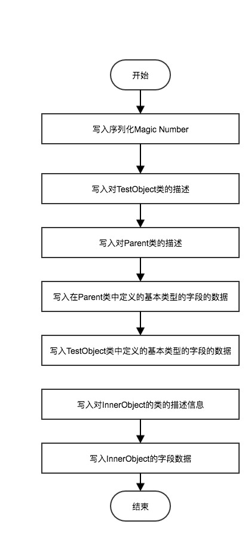

# 序列化底层实现

## 目录

- [序列化源码分析](#序列化源码分析)
- [反序列化源码分析](#反序列化源码分析)

生成一个`ObjectStreamClass`类文件描述对象



## 序列化源码分析

ObjectOutputStream的实现很复杂，建议读者们先对ObjectOutputStream源码的主要方法先过一遍再往下看。
ObjectOutputStream类定义：

```
public class ObjectOutputStream extends OutputStream 
        implements ObjectOutput, ObjectStreamConstants {
    //...
}
```

ObjectOutputStream继承了OutputStream类，实现了ObjectOutput接口和ObjectStreamConstants接口
ObjectStreamConstants接口并没有定义方法，其内部定义了很多byte类型常量，表示序列化后的单个字节数据的含义。

了解完这些成员变量后，我们从几个最常用的序列化操作为切入点分析：ObjectOutputStream的构造方法和writeObject方法。
ObjectOutputStream的构造方法：

```java
public ObjectOutputStream(OutputStream out) throws IOException {
    //检查继承权限
    verifySubclass();
    //构造一个BlockDataOutputStream用于向out写入序列化数据
    bout = new BlockDataOutputStream(out);
    //构造一个大小为10，负载因子为3的HandleTable和ReplaceTable
    handles = new HandleTable(10, (float) 3.00);
    subs = new ReplaceTable(10, (float) 3.00);
    //恒为false，除非子类调用protected构造方法
    enableOverride = false;
    writeStreamHeader();
    //将缓存模式打开，写入数据时先写入缓冲区
    bout.setBlockDataMode(true);
    if (extendedDebugInfo) {
        debugInfoStack = new DebugTraceInfoStack();
    } else {
        debugInfoStack = null;
    }
}

```


`BlockDataOutputStream` 是 `ObjectOutputStream`的内部类，它将构造`ObjectOutputStream`传入的`OutputStream`实例包装起来，当外部类ObjectOutputStream需要向这个OutputStream写入序列化数据时，就由这个类来完成实际的写入操作。

构造方法首先调用verifySubclass方法分析现在构造的是不是ObjectOutputStream的子类，即：

```java
private void verifySubclass() {
    Class<?> cl = getClass();
    //如果构造的不是ObjectOutputStream的子类则直接返回
    if (cl == ObjectOutputStream.class)
        return;
    //否则获取安全管理器检查是否有继承ObjectOutputStream的权限
    SecurityManager sm = System.getSecurityManager();
    if (sm == null)
        return;
    //移除Caches中已经失去引用的Class对象
    processQueue(Caches.subclassAuditsQueue, Caches.subclassAudits);
    //将ObjectOutputStream的子类存入Caches
    WeakClassKey key = new WeakClassKey(cl, Caches.subclassAuditsQueue);

    Boolean result = Caches.subclassAudits.get(key);
    if (result == null) {
        result = Boolean.valueOf(auditSubclass(cl));
        Caches.subclassAudits.putIfAbsent(key, result);
    }
    if (result.booleanValue())
        return;
    //如果没有权限则抛出SecurityException异常
    sm.checkPermission(SUBCLASS_IMPLEMENTATION_PERMISSION);
}
```

该方法如果识别到构造的是ObjectOutputStream的子类，则会检查是否拥有SUBCLASS_IMPLEMENTATION_PERMISSION权限，否则抛出SecurityException异常。
另外，ObjectOutputStream通过一个Cache静态内部类中的ConcurrentHashMap来缓存ObjectOutputStream子类信的息。Class类通过内部类WeakClassKey（继承WeakReference，将一个弱引用指向一个Class对象）存储。


```java
private static class Caches {
    static final ConcurrentMap<WeakClassKey,Boolean> subclassAudits = new ConcurrentHashMap<>();
    static final ReferenceQueue<Class<?>> subclassAuditsQueue = new ReferenceQueue<>();
}
```


在进行完ObjectOutputStream的类型检查后，构造方法会随之构建一个BlockDataOutputStream用于向传入的OutputStream写入对象信息，并构建长度为10，负载因子为3的HandleTable和ReplaceTable。随后，将魔数(0xACED)和版本标识符(0x0005)写入文件头，用来检测是不是一个序列化对象。

```java
protected void writeStreamHeader() throws IOException {
    bout.writeShort(STREAM_MAGIC); //写入两个字节：0xAC和0xED
    bout.writeShort(STREAM_VERSION); //写入两个字节:0x00和0x05
}
```

```java
/**
     * Magic number that is written to the stream header. 序列化文件的魔数 ACED
     */
    final static short STREAM_MAGIC = (short)0xaced;

    /**
     * Version number that is written to the stream header.
     */
    final static short STREAM_VERSION = 5;
```


最后根据sun.io.serialization.extendedDebugInfo配置信息决定是否启用调式信息栈。

```java
private static final boolean extendedDebugInfo =
        java.security.AccessController.doPrivileged(
            new sun.security.action.GetBooleanAction(
                "sun.io.serialization.extendedDebugInfo")).booleanValue();

```

如果extendedDebugInfo为true，则构造方法会构造一个DebugTraceInfoStack，否则置为null。

构造完ObjectOutputStream对象后，我们一般会随之调用writeObject(Object)方法将对象写入

```java
public final void writeObject(Object obj) throws IOException {
    //在ObjectOutputStream中这个变量恒为false，只有子类为true
    if (enableOverride) {
        //实现为空，供子类重写用
        writeObjectOverride(obj);
        return;
    }
    try {
        writeObject0(obj, false);
    } catch (IOException ex) {
        if (depth == 0)
            writeFatalException(ex);
        throw ex;
    }
}
```

writeObject方法首先会检查是否是ObjectOutputStream的子类，如果是则调用writeObjectOverride方法，这个方法默认实现为空，需要子类根据实际业务需求定制序列化方法。
随后调用writeObject0方法

```java
private void writeObject0(Object obj, boolean unshared) throws IOException {
    //关闭缓冲模式，直接向目标OutputStream写入数据
    boolean oldMode = bout.setBlockDataMode(false);
    depth++;
    try {
        int h;
        //处理以前写过的和不可替换的对象
        //如果obj为null(只有当obj为null时才会返回null)
        if ((obj = subs.lookup(obj)) == null) {
            writeNull();
            return;
        } else if (!unshared && (h = handles.lookup(obj)) != -1) {
            writeHandle(h);
            return;
        } else if (obj instanceof Class) {
            writeClass((Class) obj, unshared);
            return;
        } else if (obj instanceof ObjectStreamClass) {
            writeClassDesc((ObjectStreamClass) obj, unshared);
            return;
        }

        Object orig = obj;
        Class<?> cl = obj.getClass();
        //序列化对象对应的Class对象的详细信息
        ObjectStreamClass desc;
        for (;;) {
            Class<?> repCl;
            //获取序列化对象对应的Class对象详细信息，待会会讨论ObjectStreamClass
            desc = ObjectStreamClass.lookup(cl, true);
            //直接break，因为最后(repCl=obj.getClass())==null恒等于true(我也不知道为什么这里要有for循环)
            if (!desc.hasWriteReplaceMethod() ||
                    (obj = desc.invokeWriteReplace(obj)) == null ||
                    (repCl = obj.getClass()) == cl)
                    break;
                cl = repCl;
        }
        if (enableReplace) {
            //replaceObject用来替换这个对象进行序列化，默认实现为空，一般用于子类重写实现序列化的定制
            Object rep = replaceObject(obj);
            //如果对象被替换了
            if (rep != obj && rep != null) {
                cl = rep.getClass();
                //重新查找对应的ObjectStreamClass
                desc = ObjectStreamClass.lookup(cl, true);
            }
            obj = rep;
        }

        //如果对象被替换了(非ObjectOutputStream子类不会发生)
        if (obj != orig) {
            subs.assign(orig, obj);
            if (obj == null) {
                writeNull();
                return;
            } else if (!unshared && (h = handles.lookup(obj)) != -1) {
                writeHandle(h);
                return;
            } else if (obj instanceof Class) {
                writeClass((Class) obj, unshared);
                return;
            } else if (obj instanceof ObjectStreamClass) {
                writeClassDesc((ObjectStreamClass) obj, unshared);
                return;
            }
        }

        //序列化对象类型为String、数组、枚举时，调用定制的写入方法
        if (obj instanceof String) {
            writeString((String) obj, unshared);
        } else if (cl.isArray()) {
            writeArray(obj, desc, unshared);
        } else if (obj instanceof Enum) {
            writeEnum((Enum<?>) obj, desc, unshared);
        //一般对象类型的写入(当然需要实现序列化接口)
        } else if (obj instanceof Serializable) {
            writeOrdinaryObject(obj, desc, unshared);
        //如果没有实现序列化接口会抛出异常
        } else {
            if (extendedDebugInfo)
                throw new NotSerializableException(cl.getName() + "\n" + debugInfoStack.toString());
            else
                throw new NotSerializableException(cl.getName());
        }
    } finally {
        //结束方法前将方法栈深减去1
        depth--;
        bout.setBlockDataMode(oldMode);
    }
}

```


ObjectStreamClass存储了一个Class对象的信息，其实例变量包括：Class对象，Class名称，serialVersionUID，实现了Serializable接口还是 Externalizable接口，非transient修饰的变量，自定义的writeObject和readObject的Method对象。

下面来看ObjectStreamClass的lookup方法：

```java
static ObjectStreamClass lookup(Class<?> cl, boolean all) {
    //如果all为false且cl并没有实现Serializable接口则直接返回null
    if (!(all || Serializable.class.isAssignableFrom(cl))) {
        return null;
    }
    //清除失去Class引用的ObjectStreamClass缓存
    //(缓存的用途是避免反复对同一个Class创建ObjectStreamClass对象)
    processQueue(Caches.localDescsQueue, Caches.localDescs);
    //创建一个临时的WeakClassKey用于从缓存中查找对应的ObjectStreamClass或EntryFuture
    WeakClassKey key = new WeakClassKey(cl, Caches.localDescsQueue);
    //获取保存有ObjectStreamClass或EntryFuture的引用
    Reference<?> ref = Caches.localDescs.get(key);
    Object entry = null;
    //如果引用不为null则直接获取其中的对象给entry
    if (ref != null) {
        entry = ref.get();
    }
    EntryFuture future = null;
    //如果引用的对象被GC
    if (entry == null) {
        //创建一个EntryFuture对象并将软引用newRef指向它
        EntryFuture newEntry = new EntryFuture();
        Reference<?> newRef = new SoftReference<>(newEntry);
        do {
            //从缓存中删除这个失去引用的键值对
            if (ref != null)
                Caches.localDescs.remove(key, ref);
            //将被newRef引用的EntryFuture添加到缓存（这里使用putIfAbsent而不是put可能是为了防止有其它线程已经添加了）
            ref = Caches.localDescs.putIfAbsent(key, newRef);
            if (ref != null)
                entry = ref.get();
        //循环直到ref为null或entry不为null
        } while (ref != null && entry == null);
        //如果entry为null
        if (entry == null)
            future = newEntry;
    }
    //如果从缓存中拿到了ObjectStreamClass
    if (entry instanceof ObjectStreamClass) {
        return (ObjectStreamClass) entry;
    }
    //如果从缓存中得到了EntryFuture
    if (entry instanceof EntryFuture) {
        future = (EntryFuture) entry;
        //如果创建这个EntryFuture的线程就是当前线程，即这个EntryFuture
        //是在前面的代码ref = Caches.localDescs.putIfAbsent(key, newRef);语句中设置的
        if (future.getOwner() == Thread.currentThread()) {
            entry = null;
        } else {
            entry = future.get();
        }
    }
    //如果entry为null那么就创建一个新的ObjectStreamClass对象并加入缓存
    if (entry == null) {
        try {
            entry = new ObjectStreamClass(cl);
        } catch (Throwable th) {
            entry = th;
        }
        //设置这个ObjectStreamClass实例
        if (future.set(entry)) {
            Caches.localDescs.put(key, new SoftReference<Object>(entry));
        } else {
            entry = future.get();
        }
    }
    //最后如果entry为ObjectOutputStream则直接返回，否则抛出异常
    if (entry instanceof ObjectStreamClass) {
        return (ObjectStreamClass) entry;
    } else if (entry instanceof RuntimeException) {
        throw (RuntimeException) entry;
    } else if (entry instanceof Error) {
        throw (Error) entry;
    } else {
        throw new InternalError("unexpected entry: " + entry);
    }
}

```


在ObjectStreamClass类的内部类Caches中，存在一个类型为ConcurrentMap的静态成员变量localDescs：

```java
static final ConcurrentMap<WeakClassKey,Reference<?>> localDescs = new ConcurrentHashMap<>();
private static final ReferenceQueue<Class<?>> localDescsQueue = new ReferenceQueue<>();

```


ObjectStreamClass引入这个缓存主要是为了提高获取类信息的速度，如果反复对一个类的实例们进行序列化操作，那么只需要实例化一个ObjectStreamClass实例并导入这个缓存。
WeakClassKey继承WeakReference，将一个弱引用指向这个Class对象，当对应的ClassLoader失去引用时，不至于导致垃圾回收器无法回收这个Class对象。
引用队列localDescsQueue主要用于processQueue方法清除localDescs中无用的缓存。

至于ObjectStreamClass的内部类EntryFuture的作用，我个人认为是为了实现多线程调用lookup方法而设立的。

```java
private static class EntryFuture {
    private static final Object unset = new Object();
    private final Thread owner = Thread.currentThread();
    private Object entry = unset;

    //entry是ObjectStreamClass实例
    synchronized boolean set(Object entry) {
        if (this.entry != unset)
                return false;
        this.entry = entry;
        //entry已被设置，唤醒正在调用get方法的线程
        notifyAll();
        return true;
    }

    synchronized Object get() {
        boolean interrupted = false;
        while (entry == unset) {
            try {
                //等待到entry被set为止
                wait();
            } catch (InterruptedException ex) {
                interrupted = true;
            }
        }
        //如果被强制打断则返回null
        if (interrupted) {
            AccessController.doPrivileged(
                new PrivilegedAction<Void>() {
                    public Void run() {
                        Thread.currentThread().interrupt();
                        return null;
                    }
                });
        }
        //如果是正常被set方法唤醒的则直接返回设置好的ObjectStreamClass
        return entry;
    }
    //返回创建这个EntryFuture的线程
    Thread getOwner() {
        return owner;
    }
}

```


现在回到writeObject0方法中
在获取到ObjectStreamClass对象后，会判断需要序列化的类是哪种类型。
下面我们就只分析writeOrdinaryObject方法：

```java
private void writeOrdinaryObject(Object obj, ObjectStreamClass desc,
         boolean unshared) throws IOException {
    if (extendedDebugInfo)
        debugInfoStack.push(
                (depth == 1 ? "root " : "") + "object (class \"" +
                obj.getClass().getName() + "\", " + obj.toString() + ")");
    try {
        //检查ObjectStreamClass对象
        desc.checkSerialize();
        //写入字节0x73
        bout.writeByte(TC_OBJECT);
        //写入对应的Class对象的信息
        writeClassDesc(desc, false);
        handles.assign(unshared ? null : obj);
        if (desc.isExternalizable() && !desc.isProxy()) {
            writeExternalData((Externalizable) obj);
        } else {
            //写入这个对象变量信息及其父类的成员变量
            writeSerialData(obj, desc);
        }
    } finally {
        if (extendedDebugInfo) {
            debugInfoStack.pop();
        }
    }
}

```


writeOrdinaryObject最终会以一种递归的形式写入对象信息。
writeSerialData方法会将这个实例及其父类基本数据类型写入文件，如果检测到有引用类型，那么会继续调用writeObject0方法写入，直到将这个对象包含的所有信息全部序列化为止。

## 反序列化源码分析

和`ObjectOutputStream`相反，`ObjectInputStream`负责从一个字节流读取Java对象：

```java
try (ObjectInputStream input = new ObjectInputStream(...)) {
    int n = input.readInt();
    String s = input.readUTF();
    Double d = (Double) input.readObject();
}
```

除了能读取基本类型和`String`类型外，调用`readObject()`可以直接返回一个`Object`对象。要把它变成一个特定类型，必须强制转型。

`readObject()`可能抛出的异常有：

- `ClassNotFoundException`：没有找到对应的Class；
- `InvalidClassException`：Class不匹配。

对于`ClassNotFoundException`，这种情况常见于一台电脑上的Java程序把一个Java对象，例如，`Person`对象序列化以后，通过网络传给另一台电脑上的另一个Java程序，但是这台电脑的Java程序并没有定义`Person`类，所以无法反序列化。

对于`InvalidClassException`，这种情况常见于序列化的`Person`对象定义了一个`int`类型的`age`字段，但是反序列化时，`Person`类定义的`age`字段被改成了`long`类型，所以导致class不兼容。

为了避免这种class定义变动导致的不兼容，Java的序列化允许class定义一个特殊的`serialVersionUID`静态变量，用于标识Java类的序列化“版本”，通常可以由IDE自动生成。如果增加或修改了字段，可以改变`serialVersionUID`的值，这样就能自动阻止不匹配的class版本：

```java
public class Person implements Serializable {
    private static final long serialVersionUID = 2709425275741743919L;
}
```

要特别注意反序列化的几个重要特点：

反序列化时，由JVM直接构造出Java对象，不调用构造方法，构造方法内部的代码，在反序列化时根本不可能执行。

### 