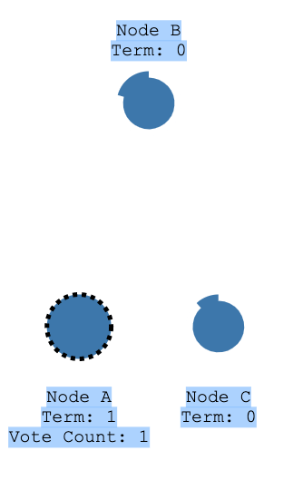
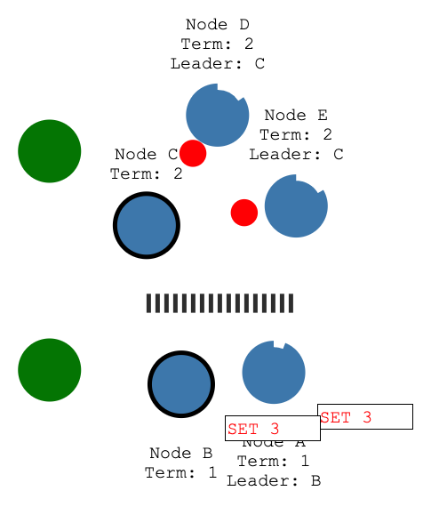
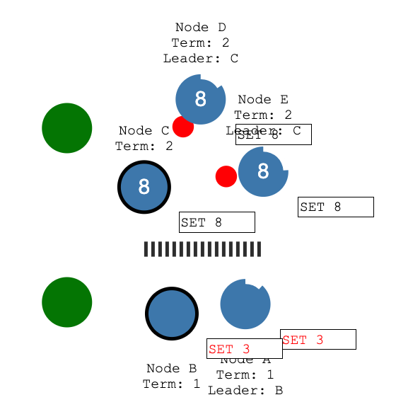
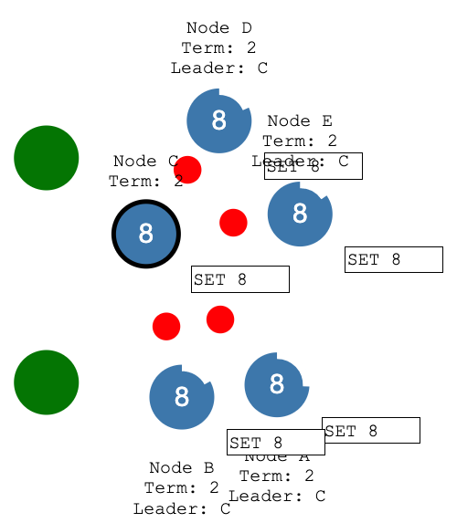

# raft 协议

> https://mp.weixin.qq.com/s/i6ULr-aW7MOxQotCQpqBCQ
>
> http://thesecretlivesofdata.com/raft/

## 为什么要有raft协议

raft 主要是用来解决数据库多节点之间的一致性问题

> 假设我们有某一个业务要实现数据存储方面的功能，最简单方法就是实现一个节点，所有的数据读写都是通过这一个节点。但是这样会存在各种各样的问题，比如数据量增大后无法承受压力，单节点如何向多节点分布，数据的一致性怎么保证，最严重的就是数据节点挂掉，数据全部丢失了。

## replication复制

为了解决节点损坏的问题，业界通用的方案是采用Replication，在Master写数据的时候挂多个Slave，写完后保证将log同步到Slave，这样的流程下来才能认为写入是成功的。

#### 数据丢失问题

通常情况下为了保证性能，我们都会使用**异步复制（Async Replication）**，不过会产生一些问题。当Master挂掉了之后很有可能有些数据并没有同步到Slave，这时候如果把这个Slave提升到新的Master就会面临数据丢失的问题。

#### 一种解决数据丢失问题的办法  -> CP方式

**强同步（Sync Replication）**解决了异步复制（Async Replication）可能潜在的问题。Master写入数据后必须保证Slave接收到log写入才算成功，当然这样会损耗一些性能，不过最严重在于Master挂掉后，Slave提升为Master，单节点的问题就又出现了。

为了保证系统中N台节点挂掉后，仍然能够对外提供服务，至少需要**2N+1**台机器，也就是传统的 Quorum，这样最少就需要三台机器，但是数量的增大也会带来更多的问题。

- 首先Master挂掉后要需要判断该提升哪个Slave为新的Master。
- 在多态集群下还容易遇到一个问题，就是在网络情况下以前的Master出现网络隔离，还在继续对外提供服务，而这时新的集群和Master已经形成了，新的数据被写入到新的Master，可是读取的却是旧的数据，这就是在分布式一致性领域所面临的线性一致性问题。

## Consensus Algorithm 一致性算法

大多数的一致性算法其实都是采用了**Replicated State Machine**的模型。对于这个模型你可以认为数据是被放在状态机上，用户操作集群时 首先需要写入log，然后通过一致性算法将log复制到其他机器，一旦确定其他机器都接收到log后就会认为该log被提交了，最后其他节点会依次将log存放到状态机。

## Raft 算法的 State 状态

Raft有着三个状态，

- Leader

  > 第一个状态就是 Leader , 即使 Raft Group 存在多个节点，Leader 也只会存在一个，也只有 Leader 能负责所有数据的读写，这样就不会出现线性一致性的问题。

- Follower

  > 当一个集群选出了Leader后其他集群的节点都会变成Follow，这个Follow只负责一件事就是接收Leader的Replication logs。当一个Follow没有接收到数据或者发现集群中没有Leader的时候，就会进入Candidate状态，这个状态表示可以开始选举了。

- Candidate

## Raft 算法的 Term 状态

Raft是不依赖系统的时间，它是将时间分成一个个Term，每个Term可以是任意长度，**每次Term开始的时候都是由一次新的选举产生的**，然后在这个Term内选出一个Leader，该Leader会一直服务到所在Leader结束。

结合Raft Term就可以进行Raft的选举。首先当系统启动后所有的节点都会进入Follow状态，Follow没有接收到任何请求的话，过一段时间就会进入Candidate状态，然后询问其他节点是否投票，如果其他节点反馈已经有新的Leader，这个Candidate就会变成Follow，而当Candidate接收到大多数的投票后就会变成Leader，之后会立即将一个log发送给其他节点开始续租Leader的时间租约。

## Leader election : Leader 选举

选举超时时间是 follower 变成一个 Candidate 前等待的时间 ,一般是 150ms 到 300ms 之间的随机数

- 当选举超时时间达到时(Node A) , 那么 Node A就会变成一个 Candidate,然后开启一个新的选举周期 (*election term*)
- NodeA 会发送请求其他节点投票给自己, 其他 Node 如果没有将票投给别人,那么就会投给他, 此时 Node 会重置它的 **选举超时(The election timeout )**

- 如果一个 Candidate 获得了大部分节点的票,那么它就会变成一个 leader
- leader 会发送消息给 follower , 这些消息发送后会有一个超时时间

- followers 会回复这些  *Append Entries* 消息
- 如果一个 followers 停止收到心跳包, 那么它会变成一个 Candidate 然后开启一个新的选举周期

## Log Replication

一个新的Leader被选出来之后就会开始工作了，它会不停的去接收客户端发送过来的请求，这些请求都会通过log落地，而这些log一定要是单调递增，以保证数据的一致性。

之后log会被复制到其他的节点，绝大多数节点都接收到这个log后， Leader就认为该log是committed的。

#### 当出现网络隔离时

Node B 无法获取到绝大多数的节点的回复,所以会一直保持 uncommitted 状态

上面的客户端有 3 个节点,所以它能提交成功

当网络分区解除, NodeB 的数据会回滚,然后跟随新的  leader (NodeC) 节点的数据

## Membership Change

对于分布式集群来说添加节点其实是分成困难的操作，最常见的做法是先更改配置中心，然后将新的配置同步到旧的节点。不过这样在同步配置的时候，就需要停止外部服务。而Raft采用了一种动态的成员节点变更，它会将新的节点到当作Raft log通过Leader传递给其他节点，这样其他节点就知道了这个新的节点的信息。不过这个过程中有可能会在某一阶段出现2个Leader的情况，**为了避免这种情况就要每次只变更一个节点，而不进行多节点变更。**

Raft也提供了一种多节点变更的算法，它是**一种两阶段提交**，Leader在第一阶段会同时将新旧集群的配置同时当成一个Raft log发送给其他旧集群节点，当这些节点接收到数据后就会和新的集群节点进入join状态，所有的操作都要进过新旧集群的大多数节点同意才会执行，然后在新的join状态内重新提交新的配置信息，在配置被committed后新的节点会上线，旧的节点会下线。

## **Optimization** 优化

#### Pre-Vote

在Follow处于网络抖动无法接受到Leader的消息的时候，它就会变成Candidate并且Term加一，但是其他集群其实还是在正常工作的，这样整个集群的就混乱了。

> Pre-Vote机制会在Follow没有接收到Leader的消息并且开始投票之前进入Pre-Candidate状态，在想其他节点发送投票请求，并获得同意后才会进入Candidate状态。

## Pipeline

正常的Raft流程中，客户端事先给Leader写入数据，Leader处理后会追加到log中，追加成功后Replication到其他节点中，­当Leader发现log被整个集群大多数节点接收后就会进行Apply。

> 这样的一个过程其实是非常低效的，所以就需要引入Pipeline，它可以将多个请求进行并发处理，有效提高效率。

### Batch

> 通常情况下接收到的客户端请求都是依次过来的，而当有一批请求过来的时候，就可以通过Batch将这些请求打包成一个Raft log发送出去。

## **Multi-Raft**

当目前的Raft Group无法支撑所有的数据的时候，就需要引入Multi-Raft处理数据，第一种做法是将数据切分成多个Raft Group分担到不同的机器上。

> 为了应对更复杂的情况就需要使用动态分裂的方法，假设最开始的只有3台机器以及一个Region，这个Region就布置在一台机器上，所有的数据都写入这台机器，当数据量达到某个预值后Region就产生分裂，得到的新的Region就可以移植到新的机器上。 