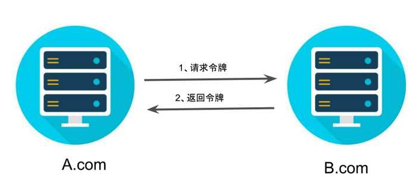

# 012-OAuth2-隐藏式

[TOC]

## 流程图



## 简介

有些 Web 应用是纯前端应用，没有后端。这时就不能用上面的方式了，必须将令牌储存在前端。**RFC 6749 就规定了第二种方式，允许直接向前端颁发令牌。这种方式没有授权码这个中间步骤，所以称为（授权码）"隐藏式"（implicit）。**

### 第一步-请求令牌

第一步，A 网站提供一个链接，要求用户跳转到 B 网站，授权用户数据给 A 网站使用。

```javascript
https://b.com/oauth/authorize?
  response_type=token&
  client_id=CLIENT_ID&
  redirect_uri=CALLBACK_URL&
  scope=read
```

上面 URL 中，`response_type`参数为`token`，表示要求直接返回令牌。

### 第二步-返回token

第二步，用户跳转到 B 网站，登录后同意给予 A 网站授权。这时，B 网站就会跳回`redirect_uri`参数指定的跳转网址，并且把令牌作为 URL 参数，传给 A 网站。

> ```javascript
> https://a.com/callback#token=ACCESS_TOKEN
> ```

上面 URL 中，`token`参数就是令牌，A 网站因此直接在前端拿到令牌。

注意，令牌的位置是 URL 锚点（fragment），而不是查询字符串（querystring），这是因为 OAuth 2.0 允许跳转网址是 HTTP 协议，因此存在"中间人攻击"的风险，而浏览器跳转时，锚点不会发到服务器，就减少了泄漏令牌的风险。

### 总结

这种方式把令牌直接传给前端，是很不安全的。因此，只能用于一些安全要求不高的场景，并且令牌的有效期必须非常短，通常就是会话期间（session）有效，浏览器关掉，令牌就失效了。