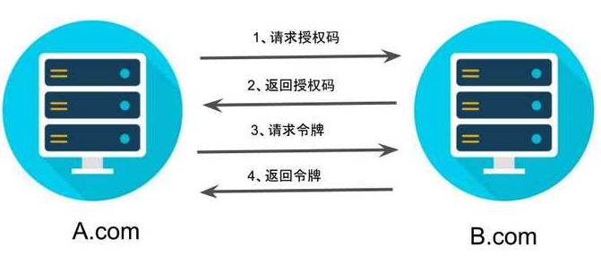

# 011-OAuth2-授权码模式

**授权码（authorization code）方式，指的是第三方应用先申请一个授权码，然后再用该码获取令牌。**

这种方式是最常用的流程，安全性也最高，它适用于那些有后端的 Web 应用。授权码通过前端传送，令牌则是储存在后端，而且所有与资源服务器的通信都在后端完成。这样的前后端分离，可以避免令牌泄漏。

## 授权码模式调用流程



#### 第一步-请求授权码

第一步，A 网站提供一个链接，用户点击后就会跳转到 B 网站，授权用户数据给 A 网站使用。下面就是 A 网站跳转 B 网站的一个示意链接。

```javascript
https://b.com/oauth/authorize?
  response_type=code&
  client_id=CLIENT_ID&
  redirect_uri=CALLBACK_URL&
  scope=read
```

上面 URL 中，`response_type`参数表示要求返回授权码（`code`），`client_id`参数让 B 知道是谁在请求，`redirect_uri`参数是 B 接受或拒绝请求后的跳转网址，`scope`参数表示要求的授权范围（这里是只读）。

#### 第二步-返回授权码

第二步，用户跳转后，B 网站会要求用户登录，然后询问是否同意给予 A 网站授权。用户表示同意，这时 B 网站就会跳回`redirect_uri`参数指定的网址。跳转时，会传回一个授权码，就像下面这样。

```javascript
https://a.com/callback?code=AUTHORIZATION_CODE
```

上面 URL 中，`code`参数就是授权码。

#### 第三步-带着授权码请求令牌

第三步，A 网站拿到授权码以后，就可以在后端，向 B 网站请求令牌。

```javascript
https://b.com/oauth/token?
 client_id=CLIENT_ID&
 client_secret=CLIENT_SECRET&
 grant_type=authorization_code&
 code=AUTHORIZATION_CODE&
 redirect_uri=CALLBACK_URL
```

上面 URL 中，`client_id`参数和`client_secret`参数用来让 B 确认 A 的身份（`client_secret`参数是保密的，因此只能在后端发请求），`grant_type`参数的值是`AUTHORIZATION_CODE`，表示采用的授权方式是授权码，`code`参数是上一步拿到的授权码，`redirect_uri`参数是令牌颁发后的回调网址。

#### 第四步-返回令牌

第四步，B 网站收到请求以后，就会颁发令牌。具体做法是向`redirect_uri`指定的网址，发送一段 JSON 数据。

```javascript
{    
  "access_token":"ACCESS_TOKEN",
  "token_type":"bearer",
  "expires_in":2592000,
  "refresh_token":"REFRESH_TOKEN",
  "scope":"read",
  "uid":100101,
  "info":{...}
}
```

