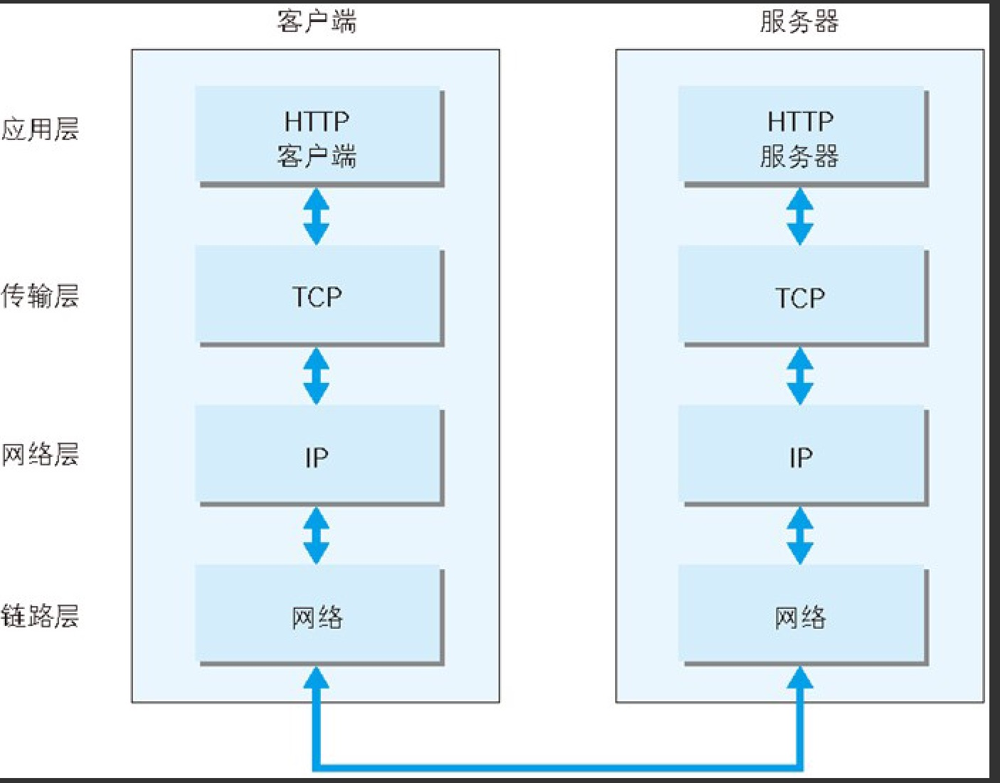

# TCP/IP 协议簇

## TCP/IP 的分层管理

因特网是在 TCP/IP 协议族的基础上运行的,而 HTTP 属于它内部的一个子集

#### 分层

如图所示

TCP/IP 主要分为四层

- **应用层**

**负责具体应用层协议的定义**

HTTP(超文本传输协议), DNS(域名服务), FTP(文件传输协议) ,TELNET(虚拟终端协议) ,SNMP(电子邮件传输协议)  等

- **传输层**

**提供两台连接的计算机中的数据传输,**

包括 TCP 传输控制协议 和 UDP 用户数据报协议

- **网络层**

**主要用于数据的传输, 路由以及地址的解析,保障网络上主机间的传输**

主要使用 IP 协议和 ARP(地址解析协议)协议

- **网络接口层**

下图显示了客户端到服务端之间传输的整个过程

利用 TCP/IP 进行网络通信时,会通过分层顺序与对方进行通讯

- 作为客户端在应用层通过 http 协议发送一个 http 请求,并发往传输层
- 传输层 TCP协议会对 HTTP 报文进行封装 ,加上 **标记号**和 **端口号**,发往网络层
- 网络层 IP 协议会对 报文再次封装,加上 **MAC 地址**,后发往链路层

如图

<img src="assets/image-20200328162120864.png" alt="image-20200328162120864" style="zoom:33%

