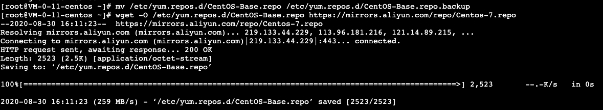
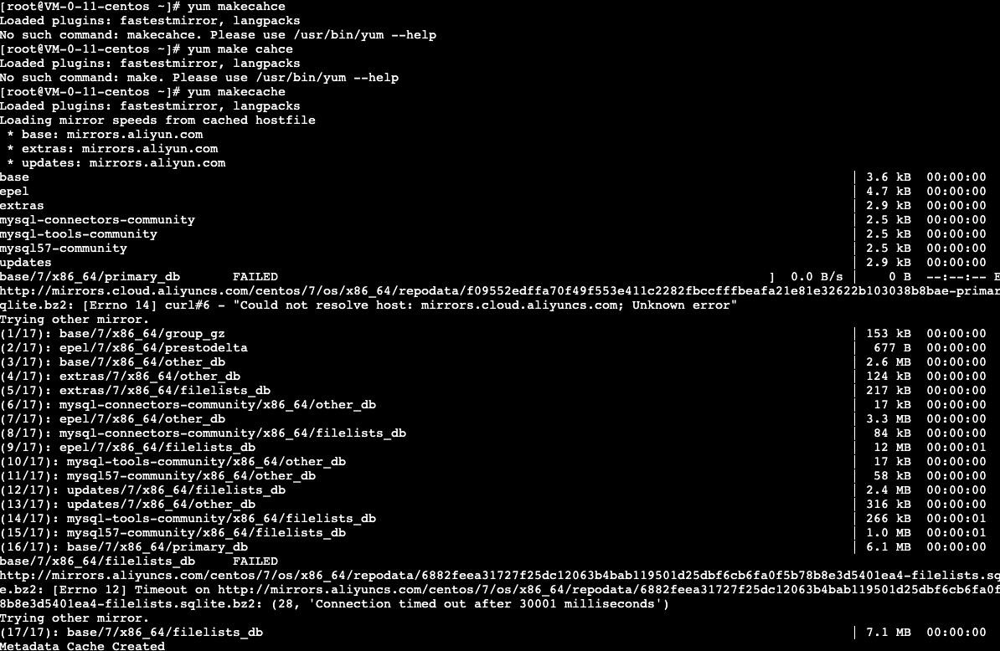

# Yum更换阿里云镜像

## 简介

CentOS，是基于 Red Hat Linux 提供的可自由使用源代码的企业级 Linux 发行版本；是一个稳定，可预测，可管理和可复制的免费企业级计算平台。

## 配置方法

### 1. 备份

```
mv /etc/yum.repos.d/CentOS-Base.repo /etc/yum.repos.d/CentOS-Base.repo.backup
```

### 2. 下载新的 CentOS-Base.repo 到 /etc/yum.repos.d/

**CentOS 6**

```
wget -O /etc/yum.repos.d/CentOS-Base.repo https://mirrors.aliyun.com/repo/Centos-6.repo
```

或者

```
curl -o /etc/yum.repos.d/CentOS-Base.repo https://mirrors.aliyun.com/repo/Centos-6.repo
```

**CentOS 7**

```
wget -O /etc/yum.repos.d/CentOS-Base.repo https://mirrors.aliyun.com/repo/Centos-7.repo
```

或者

```
curl -o /etc/yum.repos.d/CentOS-Base.repo https://mirrors.aliyun.com/repo/Centos-7.repo
```

**CentOS 8**

```
wget -O /etc/yum.repos.d/CentOS-Base.repo https://mirrors.aliyun.com/repo/Centos-8.repo
```

或者

```
curl -o /etc/yum.repos.d/CentOS-Base.repo https://mirrors.aliyun.com/repo/Centos-8.repo
```



### 3. 运行 yum makecache 生成缓存

```
yum makecache
```



### 4. 其他

非阿里云ECS用户会出现 Couldn't resolve host 'mirrors.cloud.aliyuncs.com' 信息，不影响使用。用户也可自行修改相关配置: eg:

```
sed -i -e '/mirrors.cloud.aliyuncs.com/d' -e '/mirrors.aliyuncs.com/d' /etc/yum.repos.d/CentOS-Base.repo
```

