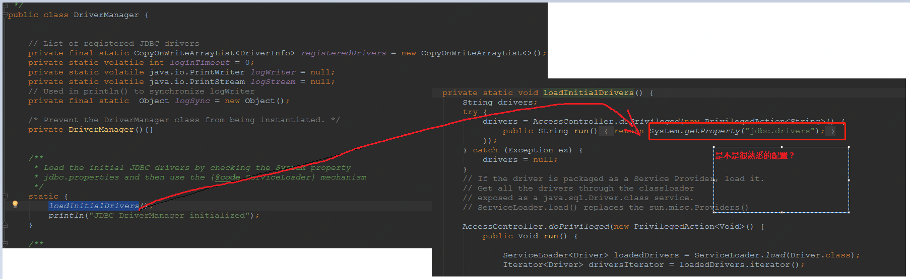
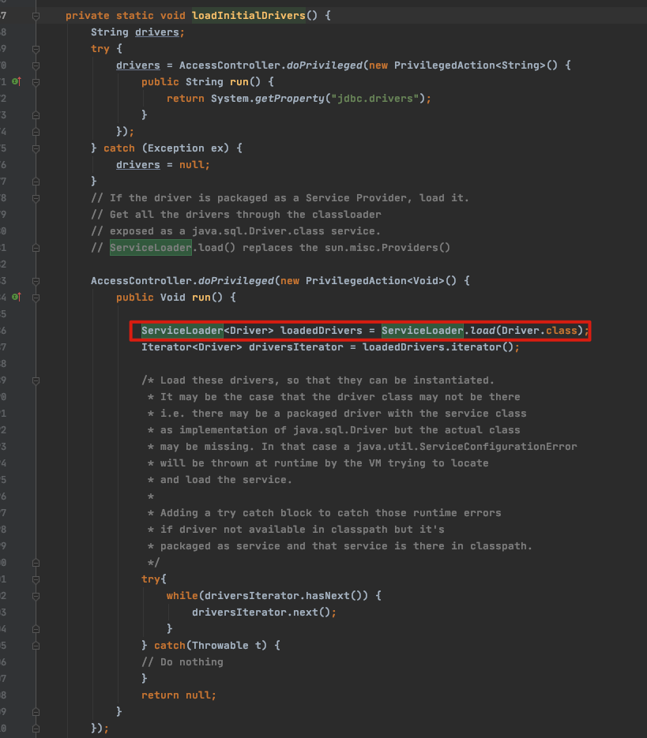
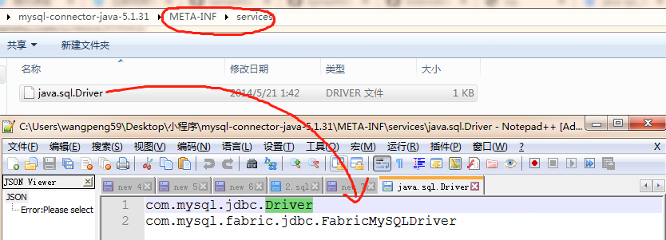
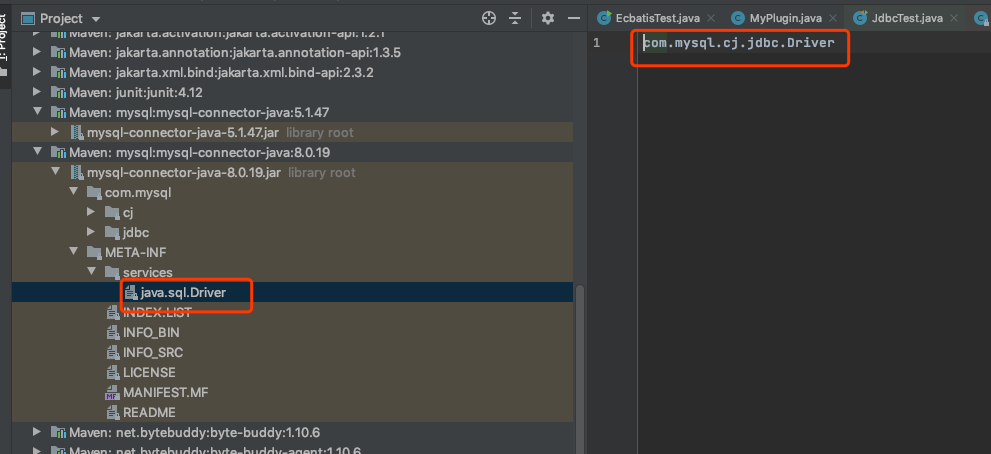

# SPI在 JDBC中的应用

## 目录

- [什么是SPI](#什么是SPI)
- [加载过程](#加载过程)

---

### 什么是SPI

>  [spi-service-provider-interface.md](../../04-java/01-basic/spi-service-provider-interface.md) 

> SPI全称Service Provider Interface，是Java提供的一套用来被第三方实现或者扩展的API，它可以用来启用框架扩展和替换组件。

## 图示


## 如何实现

数据库 DriverManager为例，看下如何实现的。

`DriverManager`是JDBC里管理和注册不通数据库Driver的工具类。

针对一个数据库、会存在不同的数据库驱动实现。

我们在使用特定驱动实现时，不希望修改现有代码，想通过简单的配置，就可以达到效果。在使用mysql驱动的时候，会有一个疑问，

`DriverManager`如何获得驱动类的？实际上用的是`Class.forName（"com.mysql.jdbc.Driver"`）加载mysql驱动后，就会执行其中的静态代码，把Driver注册到`DriverManager`中。



可以看到 ,在初始化 Drivers 时 ,使用 ServiceLoader 去加载了 JDBC 的驱动



可以看到这个  load 方法, 实际上用的是当前线程的 classloader, 这个线程往往是 用户实现的 Classloader,实际上使用的是上下文类加载器 通过设置为当前类加载器,加载用户 classpath 下的驱动

> 知识点:  [04-上下文类加载器.md](../../07-jvm/07-虚拟机类加载机制/04-上下文类加载器.md) 

```java
    public static <S> ServiceLoader<S> load(Class<S> service) {
        ClassLoader cl = Thread.currentThread().getContextClassLoader();
        return ServiceLoader.load(service, cl);
    }

```

## 加载过程

- 1、当服务提供者提供了接口的一种具体实现后，在jar包的`META-INF/services`目录下创建一个以“接口全限定名”为命名的文件，内容为实现类的全限定名；（下图是`mysql.jdbc.driver`的例子）
- 2、接口实现类所在的jar包放在主程序的classpath中；
- 3、主程序通过`java.util.ServiceLoder`动态装载实现模块，它通过扫描M`ETA-INF/services`目录下的配置文件找到实现类的全限定名，把类加载到JVM；
- 4、SPI的实现类必须携带一个不带参数的构造方法；



我们可以打断点看一下


**当我们使用最简单的 JDBC 测试类测试的时候, 值得注意的是**

- 当前线程实际上是 main 线程
- 我们没有指定 Classloader ,所以使用的是`sun.misc.Launcher$AppClassLoader` 也就是应用类加载器(双亲委派模型最下层的加载器)
- 设置了当前类加载器到ServerLoad 去加载




