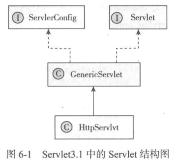

# Servlet接口

- [Servlet接口](#Servlet接口)
- [Servlet简介](#Servlet简介)

## Servlet结构




```java
public interface Servlet {
  public void init(ServletConfig config) throws ServletException;
  public ServletConfig getServletConfig();
  public void service(ServletRequest req, ServletResponse res)
  throws ServletException, IOException;
  public String getServletInfo();
  public void destroy();
}
```

| 方法             | 描述                                                         |
| ---------------- | ------------------------------------------------------------ |
| init             | 在容器启动的时候被容器调用(当load-on-startup 设置为负数或者不设置是会在Serlvet第一次用到时才调用),只调用一次 |
| getServletConfig | 用于获取ServletConfig                                        |
| service          | 处理一个请求                                                 |
| getServletInfo   | 获取Servlet相关信息                                          |
| destroy          | 用于Servlet销毁(一般是关闭服务器)时释放一些资源, 只会调用一次 |

## Servlet简介

Servlet规范的核心接口即是Servlet接口，它是所有Servlet类必须实现的接口。

在Java Servelt API中已经提供了两个抽象类方便开发者实现Servlet类，分别是GenericServlet和HttpServlet，GenericServlet定义了一个通用的、协议无关的Servlet，而HttpServlet则定义了HTTP的Servlet，这两个抽象类可以使Servlet类复用很多共性功能。

Servlet接口的核心方法为service方法，它是处理客户端请求的方法，客户端发起的请求会被路由到对应的Servlet对象上

## HttpServlet

前面说到的HttpServlet类的service方法把对HTTP协议的GET、POST、PUT、DELETE、HEAD、OPTIONS、TRACE等请求转发到各自的处理方法中，即doGet、doPost、doPut、doDelete、doHead、doOptions、doTrace等方法。

HttpServlet提供了这些共性的处理逻辑，其他继承它的类就不用再各自实现，只需要在对应的方法中做具体的处理逻辑即可。例如我们做Web开发时常常会自己定义一个Servlet，并在doGet和doPost方法中做业务逻辑处理。

一般来说，在Servlet容器中，每个Servlet类只能对应一个Servlet对象，所有请求都由同一个Servlet对象处理，但如果Servlet实现了SingleThreadModel接口则可能会在Web容器中存在多个Servlet对象。对于Web容器来说，实现了SingleThreadModel接口意味着一个Servlet对象对应着一个线程，所以此时Servlet的成员变量不存在线程安全问题。

Servlet的生命周期主要包括

- 加载实例化(主要由Web容器完成)
- 初始化(Servlet的init方法)
- 处理客户端请求(service方法)
- 销毁(destroy方法)

加载实例化，而其他三个阶段则对应

## ServletConfig

Servlet对象被创建后需要对其进行初始化操作，初始化工作可以放在以ServletConfig类型为参数的ini方法中，ServletConfig为web.xml配置文件中配置的对应的初始化参数，由Web容器完成web.xml配置读取并封装成ServletConfig对象。

当Servlet初始化完成后，开始接受客户端的请求，这些请求被封装成ServletRequest类型的请求对象和ServletResponse类型的响应对象，通过service方法处理请求并响应客户端。当一个Servlet需要从Web容器中移除时，就会调用对应的destroy方法以释放所有的资源，并且调用destroy方法之前要保证所有正在执行service方法的线程都完成执行。