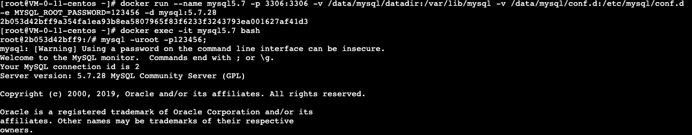

# Docker 安装 MySQL

## 查看MySQL镜像

```
docker search mysql
```

## 拉取MySQL5.7.28镜像（大小437M）

```
docker pull mysql:5.7.28
```

如果要查看 MySQL Community Server 最新版本，这个链接有最新版本号：
[MySQL Community Downloads](https://dev.mysql.com/downloads/mysql/)

注：如果镜像下载慢按以下步骤配置加速器
[centos7将docker的仓库改为aliyun的镜像仓库](https://jingyan.baidu.com/article/9989c7468251caf648ecfe87.html)

## 查看MySQL镜像

```
docker images
```

## 运行docker容器，设置ROOT用户密码

外网建议设置复杂一些的密码

```
docker run --name mysql5.7 -p 3306:3306 -v /data/mysql/datadir:/var/lib/mysql -v /data/mysql/conf.d:/etc/mysql/conf.d -e MYSQL_ROOT_PASSWORD=123456 -d mysql:5.7.28
```

参数说明：

> –name mysql5.7 容器别名
> -p  3306:3306 端口映射（本机3306端口映射容器3306端口）
> -v  /data/mysql/datadir:/var/lib/mysql 目录映射（mysql数据目录）
> -v  /data/mysql/conf.d:/etc/mysql/conf.d 目录映射（mysql配置目录）
> -d 后台运行



## 进入镜像创建自定义用户和数据库

首先进入容器

```
docker exec -it mysql5.7 bash
```

登录root用户

```
mysql -uroot -p123456;
```

上面这两个命令可以通过alias别名简化。

```
vim ~/.bashrc
```

加入一行：

```
alias sql='docker exec -it mysql5.7 mysql -uroot -p123456'
```

编译生效

```
source ~/.bashrc
```

进入MySQL客户端后执行命令：

```
create user 'hzero'@'%' identified by '123456';
flush privileges;

create database db0 DEFAULT CHARSET utf8mb4 COLLATE utf8mb4_general_ci;

grant all privileges on db0.* to 'hzero'@'%' identified by 'hzero';


flush privileges;
```

8.0版本的授权语句不一样：

```
grant all privileges on *.* to 'hzero'@'localhost' with grant option;
```

