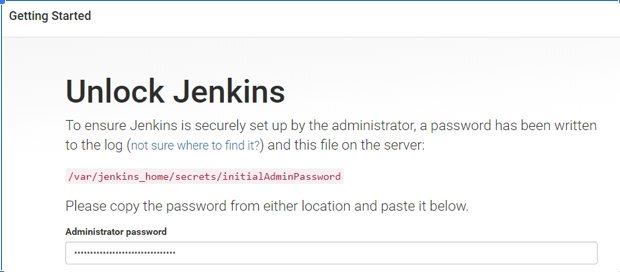
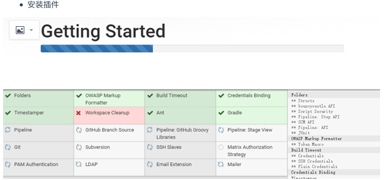
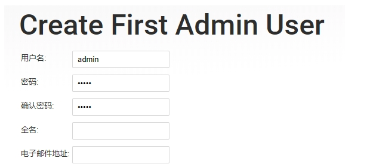
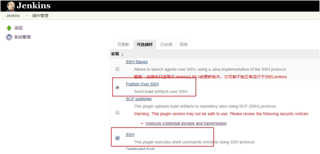

# Docker 安装 Jenkins

**Jenkins 安装配置**

- 拉取镜像：# docker pull jenkins
- 启动容器，端口 9090：# docker run -d --name jenkins -p 9090:8080 -p 50000:50000 -v /hzero/data-server/jenkins:/home/jenkins_home --privileged=true jenkins
- 获取初始密码：# docker logs jenkins


- 访问 ip:9090 进入 jenkins 配置 



- 安装插件



- 设置用户



- 安装 Publish Over SSH 和 SSH 插件，用于连接各个服务



- 创建软链：Jenkins 通过shell脚本调用 java、mvn 等命令的时候，是从 /usr/bin 文件夹中找命令的，这个时候需要做个软链接

```
ln -s  /usr/local/maven3/bin/mvn /usr/bin/mvn  ln -s /usr/local/jdk1.8.0_172/bin/jps /usr/bin/jps ln -s /usr/local/jdk1.8.0_172/bin/java /usr/bin/java ln -s /usr/local/jdk1.8.0_172/bin/javac /usr/bin/javac

 java -jar jenkins.war --httpPort=8002 --prefix=/jenkins
```


