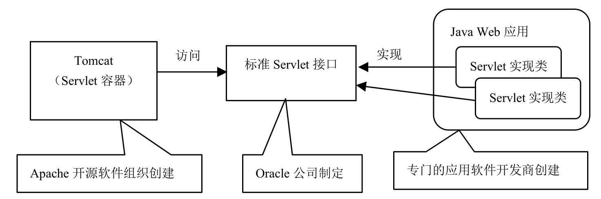
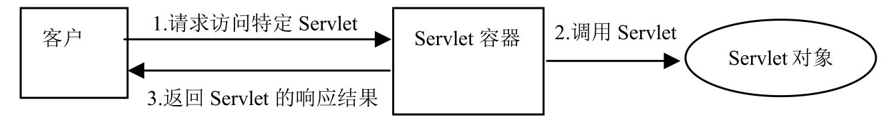
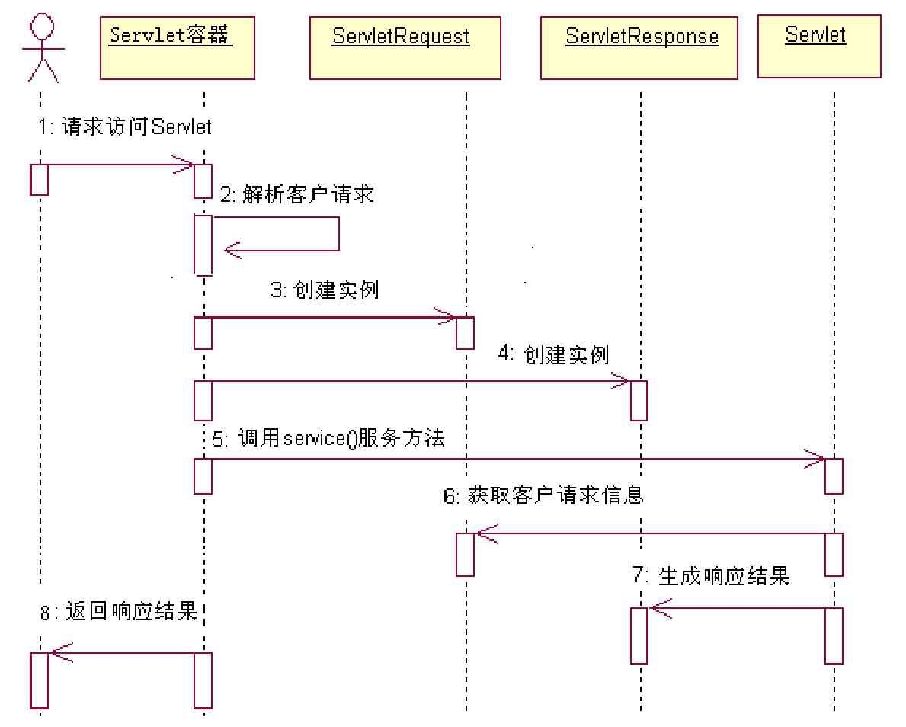

# Tomcat简介

## 目录

- [Tomcat是什么](#Tomcat是什么)

- [Web服务器和Servlet的关系](#Web服务器和Servlet的关系)
- [Servlet响应流程](#Servlet响应流程)

## Tomcat是什么

- apache开源项目
- 实现了一系列规范
  - Java Servlet 
  - JavaServer Pages
  - Java Expression Language 
  - Java WebSocket technologies
    

## Web服务器和Servlet的关系

- Web服务器可以访问任意一个Web应用所有实现Servlet的接口
- Web应用通过实现Servlet接口,编写动态程序代码, 用于被Web服务器的动态调用

> Servlet规范规定的Servlet不仅可以运行在基于HTTP协议的Web服务器上，还可以运行在基于其他应用协议的服务器上。不过，目前Servlet主要运行在Web服务器上，用来扩展Web服务器的功能。

## Servlet响应流程

1. 客户发出要求访问特定Servlet的请求。
2. Servlet容器接收到客户请求，对其解析。
3. Servlet容器创建一个ServletRequest对象，在ServletRequest对象中包含了客户请求信息以及其他关于客户的相关信息，如请求头、请求正文，以及客户机的IP地址等。
4. Servlet容器创建一个ServletResponse对象。
5. Servlet容器调用客户所请求的Servlet的service（）服务方法，并且把ServletRequest对象和ServletResponse对象作为参数传给该服务方法。
6. Servlet从ServletRequest对象中可获得客户的请求信息。
7. Servlet利用ServletResponse对象来生成响应结果。
8. Servlet容器把Servlet生成的响应结果发送给客户。

#### Servlet容器响应客户请求访问特定Servlet的时序图

## Tomcat版本和JDK版本

| Tomcat版本 | JDK最低版本 | Servlet/JSP规范 |
| ---------- | ----------- | --------------- |
| 9.x        | JDK8        | 4.0/2.3         |
| 8.x        | JDK7        | 3.1/2.3         |
| 7.x        | JDK6        | 3.0/2.3         |
| 6.x        | JDK5        | 2.5/2.1         |
| 5.5.x      | JDK1.4      | 2.4/2.1         |
| 5.0.x      | JDK1.4      | 2.4/2.0         |
| 4.1.x      | JDK1.3      | 2.3/1.2         |

#### Tomcat 9.x

Tomcat9.x建立在Tomcat 8.x的基础上，前者实现了Servlet 4.0和JSP 2.3规范。此外，它还提供了如下新特性：
●　支持HTTP/2协议。
●　使用OpenSSL（Open Secure Socket Layer，开放安全套接字层密码库）来支持TLS（Transport Layer Security，安全传输层协议），在实现中使用了JSSE（Java Secure Socket Extension，Java安全套接字扩展）连接器。
●　支持TLS虚拟主机。

#### Tomcat 8.x

Tomcat 8.x建立在Tomcat 7.x的基础上，前者实现了Servlet 3.1和JSP 2.3规范。此外，它还提供了如下新特性：
●　采用单个公共资源的实现机制，来替代早期版本中提供多个可扩展资源的特征。
●　Tomcat 8.5.x实现了JASPIC1.1（Java Authentication Service Provider，Java认证服务提供者接口）规范。

#### Tomcat 7.x

Tomcat 7.x建立在Tomcat 6.x的基础上，前者实现了Servlet 3.0和JSP 2.3规范，此外，它还提供了如下新特性：

●　针对Web应用的内存泄漏，进行检测和预防。
●　提高了Tomcat自带的两个Web应用的安全性能，该自带的两个Web应用分别是Tomcat的控制平台和管理平台。
●　采取安全措施，防止CSRF（Cross-Site Request Forgery， 跨站请求伪造）攻击网站。
●　允许在Web应用中直接包含外部内容。
●　重构连接器，对Tomcat内部实现代码进行清理和优化。

#### Tomcat 6.x

Tomcat 6.x是基于Tomcat 5.5.x的升级版本，前者实现了Servlet 2.5 和JSP 2.1规范。此外，它还提供了如下新特性：
●　优化对内存的使用。
●　先进的IO（输入输出）功能，利用JDK的java.nio包中的接口与类来提高输入输出的性能，并且增加了对异步通信的支持。
●　对Tomcat服务器的集群功能进行了重建。

#### Tomcat 5.5.x

Tomcat 5.5.x.与Tomcat 5.0.x一样支持Servlet 2.4和JSP 2.0规范。此外，在其底层实现中，Tomcat 5.5.x在原有版本的基础上进行了巨大改动。这些改动大大提高了服务器的运行性能和稳定性，并且降低了运行服务器的成本。

#### Tomcat 5.0.x

Tomcat 5.0.x在Tomcat 4.1的基础上做了许多扩展和改进，它提供的新功能和新特性包括：
●　对服务器性能进一步优化，提高垃圾回收的效率。
●　采用JMX技术来监控服务器的运行。
●　提高了服务器的可扩展性和可靠性。
●　增强了对标签库（Tag Library）的支持。
●　利用Windows wrapper和UNIX wrapper技术改进了与操作系统平台的集成。
●　采用JMX技术来实现嵌入式的Tomcat。
●　提供了更完善的Tomcat文档。
提示
JMX（Java Management Extensions）是Oracle提出的Java管理扩展规范，是一个能够在应用程序、设备和系统中嵌入管理功能的框架。JMX可以跨越一系列异构操作系统平台、系统体系结构和网络传输协议。通过JMX，用户可以灵活地开发无缝集成的系统、网络和服务管理应用。

#### Tomcat 4.1.x

Tomcat 4.1.x是Tomcat 4.0.x的升级版本。Tomcat 4.0.x完全废弃了Tomcat 3.x的架构，采用新的体系结构实现了Servlet容器。Tomcat 4.1.x在Tomcat 4.0.x的基础上又进一步升级，它提供的新功能和新特性包括：
●　基于JMX的管理控制功能。
●　实现了新的Coyote Connector（支持HTTP/1.1， AJP 1.3 和JNI）。
●　重写了Jasper JSP编译器。
●　提高了Web管理应用与开发工具的集成。
●　提供客户化的Ant任务，使Ant程序根据build.xml脚本直接和Web管理应用交互。
以上介绍中出现了很多新名词和术语，如Tag Library（标签库）、AJP和Ant等，在本书后面章节会陆续解释这些名词。

