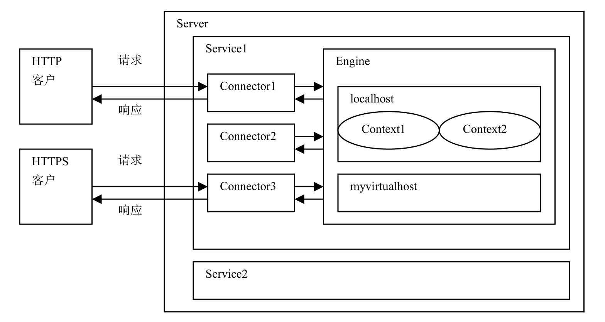
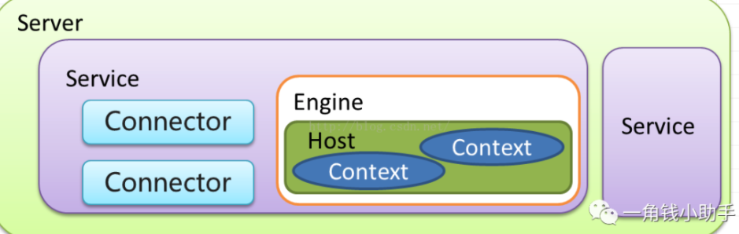
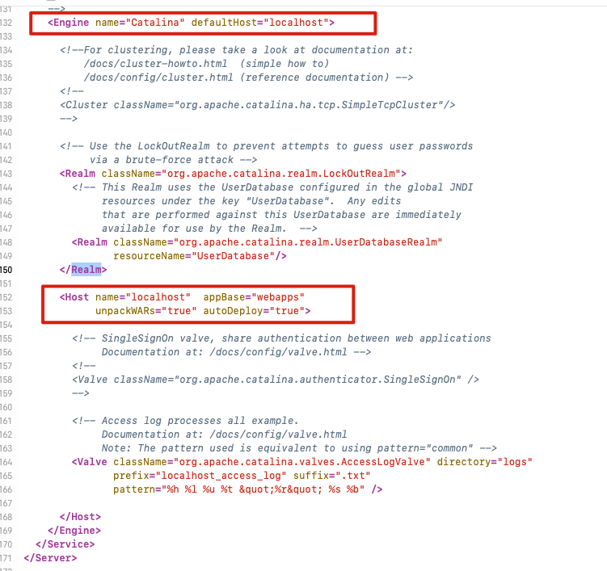

# Tomcat的组织结构






- Server 和 Service

- Connector  连接器

- - HTTP 1.1
  - SSL  https
  - AJP（ Apache JServ Protocol） apache 私有协议，用于apache 反向代理Tomcat

- Container

- - Engine  引擎 catalina
  - Host  虚拟机 基于域名 分发请求
  - Context 隔离各个WEB应用 每个Context的  ClassLoader都是独立

- Component

- - Manager （管理器）
  - logger （日志管理）
  - loader （载入器）
  - pipeline (管道)
  - valve （管道中的阀）


# Server.xml文件结构

```xml
<Server>
    <Listener /><!-- 监听器 -->
    <GlobaNamingResources> <!-- 全局资源 -->
    </GlobaNamingResources
    <Service>          <!-- 服务 用于 绑定 连接器与 Engine -->
        <Connector 8080/> <!-- 连接器-->
        <Connector 8010 /> <!-- 连接器-->
        <Connector 8030/> <!-- 连接器-->
        <Engine>      <!-- 执行引擎-->
            <Logger />
            <Realm />
               <host "www.test.com" appBase="">  <!-- 虚拟主机-->
                   <Logger /> <!-- 日志配置-->
                   <Context "/applction" path=""/> <!-- 上下文配置-->
               </host>
        </Engine>
    </Service>
</Server>
```

- 

每个元素都代表一种Tomcat组件,大致分为四类

- 顶层类元素

#### 顶层类元素

| 顶层类元素 |                                                              |
| ---------- | ------------------------------------------------------------ |
| Server     | <Server>元素代表整个Servlet容器组件，它是Tomcat的顶层元素。<Server>元素中可包含一个或多个<Service>元素。 |
| Service    | <Service>元素中包含一个<Engine>元素，以及一个或多个<Connector>元素，这些<Connector>元素共享同一个<Engine>元素。 |
|            |                                                              |

#### 连接器类元素

| 连接器类元素 | 简介                                                         |
| ------------ | ------------------------------------------------------------ |
| Connector    | 代表客户与服务器之间的通信接口,负责将客户的请求发送给服务器,并将服务器的响应结果发送给客户 |

连接器：用于接收 指定协议下的连接 并指定给唯一的Engine 进行处理。

主要属性：

- protocol   监听的协议，默认是http/1.1
- port   指定服务器端要创建的端口号
- minThread   服务器启动时创建的处理请求的线程数
- maxThread 最大可以创建的处理请求的线程数
- enableLookups 如果为true，则可以通过调用request.getRemoteHost()进行DNS查询来得到远程客户端的实际主机名，若为false则不进行DNS查询，而是返回其ip地址
- redirectPort 指定服务器正在处理http请求时收到了一个SSL传输请求后重定向的端口号
- acceptCount 指定当所有可以使用的处理请求的线程数都被使用时，可以放到处理队列中的请求数，超过这个数的请求将不予处理，默认100；
- address  绑定客户端特定地址，127.0.0.1
- bufferSize  每个请求的缓冲区大小 bufferSize * maxThreads
- compression  是否启用文档压缩
- compressionMinSize   文档压缩的最小大小
- compressableMimeTypes  text/html,text/xml,text/plain
- connectionTimeout 客户端发起链接到服务端接收为止，指定超时的时间数(以毫秒为单位)
- connectionUploadTimeout  upload情况下连接超时时间
- disableUploadTimeout  如果为true则使用 connectionTimeout
- keepAliveTimeout  当长链接闲置 指定时间主动关闭 链接 ，前提是客户端请求头 带上这个 head"connection" " keep-alive"
- maxKeepAliveRequests  最大的 长连接数 默认最大100
- maxSpareThreads  BIO 模式下 最多线闲置线程数
- minSpareThreads  BIO 模式下 最小线闲置线程数
- SSLEnabled   是否开启 sll 验证，在Https 访问时需要开启。

#### 配置多个connector

```xml
 <Connector port="8860" protocol="org.apache.coyote.http11.Http11NioProtocol"
                connectionTimeout="20000"
                redirectPort="8862"
                URIEncoding="UTF-8"
                useBodyEncodingForURI="true"
                compression="on" compressionMinSize="2048"
compressableMimeType="text/html,text/xml,text/plain,text/javascript,text/css,application/x-json,application/json,application/x-javascript"
                maxThreads="1024" minSpareThreads="200"
                acceptCount="800"
                enableLookups="false"/>
```


#### 容器类元素

| 容器类元素 | 简介                                                         |                                                              |
| ---------- | ------------------------------------------------------------ | ------------------------------------------------------------ |
| Engine     | Engine组件为特定的Service组件处理所有客户请求,               | 用于处理连接的执行器，默认的引擎是catalina。一个service 中只能配置一个Engine。 |
| Host       | Host组件为特定的虚拟主机处理所有客户请求                     | 虚拟机：基于域名匹配至指定虚拟机。类似于nginx 当中的server,默认的虚拟机是localhost. |
| Context    | Context组件为特定的Web应用处理所有客户请求                   | 每个<Context>元素代表了运行在虚拟主机上的单个Web应用。一个<Host>元素中可以包含多个<Context>元素。 |
| Cluster    | Cluster组件负责为Tomcat集群系统进行会话复制、Context组件的属性的复制，以及集群范围内WAR文件的发布。 |                                                              |

#### Context

应用上下文：一个host 下可以配置多个Context ，每个Context 都有其独立的classPath。相互隔离，以免造成ClassPath 冲突。

**演示配置多个Context**

```
<Context docBase="hello" path="/h" reloadable="true"/>
```


#### 嵌套类组件

| 嵌套类组件 | 简介 |
| ---------- | ---- |
| Valve      |      |
| Realm      |      |

#### Valve

阀门：可以理解成request 的过滤器，具体配置要基于具体的Valve 接口的子类。以下即为一个访问日志的Valve.

```
 <Valve className="org.apache.catalina.valves.AccessLogValve" directory="logs"
               prefix="www.luban.com.access_log" suffix=".txt"
               pattern="%h %l %u %t &quot;%r&quot; %s %b" />
```


## 各组件之间关系


- Connector组件负责接收客户的请求并向客户返回响应结果
- 在同一个Service组件中，多个Connector组件共享同一个Engine组件。
- 同一个Engine组件中可以包含多个Host组件
- 同一个Host组件中可以包含多个Context组件
- Tomcat安装好以后，在它的server.xml配置文件中已经配置了<Server>、<Service>、<Connector>、<Engine>和<Host>等组件



可以看出默认的配置文件

- 默认的Engine为 "Catalina"
- 默认的host为 "localhost"

