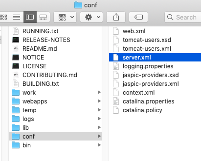
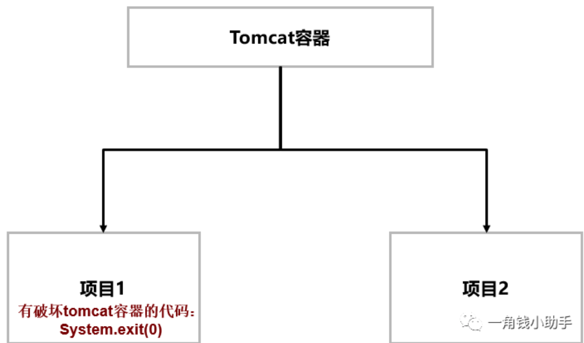
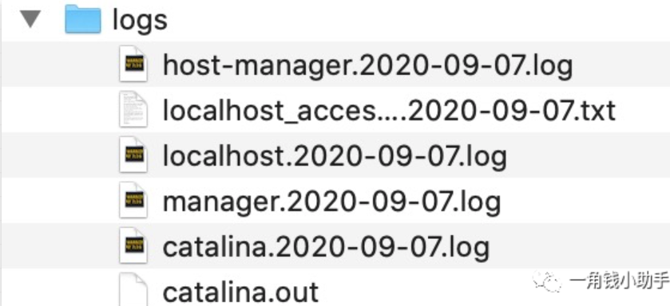

# Tomcat文件目录

https://mp.weixin.qq.com/s/EP3rJio8qHPCDAHUqeNIeQ

## 重要的变量

在整个官方文档查看过程中, 会经常看到以下变量

| 变量               | 解释                                                         |
| ------------------ | ------------------------------------------------------------ |
| **$CATALINA_HOME** | 表示Tomcat安装的根路径                                       |
| **$CATALINA_BASE** | Tomcat可以通过配置整个属性来配置多实例, 如果没有配置多实例,那么`$CATALINA_BASE` = `$CATALINA_HOME` |
|                    |                                                              |

## Tomcat核心目录



| 目录     | 解释                                                         |
| -------- | ------------------------------------------------------------ |
| /bin     | 存放运行脚本, 如 startup.sh;  shutdown.sh ; 后缀为sh(Unix内核系统) 后缀为bat (windows系统), 因为windows 32 位命令行会缺少一些功能,所以会有一些附加的文件 |
| /conf    | 配置文件和其约束文件xsd文件, 最重要的是server.xml, 是Tomcat容器的主要配置文件 |
| /logs    | 默认的Log文件存储位置                                        |
| /webapps | 存放应用                                                     |
| /lib     | 存放Tomcat容器依赖的jar包,这也就是为什么在开发Servlet应用的时候,scope为provided的原因 |
| /temp    | 存放临时文件                                                 |
| /work    | 工作目录                                                     |

## bin目录

| 文件        | 解释                                     |
| ----------- | ---------------------------------------- |
| catalina.sh | 真正启动Tomcat文件,可以在里面设置jvm参数 |
| startup.sh  | 程序项目命令文件                         |
| version.sh  | 查看版本信息                             |
| shutdown.sh | 关闭程序                                 |

## conf目录

```
web.xml
tomcat-users.xsd
tomcat-users.xml
server.xml
logging.properties
jaspic-providers.xsd
jaspic-providers.xml
context.xml
catalina.properties
catalina.policy
```


| 关注     | 文件                                             | 解释                                                         |
| -------- | ------------------------------------------------ | ------------------------------------------------------------ |
| 一般     | [catalina.policy](#catalina.policy)              | 项目安全文件                                                 |
| 一般     | catalina.properties                              | 配置tomcat启动相关信息文件                                   |
| 重点关注 | startup.sh                                       | 程序项目命令文件                                             |
|          | context.xml                                      | 监视并加载资源文件，当监视的文件发生发生变化时，自动加载     |
|          | **jaspic-providers.xml 和 jaspic-providers.xsd** |                                                              |
|          | **logging.properties**                           | 该文件为tomcat日志文件，包括配置tomcat输出格式，日志级别等   |
| 重点关注 | **server.xml**                                   | tomcat核心架构主件文件                                       |
|          | **tomcat-users.xml**                             | tomcat用户文件，如配置远程登陆账号 tomcat-users.xsd 为约束文件 |
|          | web.xml                                          | tomcat全局配置文件                                           |

## catalina.policy

项目安全文件，用来防止欺骗代码或JSP执行带有像System.exit(0)这样的命令的可能影响容器的破坏性代码. 只有当Tomcat用-security命令行参数启动时这个文件才会被使用，即启动tomcat时， `startup.sh -security` 。




上图中，tomcat容器下部署两个项目，项目1和项目2。由于项目1中有代码System.exit(0)，当访问该代码时，该代码会导致整个tomcat停止，从而也导致项目2停止。

为了解决因项目1存在欺骗代码或不安全代码导致损害Tomcat容器，从而影响其他项目正常运行的问题，启动tomcat容器时，加上-security参数就，即`startup.sh -security`，如此即使项目1中有代码System.exit(0)，也只会仅仅停止项目1，而不会影响Tomcat容器，然而起作用的配置文件就是catalina.policy文件。

## catalina.properties

## lib目录

lib文件夹主要用来存放tomcat依赖jar包，如下为 tomcat 的lib文件夹下的相关jar包。

每个jar包功能，这里就不讲解了，这里主要分析ecj-4.13.jar，这个jar包起到将.java编译成.class字节码作用。

假设要编译MyTest.java，那么jdk会执行两步：

- 第一步：将MyTest.java编译成MyTest.class

```
javac MyTest.java
```

- 第二步:执行MyTest.class

```
java MyTest.class
```

- 那么，使用ecj-4.13.jar如执行MyTest.java呢？

```
java -jar ecj-4.13.jar MyTest.java
```

## logs目录

该文件夹表示tomcat日志文件，大致包括如下六类文件：



| catalina.date.log             | 表示tomcat启动文件                                           |
| :---------------------------- | :----------------------------------------------------------- |
| catalina.out                  | 表示catalina.date.log日志汇总                                |
| host-manager.date.log         | 表示访问webapps下host-manager项目日志，如访问 ip:8080/host-manager/html |
| localhost.date.log            | 表示tomcat在启动时，自身访问服务，这个日志只记录tomcat访问日志，而非业务项目日志 |
| localhost_access_log.date.txt | 表示访问tomcat所有项目的日志记录，如下表示访问项目localhost,host-manager.html,manager.html和test/index.html四个项目日志记录 |
| manager.date.log              | 表示访问webapps下manager项目日志，如访 问 ip:8080/manager/html |

## temp目录

temp目录用户存放tomcat在运行过程中产生的临时文件。（清空不会对tomcat运行带来影响）。

## webapps目录

webapps目录用来存放应用程序，当tomcat启动时会去加载webapps目录下的应用程序。可以以文件夹、war包、jar包的形式发布应用。 当然，你也可以把应用程序放置在磁盘的任意位置，在配置文件中映射好就行。

## work目录

work目录用来存放tomcat在运行时的编译后文件，例如JSP编译后的文件。 清空work目录，然后重启tomcat，可以达到清除缓存的作用。