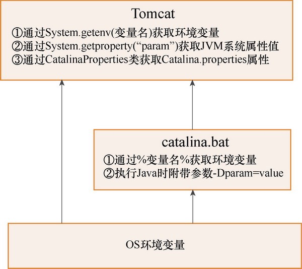

# Tomcat中的变量以及属性

变量及属性的目的主要是将某些参数剥离出程序，以实现可配置性。

在Tomcat中，启动时会涉及大量环境变量、JVM系统属性及Tomcat属性。环境变量在操作系统中配置，也可以在批处理中添加或修改环境变量，

- 在Tomcat程序中可通过System.getenv(name)获取环境变量。
- JVM系统属性可以是JVM自带的属性，也可以在Java执行命令中通过-D参数配置，在Tomcat程序中可通过System.getProperty(name)获取JVM系统属性。
- Tomcat属性主要通过catalina. properties配置文件配置，在Tomcat启动时会加载，Tomcat程序通过CatalinaProperties获取。

## Tomcat、JVM及操作系统之间相关的变量属性及操作

- 最底层的是操作系统的环境变量，假如我们在脚本catalina.bat中想获取它，可以通过`%变量名%(win)` 或者 `$变量名`直接获取；

- 假如在Tomcat中想获取它，则可以通过`System.getevn(＂变量名＂)`获取。
- 假如我们想在脚本catalina.bat中启动Java时传入参数作为JVM系统属性，则可以附带-Dparam=value参数，而在Tomcat中则通过`System.getproperty(＂param＂)`获取该JVM系统属性值。

除此之外，Tomcat自身配置文件catalina.properties则通过CatalinaProperties类获取。


