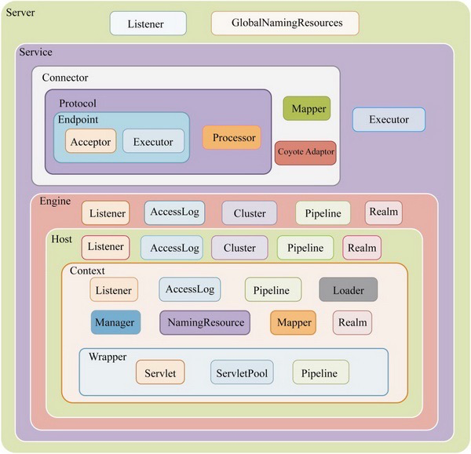

# 整体结构与组件介绍



## Tomcat架构简介

Tomcat可以看成由连接器(Connector)组件和容器(Container)组件组成

- Connector组件负责在服务器端处理客户端连接，包括接收客户端连接、接收客户端的消息报文以及消息报文的解析等工作，

- Container组件则负责对客户端的请求进行逻辑处理，并把结果返回给客户端。

Container组件则不能在图中直接找到。它其实包括4个级别的容器：

- Engine组件
- Host组件
- Context组件
- Wrapper组件

```xml
<Server>
    <Listener /><!-- 监听器 -->
    <GlobaNamingResources> <!-- 全局资源 -->
    </GlobaNamingResources
    <Service>          <!-- 服务 用于 绑定 连接器与 Engine -->
        <Connector 8080/> <!-- 连接器-->
        <Connector 8010 /> <!-- 连接器-->
        <Connector 8030/> <!-- 连接器-->
        <Engine>      <!-- 执行引擎-->
            <Logger />
            <Realm />
               <host "www.test.com" appBase="">  <!-- 虚拟主机-->
                   <Logger /> <!-- 日志配置-->
                   <Context "/applction" path=""/> <!-- 上下文配置-->
               </host>
        </Engine>
    </Service>
</Server>
```


