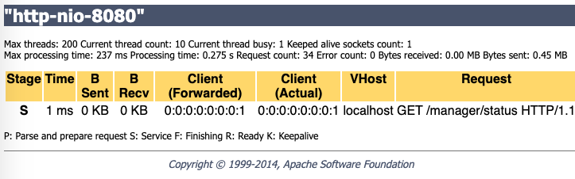

# 040-Connector开启Nio

- BIO(阻塞式)

Tomcat的默认模式，该模式性能较低，没有经过任何优化处理和支持，一个线程处理一个请求。缺点：**并发量过大时，线程数较多，浪费资源**。tomcat7及以下版本，在linux系统中默认使用该模式。

- NIO-Non-blocking IO(非阻塞IO)

Java NIO可以让你**非阻塞的使用IO**，例如：当线程从通道读取数据到缓冲区时，线程还是可以进行其他事情。当数据被写入到缓冲区时，线程可以继续处理它。从缓冲区写入通道也类似。Tomcat8在Linux系统中默认使用这种方式。

- apr

Apache Portable Runtime，从操作系统层面解决io阻塞问题。Tomcat7或Tomcat8在Win7或以上的系统中启动默认使用这种方式。Linux如果安装了apr和native，Tomcat直接启动就支持apr。

- nio2

tomcat8中有最新的nio2，速度更快，建议使用

## 开启前

## 开启后