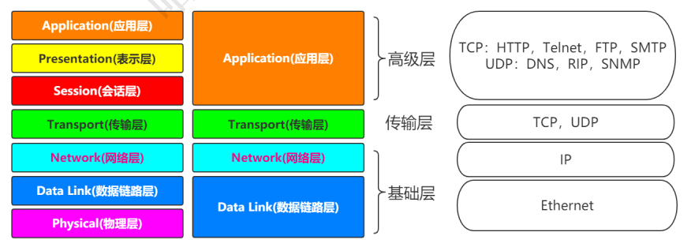

# 什么是Tomcat

### Tomcat官网

- 官网 ：https://tomcat.apache.org

> The Apache Tomcat® software is an open source implementation of the Java Servlet, 
>
> JavaServer Pages, Java Expression Language and Java WebSocket technologies. 

## TCP/IP



## 什么是Servlet

```
public interface Servlet { 
	void init(ServletConfig config) throws ServletException; 
	ServletConfig getServletConfig(); 
	void service(ServletRequest req, ServletResponse res）throws ServletException, IOException; 
	String getServletInfo(); 
	void destroy(); 
 }
```

