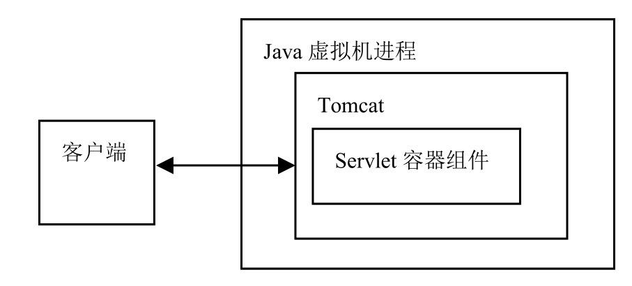
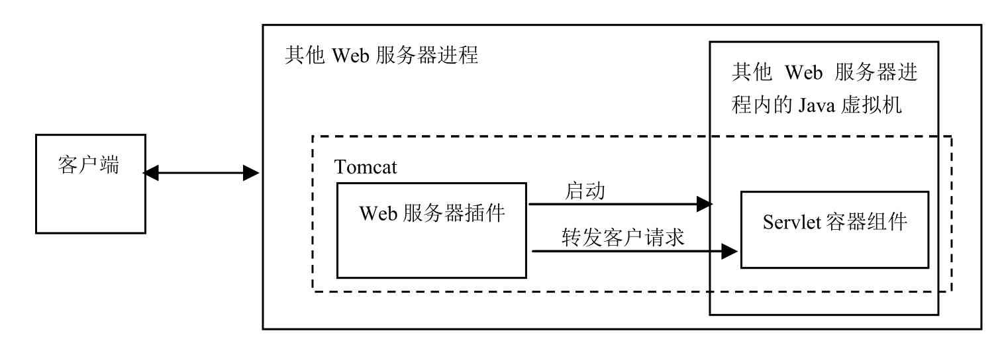
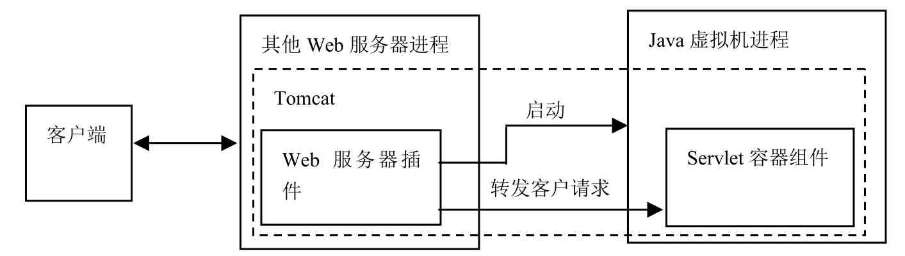

# Tomcat的工作模式

Tomcat作为Servlet容器,有以下三种模式

- [独立的Servlet容器](#独立的Servlet容器)
- [其他Web服务器进程内的Servlet容器](#其他Web服务器进程内的Servlet容器)
- [其他Web服务器进程外的Servlet容器](#其他Web服务器进程外的Servlet容器)
- [总结](#总结)

## 独立的Servlet容器

- Tomcat作为独立的Web服务器来单独运行，Servlet容器组件作为Web服务器中的一部分而存在。这是Tomcat的默认工作模式。

- 在这种模式下，Tomcat是一个独立运行的Java程序。和运行其他Java程序一样，运行Tomcat需要启动一个JVM进程，由该进程来运行Tomcat

## 其他Web服务器进程内的Servlet容器

Tomcat分为Web服务器插件和Servlet容器组件两部分

- Web服务器插件在其他Web服务器进程的内部地址空间启动一个Java虚拟机，Servlet容器组件在此Java虚拟机中运行。
- 如有客户端发出调用Servlet的请求，Web服务器插件获得对此请求的控制并将它转发（使用JNI通信机制）给Servlet容器组件。

> JNI（Java Native Interface）指的是Java本地调用接口，通过这一接口，Java程序可以和采用其他语言编写的本地程序进行通信。

## 其他Web服务器进程外的Servlet容器

在这种模式下，Tomcat分为Web服务器插件和Servlet容器组件两部分。

- Web服务器插件在其他Web服务器的外部地址空间启动一个Java虚拟机进程，Servlet容器组件在此Java虚拟机中运行。
- 如有客户端发出调用Servlet的请求，Web服务器插件获得对此请求的控制并将它转发（采用IPC通信机制）给Servlet容器。

进程外Servlet容器对客户请求的响应速度不如进程内Servlet容器，但进程外容器具有更好的伸缩性和稳定性。
提示

> IPC（Inter-Process Communication，进程间通信）是两个进程之间进行通信的一种机制。

## 总结

从Tomcat的三种工作模式可以看出，当Tomcat作为独立的Servlet容器来运行时，此时Tomcat是能运行Java Se rvlet的独立Web服务器。此外，Tomcat还可作为其他Web服务器进程内或者进程外的Servlet容器，从而与其他Web服务器集成（如Apache和IIS服务器等）。

集成的意义在于：对于不支持运行Java Servlet的其他Web服务器，可通过集成Tomcat来提供运行Servlet的功能。