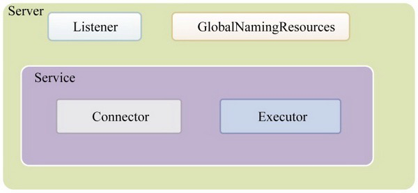

# 顶层类元素-Server组件


## Server组件

Server是最顶级的组件，它代表Tomcat的运行实例，在一个JVM中只会包含一个Server。在Server的整个生命周期中，不同阶段会有不同的事情要完成。为了方便扩展，它引入了监听器方式，所以它也包含了Listener组件。

另外，为了方便在Tomcat中集成JNDI，引入了GlobalNamingResources组件。同时，还包含了Service核心组件。




上图中我们可以看出

Server组件包含

- 若干Listener组件

- GlobalNamingResources组件

## Server组件中的监听器

Server组件是代表整个Tomcat的Servlet容器,server.xml中默认配置了6个监听器

```xml
 <Listener className="org.apache.catalina.startup.VersionLoggerListener" />
  <!-- Security listener. Documentation at /docs/config/listeners.html
  <Listener className="org.apache.catalina.security.SecurityListener" />
  -->
  <!--APR library loader. Documentation at /docs/apr.html -->
  <Listener className="org.apache.catalina.core.AprLifecycleListener" SSLEngine="on" />
  <!-- Prevent memory leaks due to use of particular java/javax APIs-->
  <Listener className="org.apache.catalina.core.JreMemoryLeakPreventionListener" />
  <Listener className="org.apache.catalina.mbeans.GlobalResourcesLifecycleListener" />
  <Listener className="org.apache.catalina.core.ThreadLocalLeakPreventionListener" />
```

| 序号 | 监听器                            | 解释 |
| ---- | --------------------------------- | ---- |
| 1    | VersionLoggerListener             |      |
| 2    | SecurityListener                  |      |
| 3    | AprLifecycleListener              |      |
| 4    | JreMemoryLeakPreventionListener   |      |
| 5    | GlobalResourcesLifecycleListener  |      |
| 6    | ThreadLocalLeakPreventionListener |      |

## 生命周期监听器


## Server组件中的GlobalNamingResources

GlobalNamingResources通过JNDI提供统一的命名对象访问接口,它的使用范围是猪呢个股Server


## Service组件

Service是服务的抽象，它代表请求从接收到处理的所有组件的集合在设计上Server组件可以包含多个Service组件，每个Service组件都包含了若干用于接收客户端消息的Connector组件和处理请求的Engine组件。

其中，不同的Connector组件使用不同的通信协议，如HTTP协议和AJP协议，当然还可以有其他的协议A和协议B。若干Connector组件和一个客户端请求处理组件Engine组成的集合即为Service。

Service组件包含了

- 若干Executor组件，每个Executor都是一个线程池，它可以为Service内所有组件提供线程池执行任务。


