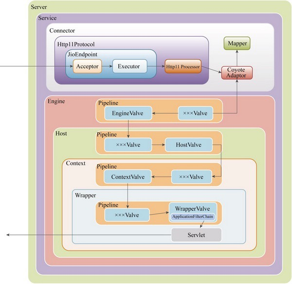

# 请求处理整体流程

上图是Tomcat的请求流转过程，为了更简洁明了，去掉了请求过程中一些非主线的组件。这里假定Tomcat作为专门处理HTTP的Web服务器，而且使用阻塞I/O方式接受客户端的连接。下面介绍请求流转的具体过程。

- ① 当Tomcat启动后，Connector 组件的接收器 (Acceptor) 将会监听是否有客户端套接字连接并接收Socket。

- ② 一旦监听到客户端连接，则将连接交由线程池Executor处理，开始执行请求响应任务。

- ③ Http11Processor组件负责从客户端连接中读取消息报文，然后开始解析HTTP的请求行、请求头部、请求体。将解析后的报文封装成**Request对象**，方便后面处理时通过Request对象获取HTTP协议的相关值。

- ④ Mapper组件根据HTTP协议请求行的URL属性值和请求头部的Host属性值匹配由哪个Host容器、哪个Context容器、哪个Wrapper容器处理请求，**这个过程其实就是根据请求从Tomcat中找到对应的Servlet**。然后将路由的结果封装到Request对象中，方便后面处理时通过Request对象选择容器。

- ⑤ CoyoteAdaptor组件负责将Connector组件和Engine容器连接起来，把前面处理过程中生成的请求对象Request和响应对象Response传递到Engine容器，调用它的管道。

- ⑥ Engine容器的管道开始处理请求，管道里包含若干阀门(Valve)，每个阀门负责某些处理逻辑。这里用xxxValve代表某阀门，我们可以根据自己的需要往这个管道中添加多个阀门，首先执行这个xxxValve，然后才执行基础阀门EngineValve，它会负责调用Host容器的管道。

- ⑦ Host容器的管道开始处理请求，它同样也包含若干阀门，首先执行这些阀门，然后执行基础阀门HostValve，它继续往下调用Context容器的管道。

- ⑧ Context容器的管道开始处理请求，首先执行若干阀门，然后执行基础阀门ContextValve，它负责调用Wrapper容器的管道。

- ⑨ Wrapper容器的管道开始处理请求，首先执行若干阀门，然后执行基础阀门WrapperValve，它会执行该Wrapper容器对应的Servlet对象的处理方法，对请求进行逻辑处理，并将结果输出到客户端。

  

