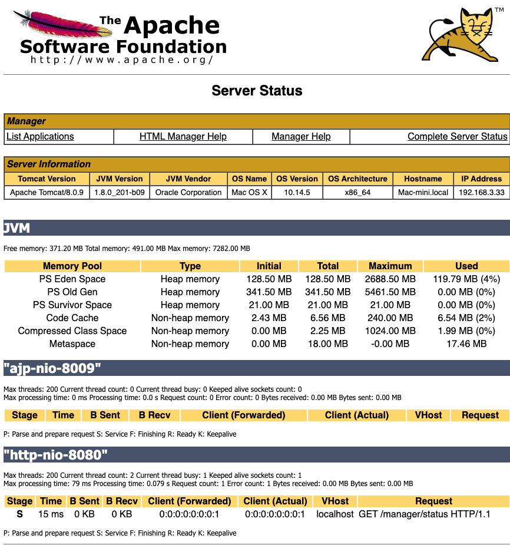

# 设置用户名和密码

修改配置文件

```
%TOMCAT_HOME%/conf/tomcat-users.xml
```

## 设置配置文件

```xml
  <role rolename="manager"/>
  <role rolename="manager-gui"/>
  <role rolename="admin"/>
  <role rolename="admin-gui"/>
 <user username="tomcat" password="tomcat" roles=" admin-gui,admin,manager-gui,manager"/>
```



